# 计算机操作系统

> author: spongehah from:hut
>
> 参考视频: B站王道考研计算机操作系统

[TOC]

# 一 绪论

## 1 操作系统的概念、功能

### 1.1 概念（定义）

**操作系统**(Operating System,Os)是指控制和**管理**整个计算机系统的**硬件和软件**资源，并合理地组织调度计算机的工作和资源的分配；以**提供给用户和其他软件方便的接口和环境**；它是计算机系统中最基本的**系统软件。**

### 1.2 三个功能和目标

>1. 操作系统是系统资源的管理者
>2. 向上层提供方便易用的服务
>3. 是最接近硬件的一层软件

#### 功能1：系统资源的管理者

.assets/image-20230907162222470.webp)

一共有四个功能：

- 处理机管理		Step3
- 存储器管理		Step2
- 文件管理		  Step1
- 设备管理		  Step4

#### 功能2：向上层提供方便易用的服务

.assets/image-20230907162631435.webp)

操作系统屏蔽掉了硬件的不友好的接口，而对用户暴露友好的交互接口

**程序接口**：可以在程序中进行**系统调用**来使用程序接口。普通用户不能直接使用程序接口，只能通过程序代码**间接**使用。

- 如：写C语言“Hello world”程序时，在printf函数的底层就使用到了操作系统提供的显式相关的“系统调用”
- 系统调用类似于函数调用，是应用程序请求操作系统服务的唯一方式
- 在有的教材中：**系统调用=广义指令**

##### 附录：接口的分类

> **接口的分类：**
>
> .assets/image-20230907162935759.webp)
>
> - 给用户使用的
>
>   1. GUI图形化接口
>
>   2. 命令接口：
>
>      - 联机命令接口
>        - 交互式接口	**一句一句**的执行
>
>      - 脱机命令接口
>        - **批量**处理	类似于交互式接口的集合，如windows的.bat文件
>
> - 给软件/程序员使用的
>
>   1. 程序接口，即**系统调用**，用户通过程序间接调用（2.3中详细讲解）

#### 功能3：作为最接近硬件的层次

需要实现**对硬件机器的拓展**

没有任何软件支持的计算机成为**裸机**。在裸机上安装的操作系统，可以提供资源管理功能和方便用户的服务功能，将裸机改造成功能更强、使用更方便的机器

通常把覆盖了软件的机器成为**扩充机器**，又称之为**虚拟机**

>类比汽车：
>
>发动机一一只会转：轮胎一一只会滚：
>在原始的硬件机器上覆盖一层传动系统一一让发动机带着轮子转一一使原始的硬件机器得到拓展
>
>操作系统对硬件机器的拓展：将CPU、内存、磁盘、显示器、键盘等硬件合理地组织起来，让各种硬件
>能够相互协调配合，实现更多更复杂的功能

### 1.3 小总结

.assets/image-20230907163540898.webp)

## 2 操作系统的特征

### 2.1 操作系统最基本的两个特征--并发和共享

1. **并发**：指两个或多个事件在同一时间间隔内发生。这些事件**宏观上是同时发生**的，但**微观上是交替发生**的。
   - 常考易混概念一一**并行**：指两个或多个事件在同一时刻同时发生。
   - **操作系统的并发性**指计算机系统中“同时”运行着多个程序，这些程序宏观上看是同时运行着的，而微观上看是交替运行的。
   - 操作系统就是伴随着“多道程序技术”而出现的。因此，**操作系统和程序并发是一起诞生的**。
   - **注意：** **单核CPU**同一时刻只能执行**一个程序**，各个程序只能**并发**地执行；**多核CPU**同一时刻可以同时执行**多个程序**，多个程序可以**并行**地执行；
     比如Intel的第八代i3处理器就是4核CPU,意味着可以并行地执行4个程序
2. **共享**：共享即资源共享，是指系统中的资源可供内存中多个并发执行的进程共同使用。
   - 有两种资源共享方式：
     1. `互斥共享方式`：系统中的某些资源，虽然可以提供给多个进程使用，但**一个时间段内只允许`一个进程`访问该资源**
     2. `同时共享方式`：系统中的某些资源，**允许一个时间段内由`多个进程`“同时”对它们进行访问**

> 所谓的“同时”往往是宏观上的，而在微观上，这些进程可能是交替地对该资源进行访问的（即分时共享）
>
> 生活实例：
> 互斥共享方式：
> 使用QQ和微信视频。同一时间段内摄像头只能分配给其中一个进程。
> 同时共享方式：使用QQ发送文件A,同时使用微信发送文件B。宏观上看，两边都在同时读取并发送文件，说明两个进程都在访问硬盘资源，从中读取数据。微观上看，两个进程是交替着访问硬盘的。

#### 并发和共享的关系

- **并发性**指计算机系统中同时存在着多个运行着的程序。
- **共享性**是指系统中的资源可供内存中多个并发执行的进程共同使用。

通过上述例子来看并发与共享的关系：

使用QQ发送文件A,同时使用微信发送文件B。

1.两个进程正在并发执行**（并发性）**

2.需要共享地访问硬盘资源**（共享性）**

>可以看到：
>
>如果失去并发性，则系统中只有一个程序正在运行，则共享性失去存在的意义
>
>如果失去共享性，则QQ和微信不能同时访问硬盘资源，就无法实现同时发送文件，也就无法并发

**所以`并发性和共享性互为存在条件`**

### 2.2 另外两个特征

#### 1）虚拟

**虚拟**是指把一个物理上的实体变为若干个逻辑上的对应物。物理实体（前者）是实际存在的，而逻辑上对应物（后者）是用户感受到的。

虚拟技术包含：

- 空分复用技术（如虚拟存储器技术）
- 时分复用技术（如虚拟处理器）

先说结论：显然，如果失去了并发性，则一个时间段内系统中只需运行一道程序，那么就失去了实现虚拟性的意义了。因此，**没有并发性，就谈不上虚拟性**

>Yo~用两个个例子来理解
>背景知识：一个程序**需要放入内存**并给它**分配CPU**才能执行
>
> 
>
>**虚拟技术中的“空分复用技术”：**
>
>eg1：GTA5需要4GB的运行内存，QQ需要256MB的内存，迅雷需要256MB的内存，网易云音乐需要256MB的内存
>我的电脑：4GB内存
>问题：这些程序同时运行需要的内存远大于4GB,那么为什么它们还可以在我的电脑上同时运行呢？
>答：这是虚拟存储器技术。实际只有4GB的内存，在用户看来似乎远远大于4GB
>
> 
>
>**虚拟技术中的“时分复用技术”**。微观上处理机在各个微小的时间段内交替着为各个进程服务
>
>eg2：单核CPU打开六个应用程序，但6个程序却能同时运行

#### 2）异步

**异步**是指，在多道程序环境下，允许多个程序并发执行，但由于资源有限，进程的执行不是一贯到底的，而是走走停停，以不可预知的速度向前推进，这就是进程的异步性。

> eg:
>
> .assets/image-20230907170252504.webp)

由于并发运行的程序会争抢着使用系统资源，而系统中的资源有限，因此进程的执行不是一贯到底的，而是走走停停的，以不可预知的速度向前推进

如果失去了并发性，即系统只能串行地运行各个程序，那么每个程序的执行会一贯到底。**只有系统拥有并发性，才有可能导致异步性**

没有并发和共享，就谈不上虚拟和异步，而并发和共享互为存在条件，**因此并发和共享是操作系统的两个最基本的特征**

### 2.3 小总结

.assets/image-20230907170415535.webp)

## 3 OS的发展与分类

.assets/image-20230907170613504.webp)

### 3.1 手工操作阶段

.assets/image-20230907170643996.webp)

> **CPU和人工串行**，CPU总是等待人的操作，CPU利用率极低

### 3.2 单道批处理系统（引入脱机I/O）

.assets/image-20230907170723861.webp)

> **监督程序**实现批处理，程序可以一批一批进行处理，减少了人机矛盾，略微提高了CPU的利用率
>
> 缺点：但是CPU的处理速度仍然远高于I/O速度，CPU与I/O设备串行，告诉CPU受到低俗IO牵制

### 3.3 多道批处理系统（操作系统的开始）

.assets/image-20230907171159950.webp)

>优点：CPU和IO错开执行，可让多道程序并发执行，资源利用率大幅提升
>
>缺点：没有人机交互功能

### 3.4 分时操作系统

.assets/image-20230907171534567.webp)

> 优点：提供人机交互功能
>
> 缺点：不能优先处理紧急任务

### 3.5 实时操作系统

.assets/image-20230907171626994.webp)

> 分类：
>
> - 硬实时
> - 软实时
>
> 优点：提供人机交互功能，且能优先处理紧急任务

还有其它不常用的操作系统，小总结中可见

### 3.6 小总结

.assets/image-20230907171735419.webp)

# 二 操作系统的运行机制

## 1 预备知识

### 1.1 内核程序和应用程序

.assets/image-20230907172246660.webp)

### 1.2 程序是如何运行的

.assets/image-20230907172311101.webp)

### 1.3 特权指令与非特权指令

.assets/image-20230912102719566.webp)

> 只有**内核程序**才能调用特权指令，而**应用程序**只能调用非特权指令

### 1.4 内核态和用户态

.assets/image-20230912102907514.webp)

#### ★内核态和用户态的切换

.assets/image-20230912103041451.webp)

> **刚开机，CPU为内核态**，想要切换为用户态，执行内核程序中的一条**特权指令**，将CPU切换为**用户态**，才能运行应用程序

**当应用程序被篡改含有特权指令时怎么办？**

.assets/image-20230912103340929.webp)

.assets/image-20230912103555422.webp)

> 应用程序含有**假特权指令**时，CPU**识别**出该指令为特权指令，但是又判断自己处于**用户态**，于是会发出一个**中断信号**，**强制**将状态**变回核心态**夺回CPU控制权，然后**终止**该应用程序的运行，将CPU分配给其它程序

.assets/image-20230912103810181.webp)

### 1.5 小总结

.assets/image-20230912103847538.webp)

## 2 中断和异常

### 2.1 中断的作用

.assets/image-20230912103925873.webp)

>作用：“**中断**”是让操作系统内核夺回CPU使用权的**唯一途径**
>如果没有“中断”机制，那么一旦应用程序上CPU运行，CPU就会一直运行这个应用程序（**实现并发**）

### 2.2 中断的分类

.assets/image-20230912104431034.webp)

> 1. 内中断	也叫**异常**
> 2. 外中断	俗称**中断**，狭义上的中断

#### 1）内中断（异常）

**与当前执行的指令有关，中断信号来源于CPU内部**

.assets/image-20230912104539168.webp)

.assets/image-20230912104858792.webp)

> 例1：即预备知识中	★内核态和用户态的切换  部分的举例
>
> 例2：非法的
>
> 例3：**陷入指令**（也叫`Trap指令`，`访管指令`）是非特权指令，是**实现系统调用**的途径（后面会讲）
>
> 时刻记住“**中断**”是让操作系统内核夺回CPU使用权的**唯一途径**

#### 2）外中断（中断）

狭义上的中断

**与当前执行的指令无关，中断信号来源于CPU外部**

.assets/image-20230912105047012.webp)

> 例1：**实现并发运行**；在时钟部件每隔一个固定**时间片**，就会发出一个**外部中断信号**，让CPU执行处**理时钟中断的内核程序**后执行**另一个**应用程序
>
> 例2：设备的中断信号，告诉CPU任务完成

### 2.3 中断机制的基本原理

.assets/image-20230912105631376.webp)

> 中断向量表

### 2.4 中断的处理过程

.assets/image-20230922214149984.webp)

1. 关中断（硬件完成）：CPU响应中断后，应该拒绝响应更高级的中断源的中断请求
2. 保存断点（硬件完成）：为了之后能重新恢复执行这个程序，需要将原来的程序的断点（即程序计数器C)保存起来
3. 中断服务程序寻址（硬件完成）：取出中断服务程序的入口地钟址送到程序计数器PC
4. 保存现场和屏薇字（中断程序完成）：进入程序中断服务程序后，首先要保护现场，现场信息一般是指程序状态字寄存器PSW和某些通用寄存器的内容
5. 开中断（中断程序完成）：允许更高级中断请求得到响应，想象一下多道程序设计的并发执行，CPU交替执行内存里面的各个程序
6. 执行中断服务程序（中断程序完成）：这是中断请求的目的，完成某些中断后的操作
7. 关中断（中断程序完成）：保证在恢复现场和屏蔽字时不被中断，完成中断后的提作之后，需要恢复现场，不希望被打扰
8. 恢复现场和屏蔽字（中断程序完成）：将现场和屏蔽字恢复到原来的状态
9. 开中断->中断返回（中断程序完成）：中断服务程序的最后一条指令通常是一条中断返回指令，使其返回到原程序的断点处，以便继续执行原程序
   

### 2.5 小总结

.assets/image-20230912105403852.webp)

.assets/image-20230912105648040.webp)

## 3 系统调用

### 3.1 什么是系统调用

.assets/image-20230912105821467.webp)

>程序接口，即**系统调用**，用户通过程序间接调用，**应用程序可以通过系统调用来请求获得操作系统内核的服务**

.assets/image-20230912110121045.webp)

### 3.2 系统调用的用途

.assets/image-20230912110142500.webp)

.assets/image-20230912110155343.webp)

> 要实现系统调用需要通过**陷入指令**

.assets/image-20230912110443242.webp)

### 3.3 系统调用的过程

.assets/image-20230912110630738.webp)

.assets/image-20230912110707898.webp)

.assets/image-20230912110719905.webp)

> **系统调用的过程：**
>
> 1 应用程序会先进行**传参**（系统调用时会使用到的参数）
>
> 2 应用程序执行**陷入指令**（也叫`Trap指令`，`访管指令`），主动将CPU控制权还给操作系统，并执行**系统调用的入口程序**
>
> 3 根据**参数**处理系统调用的内核程序（发生在**内核态**）

### 3.4 小总结

.assets/image-20230912111316379.webp)

## 4 操作系统的体系结构

.assets/image-20230912111740511.webp)

### 4.1 操作系统的内核

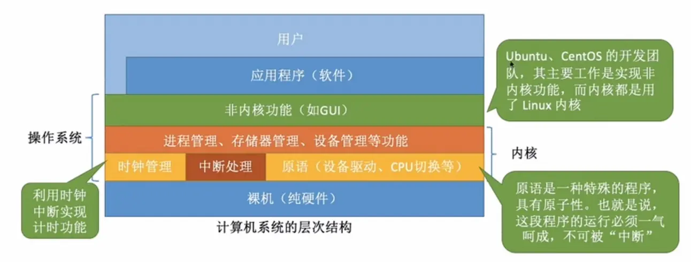

.assets/image-20230912112036495.webp)

### 4.2 大内核与微内核

.assets/image-20230912112427551.webp)

> 大内核即包含了进程管理、存储器管理、设备管理等**不会直接涉及硬件**的功能
>
> 微内核只包含**与硬件关联较紧密的模块**

#### 大内核与微内核的对比（优缺点）

.assets/image-20230912112448352.webp)

> 大内核：`性能高`，**但是结构混乱，难以维护**
>
> 微内核：**性能低**，`但是结构清晰，方便维护`

.assets/image-20230912112658413.webp)

### 4.3 其它体系结构

.assets/image-20230912112908379.webp)

> 带黄色星号代表旧重点，红色星号表示新重点

#### 1）分层结构

.assets/image-20230912113044333.webp)

优点：

- ★1.便于调试和验证，自底向上逐层调试验证
- 2.易扩充和易维护，各层之间调用接口清晰因定

缺点：

- 1.仅可调用相邻低层，难以合理定义各层的边界
- ★2.效率低，不可跨层调用，系统调用执行时间长

#### 2）模块化

.assets/image-20230912113247246.webp)

优点：

- 1模块间逻辑清涵易于维护，确定模块偏接口后即可多模块同时开发
- ★2.支持动态加载新的内核模块（如：安装设备超动程序、安装新的文件系统模块到内核)，增强OS适应性
- ★3.任何模块都可以直接调用其他模块，无需深用消息传递进行通信，效事高

缺点：

- 1.模块间的接口定义未必合理、实用
- 2.模块间相互依懒，更难调试和验证

#### 3）外核

.assets/image-20230912113434145.webp)

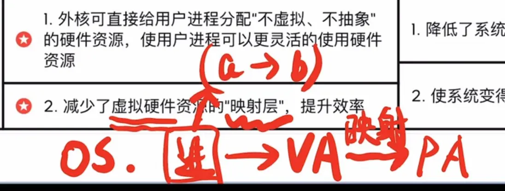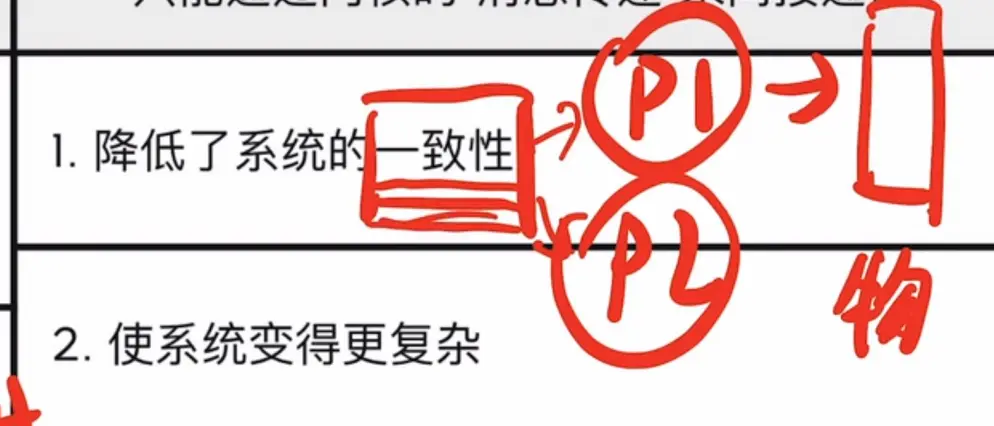

优点：

- ★1.外核可直接给用户进程分配“不虚拟、不抽象”的硬件资源，使用户进程可以更灵话的使用硬件资源
  - 应用程序可以向外核申请连续的存储空间（就不用再寻址进行随机访问），并维护这个空间
- ★2.减少了虚拟硬件资源的“映射层”，提升效率
  - 就不用再寻址进行随机访问

缺点：

- 1.降低了系统的一致性
- 2.使系统变得更复余
  - 维护连续空间有额外开销，需要不允许该程序访问分配空间外的地址，也不允许其它程序访问分配空间内的地址

## 5 操作系统引导

- 什么是操作系统引导
- 磁盘里边有哪些相关数据？
- 操作系统引导的过程

操作系统引导(boot)一一开机的时候，怎么让操作系统运行起来？

### 5.1 开机的时候，怎么让操作系统运行起来？

**安装操作系统之后：**

.assets/image-20230912121927889.webp)

.assets/image-20230912121937886.webp)

.assets/image-20230912121948183.webp)

> 安装好操作系统分好区后，磁盘表现为以上形式

### 5.2 开机过程

.assets/image-20230912122008985.webp)

.assets/image-20230912122017445.webp)

.assets/image-20230912122024893.webp)

> 1 ROM中的记录是**永久**的，不会随着断电消失，开机时首先取指令，执行BIOS中的**ROM引导程序**
>
> 2 将磁盘主引导记录MBR读到内存RAM，执行**磁盘引导程序**，扫描**分区表**
>
> 3 从**活动分区**（又称主分区，即安装了操作系统的分区，即C盘）读入分区引导记录，执行其中的程序
>
> 4 从根目录下找到完整的**操作系统初始化程序**（即启动管理器）并执行，完成“开机”的一系列动作

Windows举例：

.assets/image-20230912122033457.webp)

## 6 虚拟机

传统计算机：

.assets/image-20230912123036771.webp)

### 6.1 两类虚拟机

.assets/image-20230912123047759.webp)

> 两类虚拟机：
>
> - 直接运行在硬件上
> - 运行在宿主操作系统上

.assets/image-20230914163958865.webp)

# 三 进程与处理机管理

## 1 进程描述

### 1.1 进程的概念

.assets/image-20230914164400322.webp)

>程序：是静态的，就是个存放在磁盘里的可执行文件，就是一系列的指令集合。
>
>进程(Process)：是动态的，是程序的一次执行过程

### 1.2 进程的组成

1. 进程控制块PCB
2. 程序段
3. 数据段

**1）进程控制块PCB**

.assets/image-20230914164811485.webp)

.assets/image-20230914164835468.webp)

**2）程序段和数据段**

**程序是如何运行的**

.assets/image-20230914165046948.webp)

> **进程实体**是进程某一时刻的**快照**

.assets/image-20230914165134010.webp)

### 1.3 进程的特征

.assets/image-20230914165317364.webp)

### 1.4 进程间的关系结构

.assets/image-20230919092655893.webp)

> 进程间的关系是**树形结构**

### 1.5 小总结

.assets/image-20230914165343052.webp)

1. 动态性：进程的最基本特性
2. 并发性
3. 独立性：**进程是能独立运行、独立获得资源、独立接受调度的基本单位**（后面会说线程是调度的基本单位，进程是获得资源的基本单位）
4. 异步性：各进程以不可预知的速度向前推进，可能导致运行结果的不确定性
5. 结构性

## 2 进程的状态与状态转换

.assets/image-20230914165445461.webp)

### 2.1 进程的状态

#### 1）创建态、2）就绪态

.assets/image-20230914165536425.webp)

> 创建态：创建过程中
>
> 就绪态：除CPU以外其它所有条件都已满足

#### 3）运行态

.assets/image-20230914165642347.webp)

> 就绪态进程获取CPU后，进入运行态

#### 4）阻塞态

.assets/image-20230914165814006.webp)

> 当**运行态**的进程想要某种**系统资源或设备**但暂时**无法提供**时，就会进入**阻塞**态，CPU分配给其它进程
>
> 想要代表是进程**主动**的

**阻塞态转换为就绪态**

.assets/image-20230914170137836.webp)

> 当阻塞态想要的资源**空闲**时，可分配给当前进程，那么当前进程就可以恢复为**就绪态**
>
> 当前进程是**被动**的

#### 5）终止态

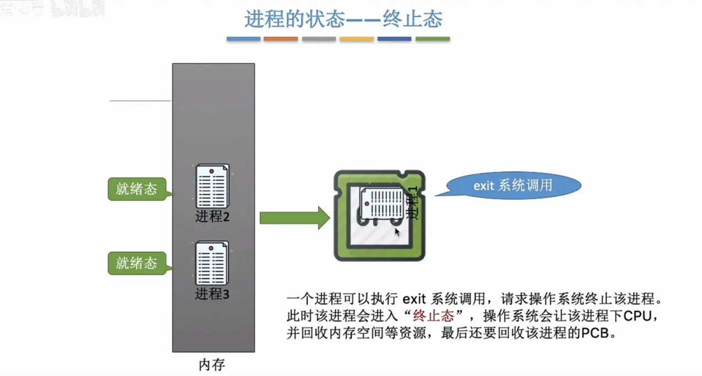

> 进程执行exit系统调用后，该进程进入**终止态**，并下CPU，回收资源和PCB

### 2.2 进程状态的转换

.assets/image-20230914170716512.webp)

> 就绪态和运行态能够相互转换，如当时间片到，或处理机被抢占都会导致运行态转换为就绪态
>
> 但是就绪态不能转换为阻塞态，阻塞态也不能转换为运行态
>
> 根据状态标志位**state**判断进程所处的状态

.assets/image-20230914170750287.webp)

### 2.3 进程的组织

.assets/image-20230914171054697.webp)

#### 1）链接方式

.assets/image-20230914170922302.webp)

有时阻塞队列还可以细分：

.assets/image-20230914170954904.webp)

#### 2）索引方式

.assets/image-20230914171043475.webp)

### 2.4 小总结

.assets/image-20230914171139286.webp)

## 3 进程控制

### 3.1 什么是进程控制？

.assets/image-20230919084242157.webp)

>进程控制的主要功能是对系统中的所有进程实施有效的管理，它具有 创建新进程 、撤销己有进程、实现进程状态转换 等功能。
>
>简化理解：进程控制就是要**实现进程状态转换**

.assets/image-20230914171451660.webp)

### 3.2 如何实现进程控制？

.assets/image-20230914171540271.webp)

> 用**原语**实现
>
> 原语是一种特殊的程序，是操作系统内核的一部分；它的执行具有**原子性**也就是说，这段程序的运行必须一气呵成，不可中断

.assets/image-20230914171658606.webp)

>如上图，若是有中断信号，将会被中断信号中断，若是进程控制时不能一气呵成，那么操作系统将出现巨大问题，所以必须需要原语能够保证**原子性**，那么原语是如何保证原子性的呢？

### 3.3 如何实现原语的原子性？

**正常情况下：**

.assets/image-20230914171900868.webp)

> 正常情况下：如果没有原语，那么将会被中断信号中断

**有原语的情况下：**

.assets/image-20230914171910922.webp)

>内核程序执行原语的时候，会先执行一个**关中断指令**，停止检测中断信号；执行完原语后才会执行**开中断指令**，继续检测中断信号；
>
>若执行原语时有中断信号，则执行完开中断指令后在进行处理

### 3.4 进程控制相关的原语

#### 1）进程创建的相关原语

.assets/image-20230919084944218.webp)

#### 2）进程的终止相关原语

.assets/image-20230919085434241.webp)

#### 3）进程的阻塞和唤醒相关原语

.assets/image-20230919090024685.webp)

#### 4）进程的切换相关原语

.assets/image-20230919090338927.webp)

##### 补充：程序是如何运行的？- 了解寄存器

.assets/image-20230919090531276.webp)

> **寄存器**即CPU用来存储数据的地方

.assets/image-20230919090935833.webp)

> PSW：程序状态字寄存器
>
> PC：程序计数器，存放下一个指令的地址
>
> IR：指令寄存器，存放当前正在执行的指令
>
> 通用寄存器：存放其它一些必要信息
>
>  
>
> eg：执行程序x++，对应如图四条指令
>
> ​	中间结果就放在了通用寄存器

##### 如何知道切换回来的进程运行到哪了？

**思考**：执行完指令3后，另一个进程开始上CPU运行；
注意：另一个进程在运行过程中也会使用各个寄存器，这种情况该怎么办？

**解决办法**：在进程切换时先`在PCB中保存这个进程的运行环境`(保存一些必要的寄存器信息)

> 即**切换原语**中的 保存运行环境 和 恢复运行环境

保存的信息：

- PSW：xxxxx
- PC：指令4的地址
- 通用寄存器：2

### 3.5 小总结

.assets/image-20230919092019578.webp)

## 4 进程通信

.assets/image-20230919093027935.webp)

### 4.1 什么是进程间通信

**进程间通信**(Inter-Process Communication,**IPC**)是指两个进程之间产生数据交互。

### 4.2 进程间通信必须通过操作系统

.assets/image-20230919093433141.webp)

> 每个进程只能访问自己的内存空间，不能直接访问其它进程的内存空间，因为不安全

### 4.3 进程通信的方式

1. 共享存储
2. 消息传递
3. 管道通信

#### 1）共享存储

.assets/image-20230919093836714.webp)

> 发起进程共享的进程申请一片共享内存区
>
> 通过mmap系统调用，将共享内存区映射到进程自己的地址空间
>
> - 实现方式：通过“增加 页表项 / 段表项 ”即可将同一片共享内存区映射到各个进程的地址空间中（第三章内容)，页表项 / 段表项存储共享存储区的**映射地址**
>
>  
>
> 共享存储有两种实现方式：
>
> - 基于**数据结构**的共享
> - 基于**存储区**的共享

- 基于**数据结构**的共享：比如共享空间里只能放一个长度为10的数组。这种共享方式**速度慢、限制多**，是一种**低级**通信方式
- 基于**存储区**的共享：操作系统在内存中划出一块共享存储区，数据的形式、存放位置都由通信进程控制，而不是操作系统。这种共享方式速度很快，是一种**高级**通信方式。

#### 2）消息传递

进程间的数据交换以**格式化的消息**(Message)为单位。进程通过操作系统提供的“发送消息/接收消息”两个**原语**进行数据交换。

.assets/image-20230921195756533.webp)

消息传递：

- 直接通信方式：消息发送进程要指明接收进程的ID

- 间接通信方式c：通过“信箱”间接地通信。因此又称“信箱通信方式”

##### ①直接通信方式：

.assets/image-20230921195927113.webp)

.assets/image-20230921195938282.webp)

> 进程P直接**指明**要发送给进程Q，使用**send原语**发送
>
> 在操作系统内核的地址空间暂时存储在消息队列里
>
> 进程Q使用**receive原语**接收消息

##### ②间接通信方式（信箱通信方式）

.assets/image-20230921200147513.webp)

.assets/image-20230921200223179.webp)

> 指明信箱使用send原语发送至对应信箱
>
> 使用receive原语接收指定信箱的消息

#### 3）管道通信

.assets/image-20230921200339073.webp)

.assets/image-20230921200347104.webp)

> 管道通信是创建一个特殊的共享文件，名为**管道文件**，**和共享存储类似**，只是共享存储分配的区域是**随意使用**的，而管道通信的管道文件类似于一个**FIFO的循环队列**
>
> 1. 管道只能采用**半双工通信**，某一时间段内只能实现单向的传输。如果要实现**双向同时通信**，则**需要设置两个管道**。
> 2. 各进程要**互斥**地访问管道（由操作系统实现）
> 3. 当**管道写满**时，**写进程**将**阻塞**，直到读进程将管道中的数据取走，即可唤醒写进程。
> 4. 当**管道读空**时，**读进程**将**阻塞**，直到写进程往管道中写入数据，即可唤醒读进程。
> 5. 管道中的数据一旦被读出，就彻底消失。因此，当多个进程读同一个管道时，可能会错乱。对此，通常有两种解决方案：①**一个管道允许多个写进程，一个读进程**（2014年408真题高教社官方答案)；②允许有**多个写进程，多个读进程**，但系统会让各个读进程轮流从管道中读数据(Linux的方案)。

### 4.4 小总结

.assets/image-20230921200836726.webp)

##  

## 5 线程的描述

### 5.1 线程的概念

#### 1）什么是线程，为什么要引入线程？

.assets/image-20230921201202940.webp)

.assets/image-20230921201215737.webp)

.assets/image-20230921201252857.webp)

> 可以把线程理解为“轻量级进程”
>
> **线程**是一个**基本的CPU执行单元**，也是**程序执行流的最小单位**。引入线程之后，不仅是进程之间可以并发，进程内的**各线程之间**也可以**并发**，从而进一步**提升了系统的并发度**，使得一个进程内也可以并发处理各种任务（如QQ视频、文字聊天、传文件)
>
>  
>
> **传统的进程**是程序执行流的最小单位
>
> **引入线程后，进程只作为除CPU之外的系统资源的分配单元**（如打印机、内存地址空间等都是分配给进程的)
>
> **引入线程后，线程成为了程序执行流的最小单位，是CPU调度的最小单位**

#### 2）引入线程机制后，有什么变化？

**传统进程**机制中，进程是资源分配、调度的基本单位

**引入线程**后，进程是**资源分配**的基本单位，线程（内核线程，非用户线程，后面讲）是**调度**的基本单位

.assets/image-20230921201603706.webp)

#### 3）线程的属性（特征）

.assets/image-20230921201849247.webp)

### 5.2 线程的实现方式和多线程模型

.assets/image-20230921202002609.webp)

#### 1）线程的实现方式

##### ①用户级线程（早期）

.assets/image-20230921202025550.webp)

很多编程语言提供了强大的线程库，可以实现线程的创建、销毁、调度等功能。
1.线程的管理工作由谁来完成？
2.线程切换是否需要CPU变态？
3.操作系统是否能意识到用户级线程的存在？
4.这种线程的实现方式有什么优点和缺点？

>**解答：**
>
>1.用户级线程由应用程序通过线程库实现，所有的**线程管理工作**都由**应用程序负责**（包括线程切换) 
>
>2.用户级线程中，**线程切换**可以在**用户态下即可完成**，无需操作系统干预。 
>
>3.在用户看来，是有多个线程。但是在操作系统内核看来，并**意识不到**线程的存在。“**用户级线程**”就是“**从用户视角看能看到的线程**” 
>
>4.优缺点
>
>- 优点：用户级线程的切换在用户空间即可完成，**不需要切换到核心态，线程管理的系统开销小，效率高**
>- 缺点：当一个用户级线程被阻塞后，整个进程都会被**阻塞，并发度不高**。多个线程在多核处理机上**不可并行运行**

##### ②内核级线程

.assets/image-20230921202538201.webp)

1.线程的管理工作由谁来完成？
2.线程切换是否需要CPU变态？
3.操作系统是否能意识到内核级线程的存在？
4.这种线程的实现方式有什么优点和缺点？

> 1.**内核级线程的管理工作**由**操作系统内核**完成。 
>
> 2.线程调度、切换等工作都由内核负责，因此**内核级线程的切换**必然需要在**核心态**下才能完成 
>
> 3.操作系统会为每个内核级线程建立相应的 TCB(Thread Control Block,线程控制块)，通过TCB对线程进行管理。“**内核级线程**”就是“**从操作系统内核视角看能看到的线程**”
>
> 4.优缺点
>
> - 优点：当一个线程被阻塞后，别的线程还可以**继续执行，并发能力强**。多线程可在**多核处理机上并行执行**。
> - 缺点：一个用户进程会占用多个内核级线程，线程切换由操作系统内核完成，**需要切换到核心态，因此线程管理的成本高，开销大**。

#### 2）多线程模型

##### ①一对一模型

即前面的内核级线程

##### ②多对一模型

.assets/image-20230921202833281.webp)

> 和**用户级线程基本一致**，唯一不同就是**操作系统看得见**
>
> 操作系统只“看得见”内核级线程，因此**只有内核级线程才是处理机分配的单位**。

##### ③多对多模型

.assets/image-20230921203156933.webp)

> 兼顾一对一和多对一的优点

#### 小总结

.assets/image-20230921203507888.webp)

### 5.3 线程的状态与转换

.assets/image-20230921203647257.webp)

### 5.4 线程的组织与控制

.assets/image-20230921203749389.webp)

> 和进程的组织和控制类似，上左图为线程控制块包含的重要部分
>
> 线程的组织是采用**表**的方式，可以是以一个进程为单位，将该进程所有的TCB放入一张表中

## 6 处理机调度

### 6.1 处理机调度的概念、层次

.assets/image-20230921204215355.webp)

#### 1）调度的基本概念

.assets/image-20230921204305782.webp)

当有一堆任务要处理，但由于资源有限，这些事情没法同时处理。这就需要确定**某种规则**来**决定**处理这些任务的**顺序**，这就是“调度”研究的问题。

#### 2）调度的三个层次

##### ①高级调度（作业调度）

.assets/image-20230921204544050.webp)

>**高级调度（作业调度）**。按一定的原则从外存的作业后备队列中挑选一个作业调入内存，并创建进程。**每个作业只调入一次，调出一次**。作业调入时会建立PCBy调出时才撤销PCB。
>
>**频率很低**

##### ②低级调度（进程调度）

.assets/image-20230921204626800.webp)

>**低级调度（进程调度/处理机调度）**一一按照某种策略从就绪队列中选取一个进程，将处理机分配给它。进程调度是操作系统中**最基本的一种调度**，在一般的操作系统中都必须配置进程调度。进程调度的**频率很高**，一般几十毫秒一次。

##### ③中级调度（内存调度）

.assets/image-20230921204647255.webp)

> 内存不够时，可将某些进程的数据**调出到外存**。等内存空闲或者进程需要运行时再重新调入内存。
>
> 暂时调到外存等待的进程状态为挂起状态。被挂起的进程PCB会被组织成挂起队列
>
> **中级调度（内存调度）**一一按照某种策略决定将哪个处于挂起状态的进程重新调入内存。一个进程可能会被多次调出、调入内存，因此中级调度发生的频率要比高级调度更高。**频率中等**

#### 3）进程挂起态与七状态模型

.assets/image-20230921204927142.webp)

>**挂起**态是将进程映像调到**外存**去了，而**阻塞**态下进程映像还在**内存**中

#### 小总结

.assets/image-20230921205113371.webp)

.assets/image-20230921205119868.webp)

### 6.2 进程调度（低级调度）的时机、方式、切换与过程

.assets/image-20230926134716537.webp)

#### 1）进程调度的时机

.assets/image-20230926135642271.webp)

> **进程调度**（低级调度），就是按照某种算法从就绪队列中选择一个进程为其分配处理机。
>
> - **需要进行**进程调度与切换的情况：
>   - 进程**主动**放弃
>     - 进程正常终止
>     - 运行过程中发生**异常**而终止
>     - 进程主动请求**阻塞**（如等待I/O)
>   - 进程**被动**放弃
>     - 分给进程的**时间片用完**
>     - 有更**紧急**的事需要处理（如I/O中断）
>     - 有更**高优先级**的进程进入就绪队列
>
> - **不能进行**进程调度与切换的情况：
>   1. 在**处理中断的过程中**。中断处理过程复杂，与硬件密切相关，很难做到在中断处理过程中进行进程切换。
>   2. 进程在操作系统**内核程序临界区**中。
>   3. 在**原子操作过程中**（原语）。原子操作不可中断，要一气呵成（如之前讲过的修改PCB中进程状态标志，并把PCB放到相应队列)
>
>  
>
> 针对不能进行的第二点，**注意**区分临界区和内核临界区：
>
> .assets/image-20230926140328542.webp)
>
> 注意区分**内核临界区**和**临界区**
>
> - 临界资源：一个时间段内只允许一个进程使用的资源。各进程需要互斥地访问临界资源。
>   - **临界区**：访问临界资源的那段代码，比如**IO设备**。
> - **内核程序临界区**一般是用来访问某种内核数据结构的，比如进程的**就绪队列**（由各就绪进程的PCB组成)
>
> **在临界区是可以进行进程调度的**

#### 2）进程调度的方式

.assets/image-20230926140625226.webp)

>- **非剥夺调度方式**，又称**非抢占方式**。即，只允许进程主动放弃处理机。在运行过程中即便有更紧迫的任务到达，当前进程依然会继续使用处理机，直到该进程终止或主动要求进入阻塞态。
>- **剥夺调度方式**，又称**抢占方式**。当一个进程正在处理机上执行时，如果有一个更重要或更紧迫的进程需要使用处理机，则立即暂停正在执行的进程，将处理机分配给更重要紧迫的那个进程。

#### 3）进程的切换与过程

.assets/image-20230926140734413.webp)

> 狭义的进程调度：从就绪队列**选中**一个要运行的进程
>
> 进程切换：使一个进程**让出**处理机，由另一个进程**占用**处理机的过程。（涉及到PCB的保存与恢复）
>
> 
>
> **广义的进程调度** = 狭义的的进程调度 + 进程切换
>
> 进程切换都是**有代价**的

#### 小总结

.assets/image-20230926143132313.webp)

### 6.3 调度器、评价指标、调度算法

#### 1）调度器/调度程序、闲逛进程

.assets/image-20230926143328966.webp)

> ②和③的转换由调度程序决定
>
> 决定因素：调度算法和时间片大小

.assets/image-20230926143521953.webp)

**闲逛进程：**

.assets/image-20230926143553005.webp)

> 闲逛进程就是当**没有就绪队列时运行的进程**，**优先级最低，能耗低**，每运行一个完整的指令周期，都会例行检查有没有中断，看是否需要发生进程调度

#### 2）调度算法的评价指标

.assets/image-20230926143940989.webp)

.assets/image-20230926143948039.webp)

.assets/image-20230926143954111.webp)

.assets/image-20230926144000248.webp)

.assets/image-20230926144005927.webp)

.assets/image-20230926144010635.webp)

> 1. CPU利用率
> 2. 系统吞吐量
> 3. 周转时间
> 4. 平均周转时间
> 5. 带权周转时间
> 6. 带权平均周转时间
> 7. 等待时间
> 8. 相应时间

.assets/image-20230926144155898.webp)

#### 3）调度算法

##### ①先来先服务FCFS

.assets/image-20230926144255399.webp)

.assets/image-20230926144308920.webp)

##### ②短作业优先SPF

##### ③最短剩余时间优先SRTN

.assets/image-20230926144333957.webp)

.assets/image-20230926144532772.webp)

.assets/image-20230926144557937.webp)

.assets/image-20230926144617442.webp)

.assets/image-20230926145158934.webp)

> 未说明时，**默认是非抢占式的**，注意图中严格来说部分

##### ④高相应比优先HRRN

.assets/image-20230926144810697.webp)

.assets/image-20230926144853599.webp)

.assets/image-20230926144915057.webp)

> 非抢占式的，**需要等运行完当前进程后才进行一次相应比计算**

##### 前四种算法小总结

.assets/image-20230926145006473.webp)

> 不关心相应时间，不区分任务紧程度，适合用于早期的批处理系统

##### ⑤时间片轮转RR

**时间片大小为2时：**

.assets/image-20230926145408637.webp)

.assets/image-20230926145416808.webp)

.assets/image-20230926145423730.webp)

**时间片大小为5时：**

.assets/image-20230926145505140.webp)

**两种时间片大小对比：**

.assets/image-20230926145517229.webp)

> 一般来说，设计时间片时要让切换进程的开销占比**不超过1%**

.assets/image-20230926145548324.webp)

##### ⑥优先级调度算法

**非抢占式：**

.assets/image-20230928165157017.webp)

**抢占式：**

.assets/image-20230928165205219.webp)

.assets/image-20230928165248912.webp)

> 通常：
>
> - 系统进程优先级**高于**用户进程
> - 前台进程优先级**高于**后台进程
> - 操作系统更**偏好I/O型进程**（或称I/O繁忙型进程）
>   注：与I/O型进程相对的是计算型进程（或称CPU繁忙型进程）

.assets/image-20230928165256901.webp)

##### ⑦多级反馈队列调度算法

.assets/image-20230928165510318.webp)

.assets/image-20230928165517560.webp)

.assets/image-20230928165523587.webp)

##### 后三种算法小总结

.assets/image-20230928165736465.webp)

##### ⑧多级队列调度算法

.assets/image-20230928165816531.webp)

> 每个进程按照分类进入对应的分类，
> 每个队列可以按照固定优先级或者时间片划分的方式进行调度
> 每个队列内部可以采用不同的其它调度算法

## 7 进程同步与进程互斥

### 7.1 进程同步的概念

.assets/image-20230928170014108.webp)

.assets/image-20230928170030526.webp)

> 知识点回顾：进程具有**异步性**的特征。异步性是指，**各并发执行的进程以各自独立的、不可预知的速度向前推进**。
>
> 进程同步：为了解决进程的异步带来的不确定顺序，**制约多个进程协调他们的工作次序**

### 7.2 进程互斥的概念

.assets/image-20230928170233651.webp)

> 回顾：操作系统的特征：共享
>
> 我们把**一个时间段内只允许一个进程使用**的资源称为**临界资源**。如IO设备
>
> **进程互斥**指当一个进程访问某临界资源时，另一个想要访问该临界资源的进程必须等待。当前访问临界资源的进程访问结束，释放该资源之后，另一个进程才能去访问临界资源。

#### 1）进程互斥的组成部分

.assets/image-20230928170728373.webp)

> - 进入区：负责检查是否可进入临界区，若可进入，则应设置正在访问临界资源的标志（可理解为“上锁”)，以阻止其他进程同时进入临界区
> - 临界区：访问临界资源的那段代码
> - 退出区：负责解除正在访问临界资源的标志（可理解为“解锁”）
> - 剩余区：做其它处理

#### 2）进程互斥要遵循的四个原则

.assets/image-20230928170915036.webp)

> 1. 空闲让进。临界区空闲时，可以允许一个请求进入临界区的进程立即进入临界区；
> 2. 忙则等待。当己有进程进入临界区时，其他试图进入临界区的进程必须等待：
> 3. 有限等待。对请求访问的进程，应保证能在有限时间内进入临界区（保证不会饥饿）；
> 4. 让权等待。当进程不能进入临界区时，应立即释放处理机，防止进程忙等待。

### 小总结

.assets/image-20230928171016104.webp)

### 7.3 进程互斥的软件实现方法（算法）

.assets/image-20230928171056810.webp)

.assets/image-20230928171149742.webp)

#### 1）单标志法

.assets/image-20230928171200519.webp)

.assets/image-20230928171602922.webp)

#### 2）双标志先检查法

.assets/image-20230928171238064.webp)

.assets/image-20230928171216164.webp)

#### 3）双标志后检查法

.assets/image-20230928171252311.webp)

.assets/image-20230928171257461.webp)

#### 4）Peterson皮特孙算法

.assets/image-20230928171311648.webp)

.assets/image-20230928171328188.webp)

.assets/image-20230928171335116.webp)

.assets/image-20230928171341652.webp)

.assets/image-20230928171456114.webp)

#### 小总结

.assets/image-20230928171525190.webp)

### 7.4 进程互斥的硬件实现方法

.assets/image-20231003151335734.png)

#### 1）中断屏蔽方法(开关中断)

.assets/image-20231003151500047.png)

> - 优点：简单、高效
> - 缺点：
>   - 不适用于多处理机，因为开关中断指令只作用于一个CPU
>   - 只适用于操作系统内核进程，不适用于用户进程（因为开/关中断指令只能运行在内核态，这组指令如果能让用户随意使用会很危险)

#### 2）TestAndSet指令(TSL指令)

.assets/image-20231003152022940.png)

> 类似于CAS，适合多处理机，缺点：不满足让权等待

#### 3）Swap指令(CAS)

.assets/image-20231003152451720.png)

> 和TSL指令类似，应该就是JAVA中的CAS（Compare And Swap），也可能只是CAS中的S，适合多处理机，缺点也是不满足让权等待

#### 小总结

.assets/image-20231003152614519.png)

> 后两者适合于多处理机，**虽然不满足让权等待，但是等待期间不用切换进程上下文，多处理器系统中，若上锁的时间短，则等待代价很低**

### 7.5 互斥锁

.assets/image-20231003152913200.png)

> **Mutex lock** ：互斥信号量（Java synchronized锁的底层实现原理）

.assets/image-20231003153027709.png)

> 虽然不满足让权等待，但是等待期间不用切换进程上下文，多处理器系统中，若上锁的时间短，则等待代价很低

### 7.6 信号量机制

.assets/image-20231003153404123.png)

> 为了解决前面的算法无法解决的让权等待

.assets/image-20231003153708171.png)

> **信号量**：可以理解为**资源的个数**，小于0时代表资源用尽需要排队
>
> wait、signal原语常**简称为P、V操作**（来自荷兰语proberen和verhogen)。因此，做题的时候常把 wait(S)、signal(S)两个操作分别写为**P(S)、V(S)**

#### 1）整型信号量

.assets/image-20231003154054286.png)

> 用**wait原语**实现检查和上锁一气呵成，解决了双标志先检查法的问题
>
> 但是还是不满足让权等待
>
> 有没有什么办法改进一下？  记录型信号量

#### 2）记录型信号量

.assets/image-20231003154350516.png)

> wait先减value，signal先加value
>
> - 要是减完发现value < 0，**主动阻塞**
> - 要是加完发现value <= 0，**唤醒队头进程**（可以等于0是因为正常情况没人等待自己释放后应该大于0）

**eg：**

.assets/image-20231003154613830.png)

.assets/image-20231003154802215.png)

.assets/image-20231003154959372.png)

.assets/image-20231003155131636.png)

> 默认情况下没特别说明，信号量指记录型信号量

#### 小总结

.assets/image-20231003155234934.png)

### 7.7 用信号量实现进程互斥、同步、前驱关系

.assets/image-20231003155330351.png)

#### 1）信号量实现进程互斥

.assets/image-20231003155748617.png)

> 设置**互斥信号量mutex,初值为1**			semaphore mutex=1;	默认代表记录型信号量
>
> **P、V操作必须成对出**现

#### 2）信号量实现进程同步

.assets/image-20231003155826331.png)

> 为解决异步问题，控制多个进程的执行顺序，让他们按照我们想要的顺序运行
>
> 设置**互斥信号量mutex,初值为0**
>
> **先V后P**

.assets/image-20231003160059534.png)

> - 若是P1先到，则将mutex加1，P2到了mutex > 0，不会被阻塞
> - 若是P2先到，则将mutex减1，mutex < 0，会被阻塞，P1到了后先加1，mutex = 0 -> wakeupP2

#### 3）信号量实现前驱关系

.assets/image-20231003160821372.png)

> 前驱关系就是**多级进程同步问题**
>
> 先V后P，和解决进程同步原理一致

#### 小总结

.assets/image-20231003160959857.png)

> 实现互斥：**Mutex初始值为1**
>
> 实现同步：**Mutex初始值为0**

### 7.8 信号量机制经典问题

#### 1）生产者-消费者问题

.assets/image-20231005145621481.png)

.assets/image-20231005150524953.png)

.assets/image-20231005150657095.png)

#### 2）多生产者-多消费者问题

.assets/image-20231005155647007.png)

.assets/image-20231005151200165.png)

**若不设置互斥信号量mutex能实现吗？**

.assets/image-20231005151322696.png)

> 能，原因在于：**本题中的缓冲区大小为1**，在任何时刻，apple、orange、plate三个同步信号量中最多只有一个是1。因此在任何时刻最多只有一个进程的P操作不会被阻塞，并顺利地进入临界区
>
> 如果是两个进程同时访问缓冲区的情况，有可能导致两个进程写入缓冲区的数据相互覆盖的情况因此，**如果缓冲区大小大于1，就必须专门设置一个互斥信号量mutex来保证互斥访问缓冲区。**

总结：在生产者-消费者问题中，如果缓冲区大小为1，那么有可能不需要设置互斥信号量就可以实现互斥访问缓冲区的功能。当然，这不是绝对的，要具体问题具体分析。

建议：在考试中如果来不及仔细分析，可以加上互斥信号量，保证各进程一定会互斥地访问缓冲区。但需要注意的是，实现互斥的P操作一定要在实现同步的P操作之后，否则可能引起“死锁”。

PV操作题目的解题思路：

- 1.关系分析。找出题目中描述的各个进程，分析它们之间的同步、互斥关系。
- 2.整理思路。根据各进程的操作流程确定P、V操作的大致顺序。
- 3.设置信号量。设置需要的信号量，并根据题目条件确定信号量初值。（**互斥信号量初值一般为1，同步信号量的初始值要看对应资源的初始值是多少**)

.assets/image-20231005151823385.png)

#### 3）吸烟者问题（一生产者生产多种产品-多消费者问题）

.assets/image-20231005160118215.png)

.assets/image-20231005160203534.png)

.assets/image-20231005152511117.png)

#### 4）读者写者问题

.assets/image-20231005152855318.png)

.assets/image-20231005153517380.png)

.assets/image-20231005154022118.png)

> - rw实现对共享文件的互斥访问
> - count实现读进程不互斥
> - mutex实现读进程不互斥的互斥判断
> - w实现公平写优先

.assets/image-20231005154206084.png)

#### 5）哲学家就餐问题

.assets/image-20231005154538540.png)

.assets/image-20231005154652535.png)

> 如果对哲学家拿起筷子的动作不做限制的话，就会发生循环等待死锁问题
>
> 如何预防死锁呢？
>
> - ①最多只能四个哲学家同时进餐，那么会有一个哲学家可以同时得到两根筷子（**互斥信号量初值为4**）
> - ②奇数先拿左边，偶数先拿右边，左右的哲学家出现竞争（**if条件判断**）

.assets/image-20231005154849411.png)

> ③每位哲学家拿筷子是互斥进行的（即**串行化**）

.assets/image-20231005155144190.png)

> 哲学家进餐问题的关键在于**解决进程死锁。**
>
> 这些进程之间只存在互斥关系，但是与之前接触到的互斥关系不同的是，每个进程都需要同时持有两个临界资源，因此就有“死锁”问题的隐患。
>
> 如果在考试中遇到了一个进程需要同时持有多个临界资源的情况，应该参考哲学家问题的思想，分析题中给出的进程之间是否会发生循环等待，是否会发生死锁。
>
> 可以参考哲学家就餐问题解决死锁的三种思路。

### 7.9 管程

.assets/image-20231008213832923.png)

#### 1）为什么要引入管程？

.assets/image-20231008213859716.png)

> 简而言之：信号量机制太复杂，使用管程**封装**了信号量机制，让程序员更方便的调用实现同步于互斥
>
> 封装思想

#### 2）管程的定义和基本特征

.assets/image-20231008214022523.png)

> 管程就是Java中的锁，synchronized关键字

#### 3）用管程解决生产者-消费者问题

.assets/image-20231008214156662.png)

> 用管程的insert函数和remove函数来代替信号量机制的V、P操作

.assets/image-20231008214405189.png)

> 这种**互斥特性是由编译器负责实现的**，程序员不用关心
>
> 程序员可以用某种特殊的语法定义一个管程（比如：monitor ProducerConsumer......end monitor;)

#### 4）Java中类似管程的机制

.assets/image-20231008215204424.png)

#### 小总结

.assets/image-20231008215241490.png)

### 7.10 死锁

.assets/image-20231008215331152.png)

#### 1）什么是死锁？

举例：

.assets/image-20231008215345483.png)

.assets/image-20231008215353788.png)

> 死锁是在**并发环境**下，各进程因**竞争资源**而造成的一种互相等待对方手里的资源，**导致各进程都阻塞**，都无法向前推进的现象。
>
> 就是“死锁”发生死锁后若无外力干涉，这些进程都将无法向前推进

#### 2）死锁、饥饿、死循环的区别

.assets/image-20231008215454013.png)

#### 3）死锁产生的四个必要条件

.assets/image-20231008215526221.png)

> 四个必要条件：
>
> 1. 互斥条件
> 2. 不剥夺条件
> 3. 请求和保持
> 4. 循环等待
>
> 死锁一定是循环等待，仅有循环等待不一定是死锁

#### 4）什么时候会发生死锁？

.assets/image-20231008215710095.png)

> - 资源竞争
> - 请求资源的顺序不当
> - 信号量的使用顺序不当

#### 5）死锁的处理策略

1. **预防死锁**。破坏死锁产生的四个必要条件中的一个或几个。
2. **避免死锁**。用某种方法防止系统进入不安全状态，从而避免死锁（**银行家算法**)
3. **死锁的检测和解除**。允许死锁的发生，不过操作系统会负责检测出死锁的发生，然后采取某种措施解除死锁。

#### 小总结

.assets/image-20231008215908182.png)

### 7.11 死锁的处理策略

#### 1）预防死锁

.assets/image-20231008220028249.png)

**1 破坏互斥条件**

.assets/image-20231008220042374.png)

> 例如使用SPOOLing技术，使进程的进行使异步的，不再进行等待
>
> 缺点：很多时候无法破坏互斥条件

**2 破坏不剥夺条件**

.assets/image-20231008220211268.png)

> 1. 资源不满足时**主动**立即**释放**已有资源
> 2. 优先级低的进程持有的资源**可以**被优先级高地进程**抢占**
>
> 缺点：实现复杂，使进程工作失效，可能造成进程饥饿

**3 破坏请求与保持**

.assets/image-20231008220517079.png)

> 分配时**所有资源都满足才分配**
>
> 缺点：资源浪费，资源利用率低，可能进程饥饿

**4 破坏循环等待**

.assets/image-20231008220623738.png)

> 获取资源时**顺序获取**
>
> 缺点：耦合度高，资源浪费，编程麻烦

**小总结：**

.assets/image-20231008220737545.png)

#### 2）避免死锁

.assets/image-20231008221037206.png)

**案例过度：**

.assets/image-20231008221343182.png)

> 情况1：手里还有：40亿，此时B还想借30亿，你敢借吗？假如答应了B的请求手里还有：10亿只剩下10亿，如果BAT都提出再借 20亿的请求，那么任何一个企业的需求都**得不到满足**…
>
> 情况2：手里还有：40亿，此时…A还想借20亿，你敢借吗？假如答应了A的请求之后按**T→B→A**的顺序借钱是OK的，按**A→T→B**的顺序借钱也是OK的手里还有：20亿或者，先借给A10亿，等A还钱了手里就有20+30=50亿，再给T20亿，等T还钱了就有50+30=80亿，最后再给B借.

上面的案例中：情况1就是发生了死锁，情况2就是不会发生死锁

- **安全序列**：就是指如果系统按照这种序列分配资源，则每个进程都能顺利完成，安全序列可能有多个
  - 类似于上面情况2中的T→B→A或者A→T→B的顺序，叫做安全序列
- **安全状态**：只要能找出一个安全序列，系统就是处于安全状态
  - 上面剩余40亿时的情况就是一个安全状态，因为能找出两条安全序列
- **不安全状态**：如果分配了资源之后，系统中找不出任何一个安全序列，系统就进入了不安全状态
  - 当然，如果有进程提前归还了一些资源，那系统**也有可能重新回到安全状态**

**如果系统处于安全状态，就一定不会发生死锁**。如果系统进入**不安全状态，就可能发生死锁**（处于不安全状态未必就是发生了死锁，但发生死锁时一定是在不安全状态），因此可以在资源分配之前预先判断这次分配是否会导致系统进入不安全状态，以此决定是否答应资源分配请求。这也是“银行家算法”的核心思想。

**银行家算法：**

.assets/image-20231008222218195.png)

> 核心思想：在进程提出资源申请时，先**预判此次分配是否会导致系统进入不安全状态**。如果会进入不安全状态，就暂时不答应这次请求，让该进程先阻塞等待。
>
>  
>
> 上例中：资源总数(10,5,7)，剩余可用资源(3,3,2)
>
> 说明如果优先把资源分配给P1,那P1一定是可以顺利执行结束的等P1结束了就会归还资源。于是，资源数就可以增加到(2,0,0)+(3,3,2)=(5,3,2)
>
> 然后优先把资源分配给P3,那P3一定是可以顺利执行结束的等P3结束了就会归还资源。于是，资源数就可以增加到(2,1,1)+(5,3,2)=(7,4,3)
>
> 现在已经能满足其它任何一个进程的需求
>
> 所以**此案例处于安全状态，暂时不可能发生死锁**
>
>  
>
> 下例可能会发生死锁：
>
> .assets/image-20231008222605662.png)

.assets/image-20231008222657505.png)

银行家算法的**数据结构**：

- 长度为m的一维数组Available表示还有多少可用资源
- n*m矩阵Max表示各进程对资源的最大需求数
- n*m矩阵Allocation表示己经给各进程分配了多少资源
- Max-Allocation=Need矩阵表示各进程最多还需要多少资源
- 用长度为m的一位数组Request表示进程此次申请的各种资源数

银行家算法**步骤**：

- ①检查此次申请是否超过了之前声明的最大需求数
- ②检查此时系统剩余的可用资源是否还能满足这次请求
- ③试探着分配，更改各数据结构
- ④用安全性算法检查此次分配是否会导致系统进入不安全状态，安全才分配

安全性算法步骤：

检查当前的剩余可用资源是否能满足某个进程的最大需求，如果可以，就把该进程加入安全序列，
并把该进程持有的资源全部回收。
不断重复上述过程，看最终是否能让所有进程都加入安全序列。

**系统处于不安全状态未必死锁，但死锁时一定处于不安全状态**。系统处于安全状态**一定不会**死锁。

#### 3）检测和解除

.assets/image-20231008223211972.png)

##### ①死锁的检测

.assets/image-20231008223232511.png)

> 为了能对系统是否已发生了死锁进行检测，必须：
>
> - ①用某种**数据结构**来保存资源的请求和分配信息：
> - ②提供一种算法，利用上述信息来检测系统是否已进入死锁状态。
>
>  
>
> 进程节点 - 资源节点
>
> 请求边 - 已分配边
>
> 讲上图**看作一个快照**，分配边表示已经分配出去的，请求边表示正在请求的，不算已经分配给进程节点的

如果系统中剩余的可用资源数足够满足进程的需求，那么这个进程暂时是不会阻塞的，可以顺利地执行下去。

如果这个进程执行结束了把资源归还系统，就可能使某些正在等待资源的进程被激活，并顺利地执行下去。

例如：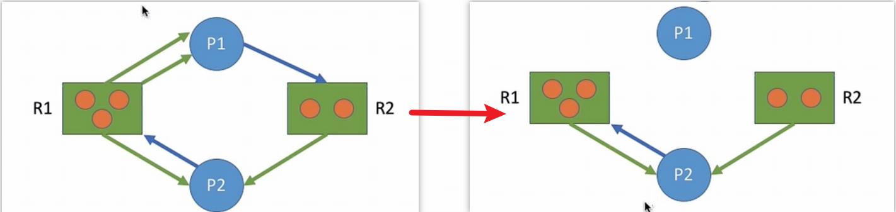

如果按上述过程分析，最终**能消除所有边**，就称这个图是**可完全简化的**。此时**一定没有发生死锁**（相当于**能找到一个安全序列**)

如果最终**不能消除所有边**，那么此时就是**发生了死锁**。

**最终还连着边的那些进程就是处于死锁状态的进程：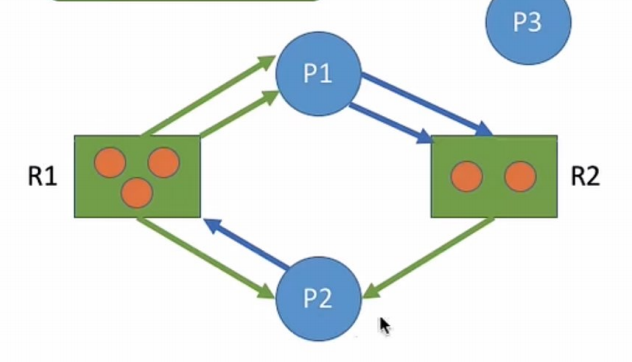**

> 如果能化为可完全简化的，就说明不会发生死锁
>
> 死锁定理：如果某时刻系统的资源分配图是不可完全简化的，那么此时系统死锁

##### ②死锁的解除

.assets/image-20231008224202402.png)

> 1. 资源剥夺法（破坏不可剥夺条件）
> 2. 撤销进程法（例如MySQL处理死锁的策略为：等待最高上限时长50s，超过则自动终止该操作，或者主动检测到死锁发生后回滚执行程度最低的事务，破坏请求和保持）
> 3. 进程回退法（破坏请求和保持）

##### 小总结

.assets/image-20231008224331207.png)

# 四 内存管理

## 1 内存的基础知识

.assets/image-20231010104752881.png)

### 1.1 什么是内存，有何作用？

**内存可存放数据**。程序执行前需要先放到内存中才能被CPU处理

作用：缓和CPU与硬盘之间的速度矛盾

.assets/image-20231010104928179.png)

> 思考：在多道程序环境下，系统中会有多个程序并发执行，也就是说会有多个程序的数据需要同时放到内存中。那么，如何区分各个程序的数据是放在什么地方的呢？
>
> 方案：给内存的存储单元编地址
>
> **存储单元**：内存地址从0开始，**每个地址对应一个存储单元**
>
> - 如果计算机**“按字节编址”**则每个存储单元大小为**1字节**，即1B,即8个二进制位
> - 如果字长为**16位**的计算机**“按字编址”**，则每个存储单元大小为**1个字**；每个字的大小为**16个二进制位**

### 1.2 指令的工作原理和代码到程序运行的三步

.assets/image-20231010105436370.png)

> **指令的工作基于“地址”**，每个地址对应一个数据的存储单元
>
> 上图中每条指令的**加红部分代表的是指令类型**，第二个8位代表的是某个某个寄存器的地址，第三个8位代表的是从这个地址取数据，下面的指令根据指令类型进行操作
>
> - 指令1代表从地址01001111取数据到寄存器00000011
> - 指令2代表将寄存器00000011的数据加上00000001
> - 指令3代表将寄存器00000011的数据写回地址01001111

思考：不可能每个进程分配到的地址都是从地址0开始的，如果这个进程不是从地址0开始存放的，会影响指令的正常执行吗？

**地址从0开始存放：**

.assets/image-20231010110102989.png)

> 正常工作

**地址不从0开始存放：**

.assets/image-20231010110132295.png)

> 现在要解决的就是，**如何将逻辑地址转换为物理地址？**
>
> 答案是马上要讲的**装入**

.assets/image-20231010110419990.png)

> 而程序代码到程序运行要经历：**编译 -> 链接 -> 装入** 三个步骤才能真正装入内存运行
>
> - **编译**就是把高级语言翻译为机器语言
> - **链接**：由链接程序将编译后形成的一组目标模块，以及所需库函数链接在一起，**形成一个完整的装入模块**
> - **装入**（装载）：由装入程序**将装入模块装入内存运行**，并将**逻辑地址转换为物理地址**
>
> 接下来要讲的就是如何链接以及如何装入

### 1.3 链接的三种方式

**链接**：由链接程序将编译后形成的一组目标模块，以及所需库函数链接在一起，**形成一个完整的装入模块**

#### 1）静态链接

静态链接：在程序**运行之前**，先将各目标模块及它们所需的
库函数**连接成一个完整的可执行文件（装入模块）**，之后**不再拆开**。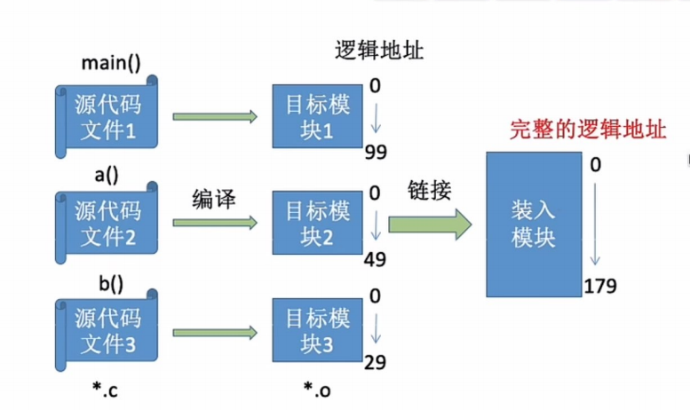

#### 2）装入时动态链接

装入时动态链挠：将各目标模块装入内存时，**边装入边链接**的链接方式。（结合后面的装入一起）

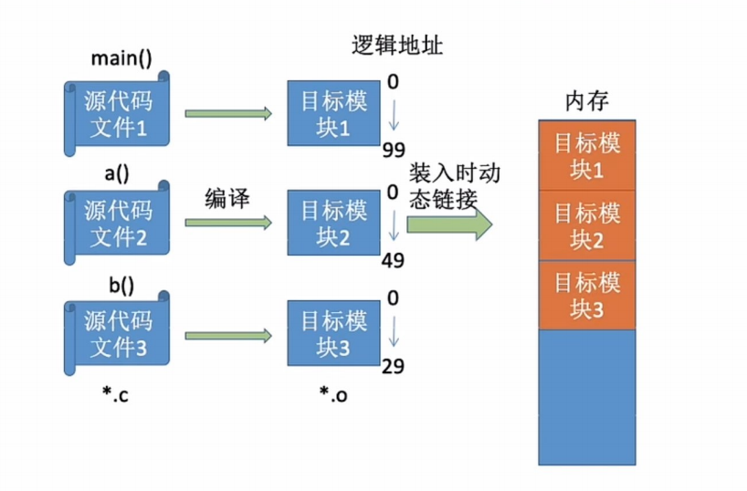

#### 3）运行时动态链接

运行时动态链接：在程序执行中**需要该目标模块时，才对它进行链接**。其优点是便于修改和更新，便于实现对目标模块的共享。**用不到的模块就不需要装入内存**

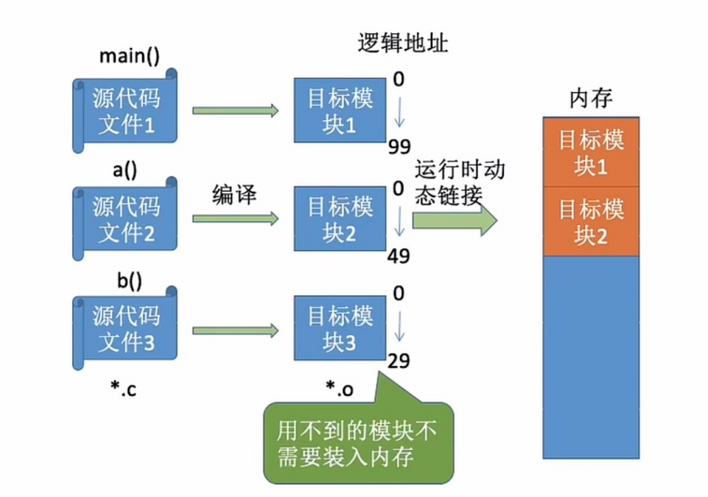

### 1.4 装入的三种方式

**装入**（装载）：由装入程序**将装入模块装入内存运行**，并将**逻辑地址转换为物理地址**

#### 1）绝对装入

**绝对装入**：在编译时，如果知道程序将放到内存中的哪个位置，编译程序将产生绝对地址的目标代码。装入程序按照装入模块中的地址，将程序和数据装入内存。 

Eg:如果知道装入模块要从地址为100的地方开始存放

.assets/image-20231010111459979.png)

> 链接后得到的**装入模块直接就使用的是绝对地址**，
>
> 不足：**只适用于单道程序阶段，此时还无操作系统**

#### 2）静态重定位（可重定位装入）

**静态重定位**：又称**可重定位装入**。编译、链接后的装入模块的地址都是从0开始的，指令中使用的地址、数据存放的地址都是相对于起始地址而言的逻辑地址。可根据内存的当前情况，将装入模块装入到内存的适当位置。**装入时对地址进行“重定位”，将逻辑地址变换为物理地址**（地址变换是在装入时**一次性完成**的)

.assets/image-20231010111831907.png)

> 将装入模块装入内存时**一次性**分配要求的**全部内存空间**，并将**逻辑地址变换为物理地址**，适用于**早期多道批处理**
>
> 不足：如果没有足够的内存，就不能装入该作业。作业一旦进入内存后，**在运行期间就不能再移动**，也不能再申请内存空间。

#### 3）动态重定位（动态运行时装入）

**动态重定位**：又称**动态运行时装入**。编译、链接后的装入模块的地址都是从0开始的。装入程序把装入模块装入内存后，并不会立即把逻辑地址转换为物理地址，**装入时依然保持使用逻辑地址**，而是把**地址转换推迟到程序真正要执行时才进行**。因此装入内存后所有的地址依然是逻辑地址。这种方式需要一个**重定位寄存器**的支持。

.assets/image-20231010112538351.png)

.assets/image-20231010112852009.png)

> 重定位寄存器：存放装入模块存放的**起始位置**，适用于**现代操作系统**
>
> 优点：
>
> 1. 可将程序分配到**不连续的存储区**中；
> 2. 在程序运行前**只需装入它的部分代码即可投入运行**，然后在程序运行期间，根据需要动态申请分配内存
> 3. 便于程序段的**共享**，可以向用户提供一个比存储空间大得多的地址空间。

### 小总结

.assets/image-20231010113116291.png)

## 2 内存管理

### 2.1 内存管理要实现的四个目标

1.操作系统负责**内存空间的分配与回收**
.assets/image-20231010113403691.png)

2.操作系统需要提供某种技术从**逻辑上对内存空间进行扩充**（覆盖技术、交换技术、虚拟技术）
.assets/image-20231010115847697.png)

3.操作系统需要提供地址转换功能，负责程序的**逻辑地址**与**物理地址**的**转换**（这个过程称为**地址重定位**），采用**装入**
.assets/image-20231010113549970.png)

4.操作系统需要提供**内存保护功能**。保证各进程在各自存储空间内运行，**互不干扰**

- 方法一：在CPU中**设置一对上、下限寄存器**，存放进程的上、下限地址。进程的指令要访问某个地址时，CPU检查是否越界
  假设进程1的逻辑地址空间为0 ~ 179：实际物理地址空间为100 ~ 279
  
- 方法二：采用**重定位寄存器**（又称**基址寄存器**）和**界地址寄存器**（又称**限长寄存器**）进行越界检查。重定位寄存器中存放的是进程的**起始物理地址**。界地址寄存器中存放的是进程的**最大逻辑地址**（注意一个是物理，一个是逻辑）
  假设进程1的逻辑地址空间为0 ~ 179：实际物理地址空间为100 ~ 279
  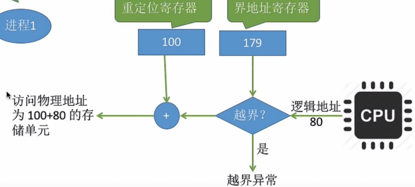

**小总结：**

.assets/image-20231010114411624.png)

### 2.2 实现内存空间的扩充

.assets/image-20231010115124792.png)

虚拟存储技术后面才会讲

#### 1）覆盖技术

.assets/image-20231010115243417.png)

> **覆盖技术**，用来**解决“程序大小超过物理内存总和”的问题**
>
> 覆盖技术的思想：将**程序分为多个段**（多个模块）常用的段常驻内存，不常用的段在需要时调入内存。
>
> 内存中分为**一个“固定区”**和**若干个“覆盖区”**。
>
> 需要**常驻内存的段放在“固定区”**中，**调入后就不再调出**（除非运行结束）**不常用的段放在“覆盖区”**，**需要用到时调入内存，用不到时调出内存**

.assets/image-20231010115422566.png)

> 例如A端需放入固定区
>
> B段和C段最多只能同时运行一个，所以只需要划分一个大者（10K）的覆盖区即可
>
> D段和E、F段也是如此，只需要划分一个12K的覆盖区即可
>
> **优点：**这样总内存大小8+8+10+12+4+10=52K的进程，只需要划分30K就可以运行
>
> **缺点：**必须由**程序员声明覆盖结构**，操作系统完成自动覆盖。**对用户不透明，增加了用户编程负担**。覆盖技术只用于**早期的操作系统**中，现在己成为历史。

#### 2）交换技术

.assets/image-20231010115947667.png)

> **交换（对换）技术**的设计思想：内存空间紧张时，系统**将内存中某些进程暂时换出外存**，把外存中某些已具备运行条件的进程**换入**内存（进程在内存与磁盘间动态调度）
>
> 即**中级调度**的应用：暂时换出外存等待的进程状态为**挂起状态（挂起态，suspend)**，挂起态又可以进一步细分为**就绪挂起、阻塞挂起**两种状态
> .assets/image-20231010120131057.png)

1. 应该在外存（磁盘）的什么位置保存被换出的进程？
   - 具有对换功能的操作系统中，通常把磁盘空间分为**文件区**和**对换区**两部分。**文件区主要用于存放文件，主要追求存储空间的利用率**，因此对文件区空间的管理**采用离散分配方式**：对换区空间只占磁盘空间的小部分，**被换出的进程数据就存放在对换区**。由于对换的速度直接影响到系统的整体速度，因此对换区空间的管理**主要追求换入换出速度**，因此通常对换区**采用连续分配方式**（学过文件管理章节后即可理解)。总之，**对换区的I/O速度比文件区的更快**。
2. 什么时候应该交换？
   - 交换通常在许多进程运行且**内存吃紧时进行**，而系统负荷降低就暂停。例如：在发现许多进程运行时经常发生缺页，就说明内存紧张，此时可以换出一些进程；如果缺页率明显下降，就可以暂停换出。
3. 应该换出哪些进程？
   - 可**优先换出阻塞进程**；可换出**优先级低**的进程；为了防止优先级低的进程在被调入内存后很快又被换出导致饥饿，有的系统还会**考虑进程在内存的驻留时间**

(注意：**PCB会常驻内存**，不会被换出外存)

#### 覆盖和交换的区别

.assets/image-20231010120643030.png)

> 覆盖是在**同一个**程序或进程中的，交换是在**不同**进程（或作业）之间的

### 2.3 实现内存空间的分配与回收

.assets/image-20231012144211986.png)

#### 2.3.1 连续分配管理方式

##### 1）单一连续分配

.assets/image-20231012144510835.png)

> 优点：实现简单，无外部碎片
>
> 缺点：有内部碎片，同一时间只能运行一个程序，内存利用率极低

##### 2）固定分区分配

.assets/image-20231012144653905.png)

.assets/image-20231012144816213.png)

> 分为两类：
>
> 1. 分区大小相等：缺乏灵活性，但适用于某些特定场景
> 2. 分区大小不等：增加了灵活性
>
> 优点：实现简单，无外部碎片
>
> 缺点：用户程序太大时不得不使用覆盖技术，会降低性能
> 	会产生内部碎片，内存利用率低

##### 3）动态分区分配

.assets/image-20231012144929411.png)

> 1.系统要用什么样的**数据结构**记录内存的使用情况？ 
>
> - 空闲分区表：每个空闲分区对应一个表项。表项中包含分区号分区大小、分区起始地址等信息
> - 空闲分区链：每个分区的起始部分和末尾部分分别设置前向指针和后向指针。起始部分处还可记录分区大小等信息
>   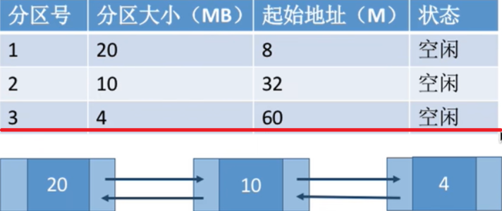
>
> 2.当很多个空闲分区都能满足需求时，应该**选择哪个分区**进行分配？ 
>
> - 把一个新作业装入内存时，须按照一定的**动态分区分配算法**，从空闲分区表（或空闲分区链）中选出一个分区分配给该作业。由于分配算法算法对系统性能有很大的影响，因此人们对它进行了广泛的研究。下个小节会介绍四种**动态分区分配算法**
>
> 3.如何进行分区的**分配与回收**操作？
>
> - 回收时**相邻的空闲区合并成一个**，若无相邻空闲区则自己成为一个空闲区

.assets/image-20231012145835251.png)

> 动态分区分配**没有内部碎片**，但是**有外部碎片**。（前面两种方法都是有内部碎片没有外部碎片）
>
> **内部碎片**：分配给某进程的内存区域中，如果有些部分没有用上。
> **外部碎片**：是指内存中的某些空闲分区由于太小而难以利用。
>
> 如何处理外部碎片？
> 可以通过**紧凑（拼凑，Compaction)技术**来解决外部碎片。例如把使用到的内存块向小地址方向整理到一起

##### 小总结

.assets/image-20231012145933335.png)

#### 2.3.2 四种动态分区分配算法

.assets/image-20231012150022466.png)

##### 1）首次适应算法

.assets/image-20231012151606649.png)

> 首次适应算法：空闲区的大小排序是**无序**的，从**低地址依次向高地址**查找，直到找到**第一个满足要求**的空闲分区

##### 2）最佳适应算法

.assets/image-20231012151912854.png)

> 最佳适应算法：空闲分区**按容量递增次序链接**，每次分配内存时顺时针查找到满足要求的第一个空闲分区，即**刚好满足要求的第一个分区**
>
> 会对空闲分区进行重新排序
>
> **缺点：每次都选最小的分区进行分配，会留下越来越多的、很小的、难以利用的内存块。因此这种方法会产生很多的外部碎片。**

##### 3）最坏适应算法

.assets/image-20231012152338647.png)

> 最坏适应算法：空闲分区**按容量递减次序链接**。每次分配内存时顺序查找空闲分区链（或空闲分区表)，找到大小能满足要求的第一个空闲分区，即**优先使用此时最大的空闲分区**
>
> 会对空闲分区进行重新排序
>
> **缺点**：每次都选最大的分区进行分配，虽然**可以让分配后留下的空闲区更大**，更可用，但是这种方式会**导致较大的连续空闲区被迅速用完**。如果之后有“**大进程”到达，就没有内存分区可用了**。

##### 4）邻近适应算法

.assets/image-20231012153310634.png)

> 邻近适应算法：和首次适应算法一致，**不对空闲分区的容量进行排序**，但是将其首尾相连构成**循环链表**，每次分配内存时**从上次查找结束的位置开始**查找空闲分区链（或空闲分区表），找到大小能**满足要求的第一个**空闲分区。
>
>  
>
> 和首次适应算法的**区别**：
>
> - 首次适应算法每次都要从头查找，每次都需要检索低地址的小分区。
> - 邻近适应算法的规则可能会导致无论低地址、高地址部分的空闲分区都有相同的概率被使用，也就导致了高地址部分的大分区更可能被使用，划分为小分区，最后导致无大分区可用（最大适应算法的缺点）

##### 小总结

.assets/image-20231012153319093.png)

 

