#  二 操作系统的运行机制

> author: spongehah from:hut
>
> 作者个人博客：https://blog.hahhome.top/
>
> 参考视频: B站王道考研计算机操作系统

[TOC]

# 1 预备知识

## 1.1 内核程序和应用程序

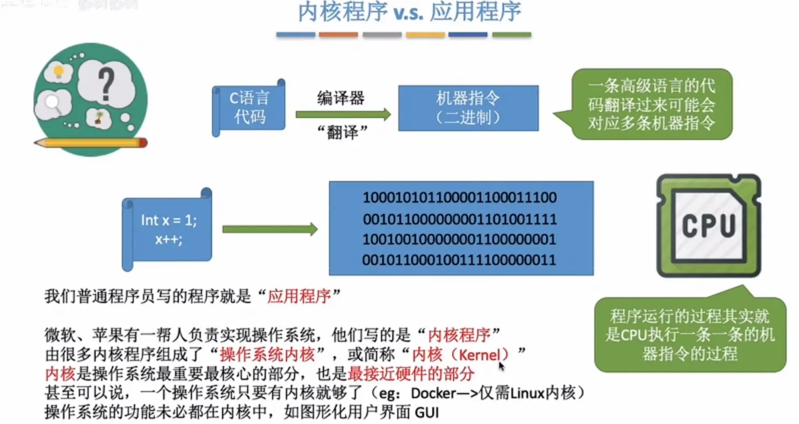

## 1.2 程序是如何运行的

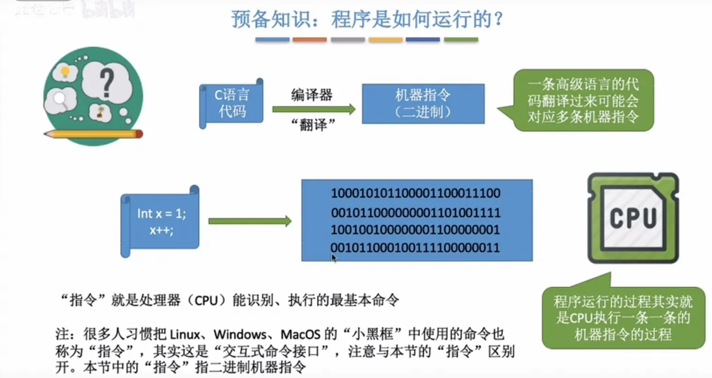

## 1.3 特权指令与非特权指令

> 只有**内核程序**才能调用特权指令，而**应用程序**只能调用非特权指令

## 1.4 内核态和用户态

### ★内核态和用户态的切换

> **刚开机，CPU为内核态**，想要切换为用户态，执行内核程序中的一条**特权指令**，将CPU切换为**用户态**，才能运行应用程序

**当应用程序被篡改含有特权指令时怎么办？**

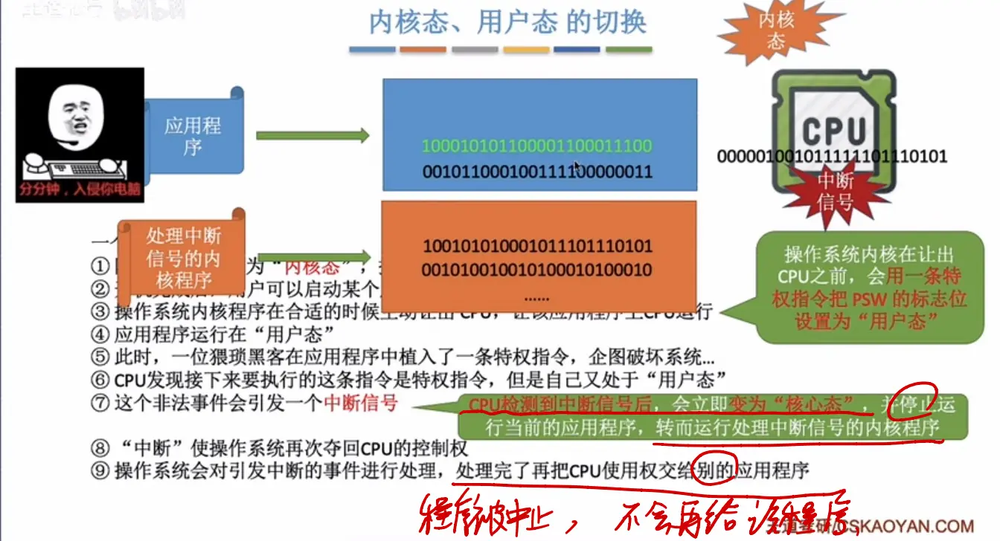

> 应用程序含有**假特权指令**时，CPU**识别**出该指令为特权指令，但是又判断自己处于**用户态**，于是会发出一个**中断信号**，**强制**将状态**变回核心态**夺回CPU控制权，然后**终止**该应用程序的运行，将CPU分配给其它程序

## 1.5 小总结

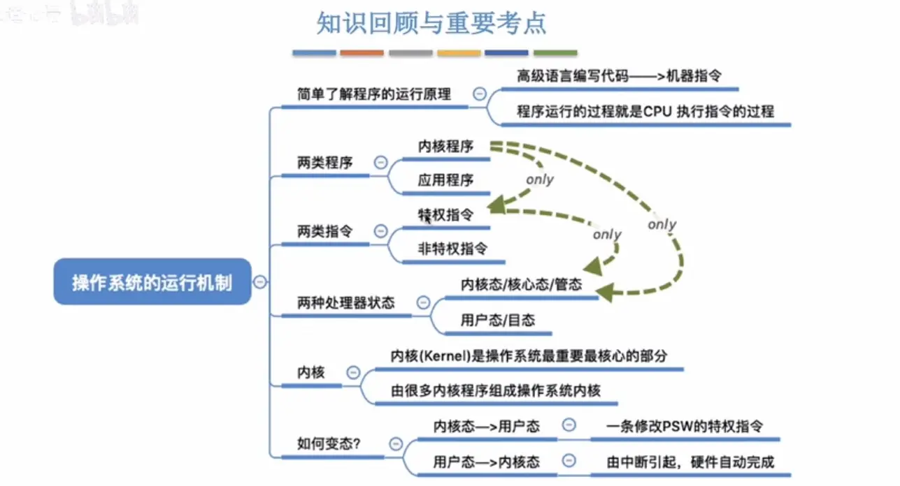

# 2 中断和异常

## 2.1 中断的作用

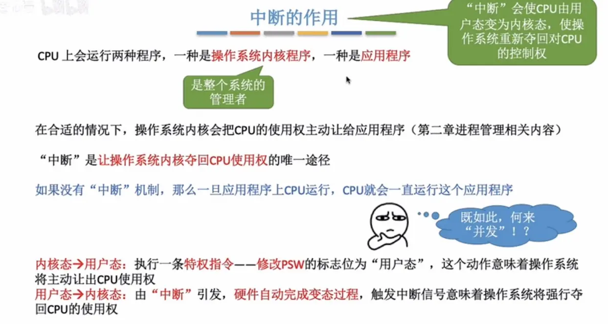

>作用：“**中断**”是让操作系统内核夺回CPU使用权的**唯一途径**
>如果没有“中断”机制，那么一旦应用程序上CPU运行，CPU就会一直运行这个应用程序（**实现并发**）

## 2.2 中断的分类

> 1. 内中断	也叫**异常**
> 2. 外中断	俗称**中断**，狭义上的中断

### 1）内中断（异常）

**与当前执行的指令有关，中断信号来源于CPU内部**

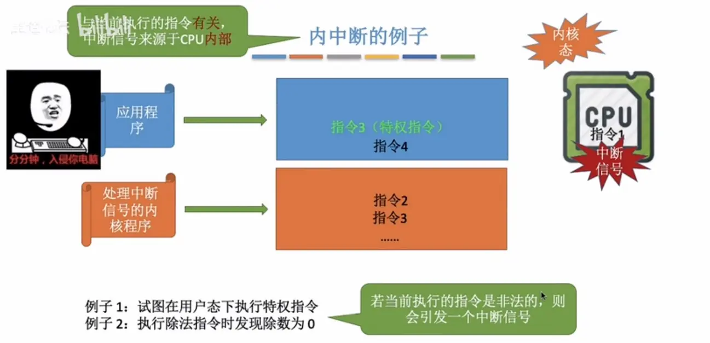

> 例1：即预备知识中	★内核态和用户态的切换  部分的举例
>
> 例2：非法的
>
> 例3：**陷入指令**（也叫`Trap指令`，`访管指令`）是非特权指令，是**实现系统调用**的途径（后面会讲）
>
> 时刻记住“**中断**”是让操作系统内核夺回CPU使用权的**唯一途径**

### 2）外中断（中断）

狭义上的中断

**与当前执行的指令无关，中断信号来源于CPU外部**

> 例1：**实现并发运行**；在时钟部件每隔一个固定**时间片**，就会发出一个**外部中断信号**，让CPU执行处**理时钟中断的内核程序**后执行**另一个**应用程序
>
> 例2：设备的中断信号，告诉CPU任务完成

## 2.3 中断机制的基本原理

> 中断向量表

## 2.4 中断的处理过程

1. 关中断（硬件完成）：CPU响应中断后，应该拒绝响应更高级的中断源的中断请求
2. 保存断点（硬件完成）：为了之后能重新恢复执行这个程序，需要将原来的程序的断点（即程序计数器C)保存起来
3. 中断服务程序寻址（硬件完成）：取出中断服务程序的入口地钟址送到程序计数器PC
4. 保存现场和屏蔽字（中断程序完成）：进入程序中断服务程序后，首先要保护现场，现场信息一般是指程序状态字寄存器PSW和某些通用寄存器的内容
5. 开中断（中断程序完成）：允许更高级中断请求得到响应，想象一下多道程序设计的并发执行，CPU交替执行内存里面的各个程序
6. 执行中断服务程序（中断程序完成）：这是中断请求的目的，完成某些中断后的操作
7. 关中断（中断程序完成）：保证在恢复现场和屏蔽字时不被中断，完成中断后的提作之后，需要恢复现场，不希望被打扰
8. 恢复现场和屏蔽字（中断程序完成）：将现场和屏蔽字恢复到原来的状态
9. 开中断->中断返回（中断程序完成）：中断服务程序的最后一条指令通常是一条中断返回指令，使其返回到原程序的断点处，以便继续执行原程序

## 2.5 小总结

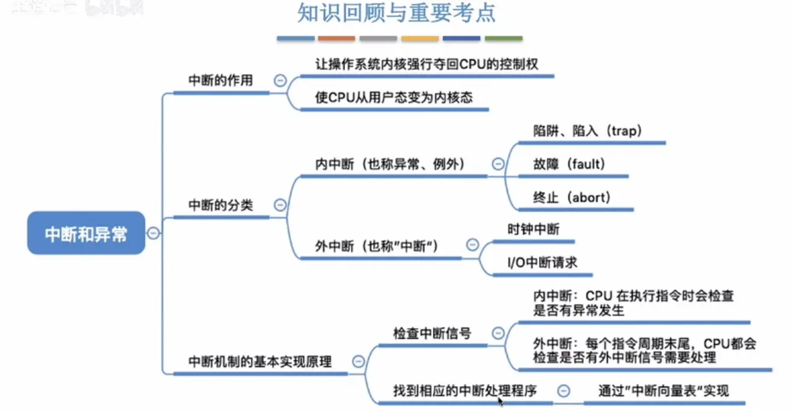

# 3 系统调用

## 3.1 什么是系统调用

>程序接口，即**系统调用**，用户通过程序间接调用，**应用程序可以通过系统调用来请求获得操作系统内核的服务**

## 3.2 系统调用的用途

> 要实现系统调用需要通过**陷入指令**

## 3.3 系统调用的过程

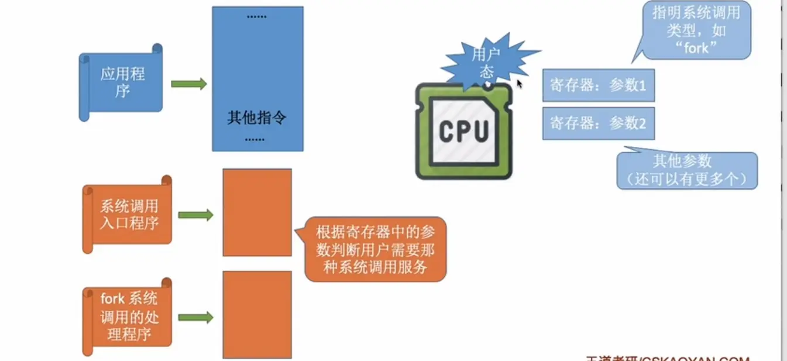

> **系统调用的过程：**
>
> 1 应用程序会先进行**传参**（系统调用时会使用到的参数）
>
> 2 应用程序执行**陷入指令**（也叫`Trap指令`，`访管指令`），主动将CPU控制权还给操作系统，并执行**系统调用的入口程序**
>
> 3 根据**参数**处理系统调用的内核程序（发生在**内核态**）

## 3.4 小总结

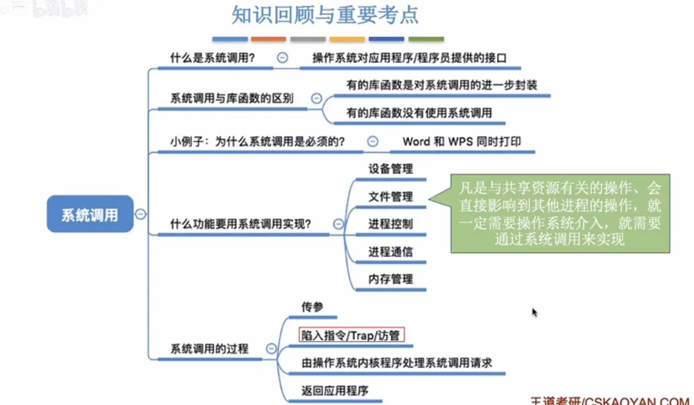

# 4 操作系统的体系结构

## 4.1 操作系统的内核

## 4.2 大内核与微内核

> 大内核即包含了进程管理、存储器管理、设备管理等**不会直接涉及硬件**的功能
>
> 微内核只包含**与硬件关联较紧密的模块**

### 大内核与微内核的对比（优缺点）

> 大内核：`性能高`，**但是结构混乱，难以维护**
>
> 微内核：**性能低**，`但是结构清晰，方便维护`

## 4.3 其它体系结构

> 带黄色星号代表旧重点，红色星号表示新重点

### 1）分层结构

优点：

- ★1.便于调试和验证，自底向上逐层调试验证
- 2.易扩充和易维护，各层之间调用接口清晰因定

缺点：

- 1.仅可调用相邻低层，难以合理定义各层的边界
- ★2.效率低，不可跨层调用，系统调用执行时间长

### 2）模块化

优点：

- 1模块间逻辑清涵易于维护，确定模块偏接口后即可多模块同时开发
- ★2.支持动态加载新的内核模块（如：安装设备驱动程序、安装新的文件系统模块到内核)，增强OS适应性
- ★3.任何模块都可以直接调用其他模块，无需深用消息传递进行通信，效事高

缺点：

- 1.模块间的接口定义未必合理、实用
- 2.模块间相互依懒，更难调试和验证

### 3）外核

优点：

- ★1.外核可直接给用户进程分配“不虚拟、不抽象”的硬件资源，使用户进程可以更灵话的使用硬件资源
  - 应用程序可以向外核申请连续的存储空间（就不用再寻址进行随机访问），并维护这个空间
- ★2.减少了虚拟硬件资源的“映射层”，提升效率
  - 就不用再寻址进行随机访问

缺点：

- 1.降低了系统的一致性
- 2.使系统变得更复余
  - 维护连续空间有额外开销，需要不允许该程序访问分配空间外的地址，也不允许其它程序访问分配空间内的地址

# 5 操作系统引导

- 什么是操作系统引导
- 磁盘里边有哪些相关数据？
- 操作系统引导的过程

操作系统引导(boot)一一开机的时候，怎么让操作系统运行起来？

## 5.1 开机的时候，怎么让操作系统运行起来？

**安装操作系统之后：**

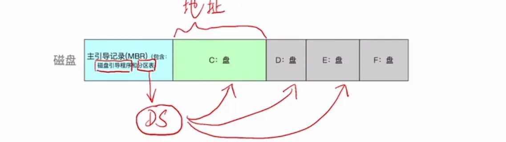

> 安装好操作系统分好区后，磁盘表现为以上形式

## 5.2 开机过程

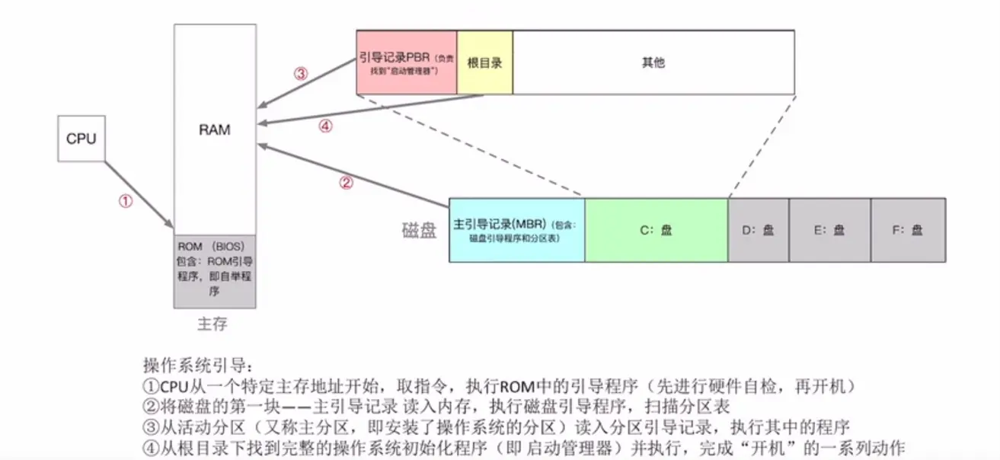

> 1 ROM中的记录是**永久**的，不会随着断电消失，开机时首先取指令，执行BIOS中的**ROM引导程序**
>
> 2 将磁盘主引导记录MBR读到内存RAM，执行**磁盘引导程序**，扫描**分区表**
>
> 3 从**活动分区**（又称主分区，即安装了操作系统的分区，即C盘）读入分区引导记录，执行其中的程序
>
> 4 从根目录下找到完整的**操作系统初始化程序**（即启动管理器）并执行，完成“开机”的一系列动作

Windows举例：

# 6 虚拟机

传统计算机：

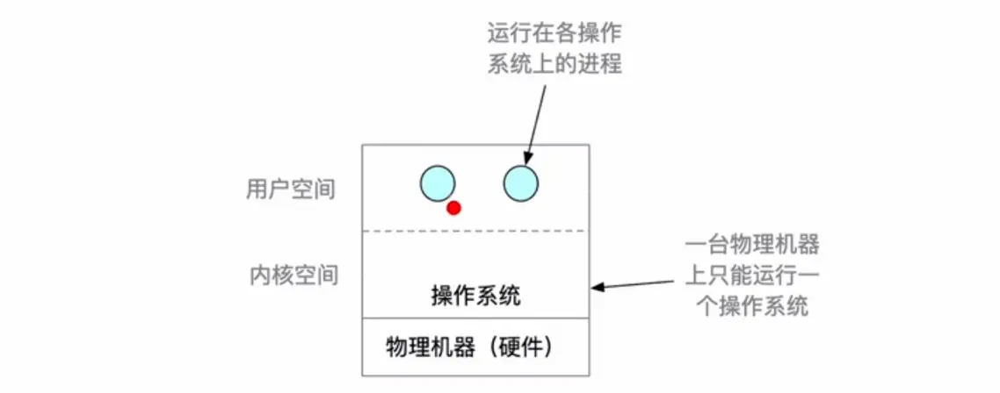

## 6.1 两类虚拟机

> 两类虚拟机：
>
> - 直接运行在硬件上
> - 运行在宿主操作系统上

