#  三 进程与处理机管理

> author: spongehah from:hut
>
> 作者个人博客：https://blog.hahhome.top/
>
> 参考视频: B站王道考研计算机操作系统

[TOC]

# 1 进程描述

## 1.1 进程的概念

>程序：是静态的，就是个存放在磁盘里的可执行文件，就是一系列的指令集合。
>
>进程(Process)：是动态的，是程序的一次执行过程

## 1.2 进程的组成

1. 进程控制块PCB
2. 程序段
3. 数据段

**1）进程控制块PCB**

**2）程序段和数据段**

**程序是如何运行的**

> **进程实体**是进程某一时刻的**快照**

## 1.3 进程的特征

## 1.4 进程间的关系结构

> 进程间的关系是**树形结构**

## 1.5 小总结

1. 动态性：进程的最基本特性
2. 并发性
3. 独立性：**进程是能独立运行、独立获得资源、独立接受调度的基本单位**（后面会说线程是调度的基本单位，进程是获得资源的基本单位）
4. 异步性：各进程以不可预知的速度向前推进，可能导致运行结果的不确定性
5. 结构性

# 2 进程的状态与状态转换

## 2.1 进程的状态

### 1）创建态、2）就绪态

> 创建态：创建过程中
>
> 就绪态：除CPU以外其它所有条件都已满足

### 3）运行态

> 就绪态进程获取CPU后，进入运行态

### 4）阻塞态

> 当**运行态**的进程想要某种**系统资源或设备**但暂时**无法提供**时，就会进入**阻塞**态，CPU分配给其它进程
>
> 想要代表是进程**主动**的

**阻塞态转换为就绪态**

> 当阻塞态想要的资源**空闲**时，可分配给当前进程，那么当前进程就可以恢复为**就绪态**
>
> 当前进程是**被动**的

### 5）终止态

> 进程执行exit系统调用后，该进程进入**终止态**，并下CPU，回收资源和PCB

## 2.2 进程状态的转换

> 就绪态和运行态能够相互转换，如当时间片到，或处理机被抢占都会导致运行态转换为就绪态
>
> 但是就绪态不能转换为阻塞态，阻塞态也不能转换为运行态
>
> 根据状态标志位**state**判断进程所处的状态

## 2.3 进程的组织

### 1）链接方式

有时阻塞队列还可以细分：

### 2）索引方式

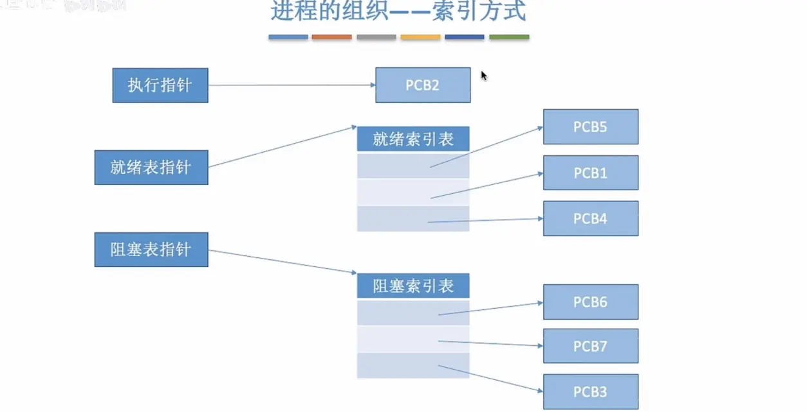

## 2.4 小总结

# 3 进程控制

## 3.1 什么是进程控制？

>进程控制的主要功能是对系统中的所有进程实施有效的管理，它具有 创建新进程 、撤销己有进程、实现进程状态转换 等功能。
>
>简化理解：进程控制就是要**实现进程状态转换**

## 3.2 如何实现进程控制？

> 用**原语**实现
>
> 原语是一种特殊的程序，是操作系统内核的一部分；它的执行具有**原子性**也就是说，这段程序的运行必须一气呵成，不可中断

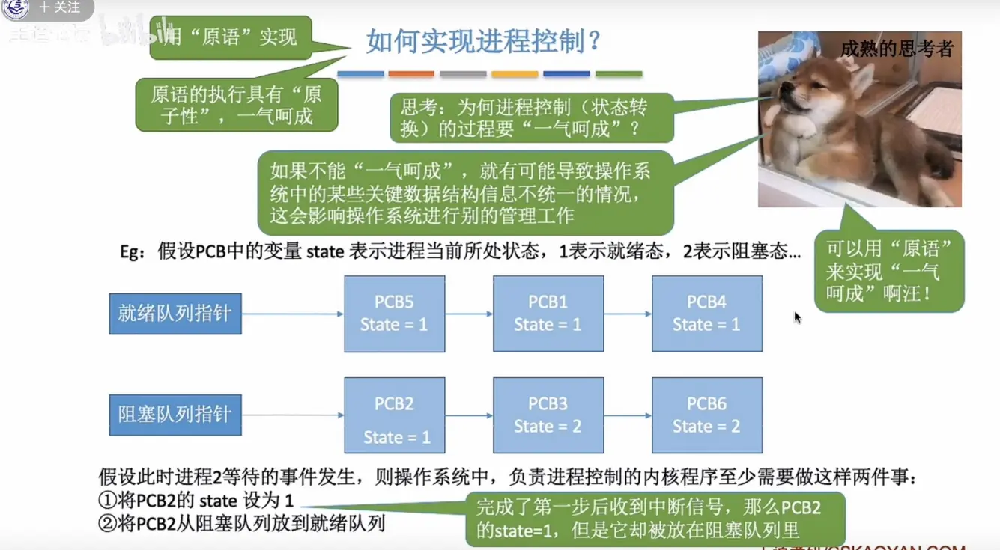

>如上图，若是有中断信号，将会被中断信号中断，若是进程控制时不能一气呵成，那么操作系统将出现巨大问题，所以必须需要原语能够保证**原子性**，那么原语是如何保证原子性的呢？

## 3.3 如何实现原语的原子性？

**正常情况下：**

> 正常情况下：如果没有原语，那么将会被中断信号中断

**有原语的情况下：**

>内核程序执行原语的时候，会先执行一个**关中断指令**，停止检测中断信号；执行完原语后才会执行**开中断指令**，继续检测中断信号；
>
>若执行原语时有中断信号，则执行完开中断指令后在进行处理

## 3.4 进程控制相关的原语

### 1）进程创建的相关原语

### 2）进程的终止相关原语

### 3）进程的阻塞和唤醒相关原语

### 4）进程的切换相关原语

#### 补充：程序是如何运行的？- 了解寄存器

> **寄存器**即CPU用来存储数据的地方

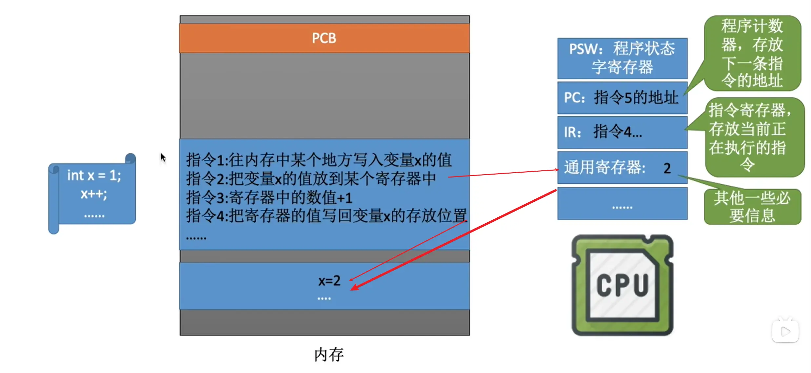

> PSW：程序状态字寄存器
>
> PC：程序计数器，存放下一个指令的地址
>
> IR：指令寄存器，存放当前正在执行的指令
>
> 通用寄存器：存放其它一些必要信息
>
> 
>
> eg：执行程序x++，对应如图四条指令
>
> ​	中间结果就放在了通用寄存器

#### 如何知道切换回来的进程运行到哪了？

**思考**：执行完指令3后，另一个进程开始上CPU运行；
注意：另一个进程在运行过程中也会使用各个寄存器，这种情况该怎么办？

**解决办法**：在进程切换时先`在PCB中保存这个进程的运行环境`(保存一些必要的寄存器信息)

> 即**切换原语**中的 保存运行环境 和 恢复运行环境

保存的信息：

- PSW：xxxxx
- PC：指令4的地址
- 通用寄存器：2

## 3.5 小总结

# 4 进程通信

## 4.1 什么是进程间通信

**进程间通信**(Inter-Process Communication,**IPC**)是指两个进程之间产生数据交互。

## 4.2 进程间通信必须通过操作系统

> 每个进程只能访问自己的内存空间，不能直接访问其它进程的内存空间，因为不安全

## 4.3 进程通信的方式

1. 共享存储
2. 消息传递
3. 管道通信

### 1）共享存储

> 发起进程共享的进程申请一片共享内存区
>
> 通过mmap系统调用，将共享内存区映射到进程自己的地址空间
>
> - 实现方式：通过“增加 页表项 / 段表项 ”即可将同一片共享内存区映射到各个进程的地址空间中（第三章内容)，页表项 / 段表项存储共享存储区的**映射地址**
>
> 
>
> 共享存储有两种实现方式：
>
> - 基于**数据结构**的共享
> - 基于**存储区**的共享

- 基于**数据结构**的共享：比如共享空间里只能放一个长度为10的数组。这种共享方式**速度慢、限制多**，是一种**低级**通信方式
- 基于**存储区**的共享：操作系统在内存中划出一块共享存储区，数据的形式、存放位置都由通信进程控制，而不是操作系统。这种共享方式速度很快，是一种**高级**通信方式。

### 2）消息传递

进程间的数据交换以**格式化的消息**(Message)为单位。进程通过操作系统提供的“发送消息/接收消息”两个**原语**进行数据交换。

消息传递：

- 直接通信方式：消息发送进程要指明接收进程的ID

- 间接通信方式：通过“信箱”间接地通信。因此又称“信箱通信方式”

#### ①直接通信方式：

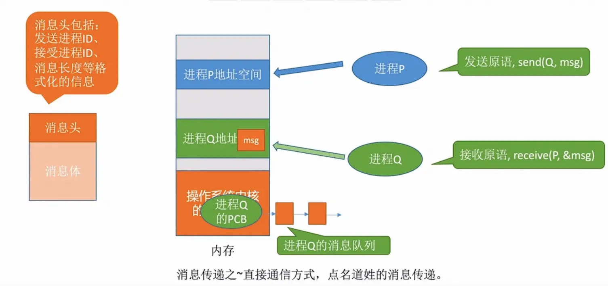

> 进程P直接**指明**要发送给进程Q，使用**send原语**发送
>
> 在操作系统内核的地址空间暂时存储在消息队列里
>
> 进程Q使用**receive原语**接收消息

#### ②间接通信方式（信箱通信方式）

> 指明信箱使用send原语发送至对应信箱
>
> 使用receive原语接收指定信箱的消息

### 3）管道通信

> 管道通信是创建一个特殊的共享文件，名为**管道文件**，**和共享存储类似**，只是共享存储分配的区域是**随意使用**的，而管道通信的管道文件类似于一个**FIFO的循环队列**
>
> 1. 管道只能采用**半双工通信**，某一时间段内只能实现单向的传输。如果要实现**双向同时通信**，则**需要设置两个管道**。
> 2. 各进程要**互斥**地访问管道（由操作系统实现）
> 3. 当**管道写满**时，**写进程**将**阻塞**，直到读进程将管道中的数据取走，即可唤醒写进程。
> 4. 当**管道读空**时，**读进程**将**阻塞**，直到写进程往管道中写入数据，即可唤醒读进程。
> 5. 管道中的数据一旦被读出，就彻底消失。因此，当多个进程读同一个管道时，可能会错乱。对此，通常有两种解决方案：①**一个管道允许多个写进程，一个读进程**（2014年408真题高教社官方答案)；②允许有**多个写进程，多个读进程**，但系统会让各个读进程轮流从管道中读数据(Linux的方案)。

## 4.4 小总结

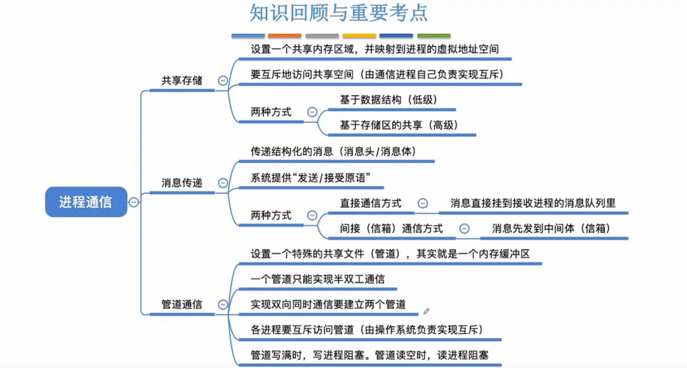

#  

# 5 线程的描述

## 5.1 线程的概念

### 1）什么是线程，为什么要引入线程？

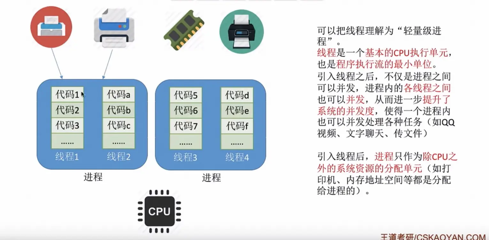

> 可以把线程理解为“轻量级进程”
>
> **线程**是一个**基本的CPU执行单元**，也是**程序执行流的最小单位**。引入线程之后，不仅是进程之间可以并发，进程内的**各线程之间**也可以**并发**，从而进一步**提升了系统的并发度**，使得一个进程内也可以并发处理各种任务（如QQ视频、文字聊天、传文件)
>
> 
>
> **传统的进程**是程序执行流的最小单位
>
> **引入线程后，进程只作为除CPU之外的系统资源的分配单元**（如打印机、内存地址空间等都是分配给进程的)
>
> **引入线程后，线程成为了程序执行流的最小单位，是CPU调度的最小单位**

### 2）引入线程机制后，有什么变化？

**传统进程**机制中，进程是资源分配、调度的基本单位

**引入线程**后，进程是**资源分配**的基本单位，线程（内核线程，非用户线程，后面讲）是**调度**的基本单位

### 3）线程的属性（特征）

## 5.2 线程的实现方式和多线程模型

### 1）线程的实现方式

#### ①用户级线程（早期）

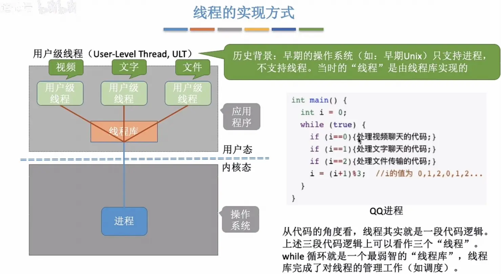

很多编程语言提供了强大的线程库，可以实现线程的创建、销毁、调度等功能。
1.线程的管理工作由谁来完成？
2.线程切换是否需要CPU变态？
3.操作系统是否能意识到用户级线程的存在？
4.这种线程的实现方式有什么优点和缺点？

>**解答：**
>
>1.用户级线程由应用程序通过线程库实现，所有的**线程管理工作**都由**应用程序负责**（包括线程切换) 
>
>2.用户级线程中，**线程切换**可以在**用户态下即可完成**，无需操作系统干预。 
>
>3.在用户看来，是有多个线程。但是在操作系统内核看来，并**意识不到**线程的存在。“**用户级线程**”就是“**从用户视角看能看到的线程**” 
>
>4.优缺点
>
>- 优点：用户级线程的切换在用户空间即可完成，**不需要切换到核心态，线程管理的系统开销小，效率高**
>- 缺点：当一个用户级线程被阻塞后，整个进程都会被**阻塞，并发度不高**。多个线程在多核处理机上**不可并行运行**

#### ②内核级线程

1.线程的管理工作由谁来完成？
2.线程切换是否需要CPU变态？
3.操作系统是否能意识到内核级线程的存在？
4.这种线程的实现方式有什么优点和缺点？

> 1.**内核级线程的管理工作**由**操作系统内核**完成。 
>
> 2.线程调度、切换等工作都由内核负责，因此**内核级线程的切换**必然需要在**核心态**下才能完成 
>
> 3.操作系统会为每个内核级线程建立相应的 TCB(Thread Control Block,线程控制块)，通过TCB对线程进行管理。“**内核级线程**”就是“**从操作系统内核视角看能看到的线程**”
>
> 4.优缺点
>
> - 优点：当一个线程被阻塞后，别的线程还可以**继续执行，并发能力强**。多线程可在**多核处理机上并行执行**。
> - 缺点：一个用户进程会占用多个内核级线程，线程切换由操作系统内核完成，**需要切换到核心态，因此线程管理的成本高，开销大**。

### 2）多线程模型

#### ①一对一模型

即前面的内核级线程

#### ②多对一模型

> 和**用户级线程基本一致**，唯一不同就是**操作系统看得见**
>
> 操作系统只“看得见”内核级线程，因此**只有内核级线程才是处理机分配的单位**。

#### ③多对多模型

> 兼顾一对一和多对一的优点

### 小总结

## 5.3 线程的状态与转换

## 5.4 线程的组织与控制

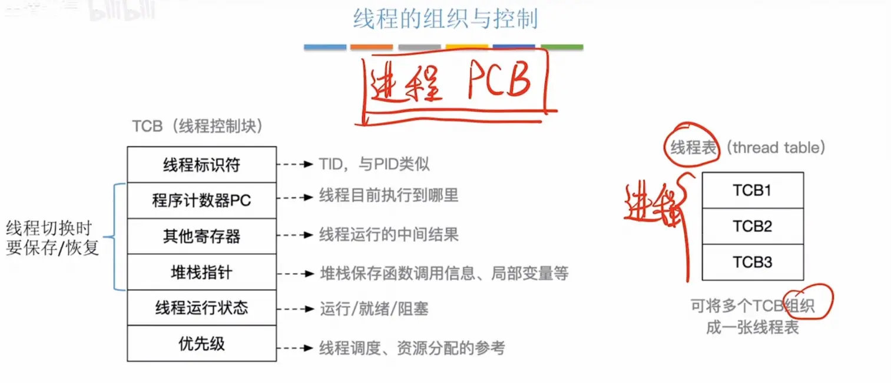

> 和进程的组织和控制类似，上左图为线程控制块包含的重要部分
>
> 线程的组织是采用**表**的方式，可以是以一个进程为单位，将该进程所有的TCB放入一张表中

# 6 处理机调度

## 6.1 处理机调度的概念、层次

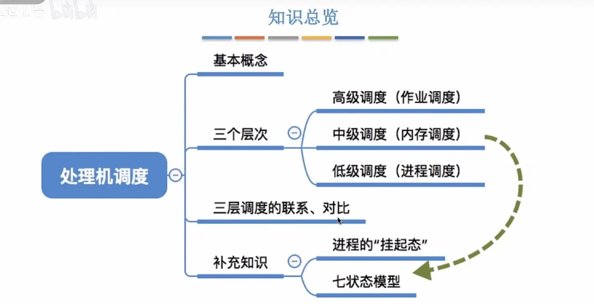

### 1）调度的基本概念

当有一堆任务要处理，但由于资源有限，这些事情没法同时处理。这就需要确定**某种规则**来**决定**处理这些任务的**顺序**，这就是“调度”研究的问题。

### 2）调度的三个层次

#### ①高级调度（作业调度）

>**高级调度（作业调度）**。按一定的原则从外存的作业后备队列中挑选一个作业调入内存，并创建进程。**每个作业只调入一次，调出一次**。作业调入时会建立PCB调出时才撤销PCB。
>
>**频率很低**

#### ②低级调度（进程调度）

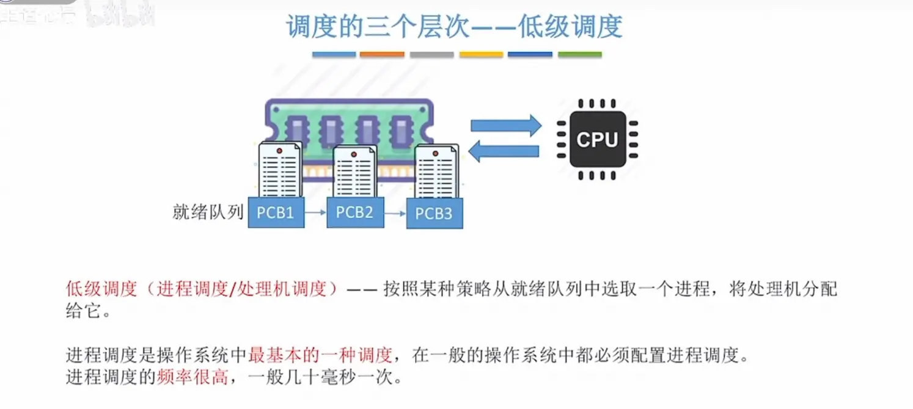

>**低级调度（进程调度/处理机调度）**————按照某种策略从就绪队列中选取一个进程，将处理机分配给它。进程调度是操作系统中**最基本的一种调度**，在一般的操作系统中都必须配置进程调度。进程调度的**频率很高**，一般几十毫秒一次。

#### ③中级调度（内存调度）

> 内存不够时，可将某些进程的数据**调出到外存**。等内存空闲或者进程需要运行时再重新调入内存。
>
> 暂时调到外存等待的进程状态为挂起状态。被挂起的进程PCB会被组织成挂起队列
>
> **中级调度（内存调度）**一一按照某种策略决定将哪个处于挂起状态的进程重新调入内存。一个进程可能会被多次调出、调入内存，因此中级调度发生的频率要比高级调度更高。**频率中等**

### 3）进程挂起态与七状态模型

>**挂起**态是将进程映像调到**外存**去了，而**阻塞**态下进程映像还在**内存**中

### 小总结

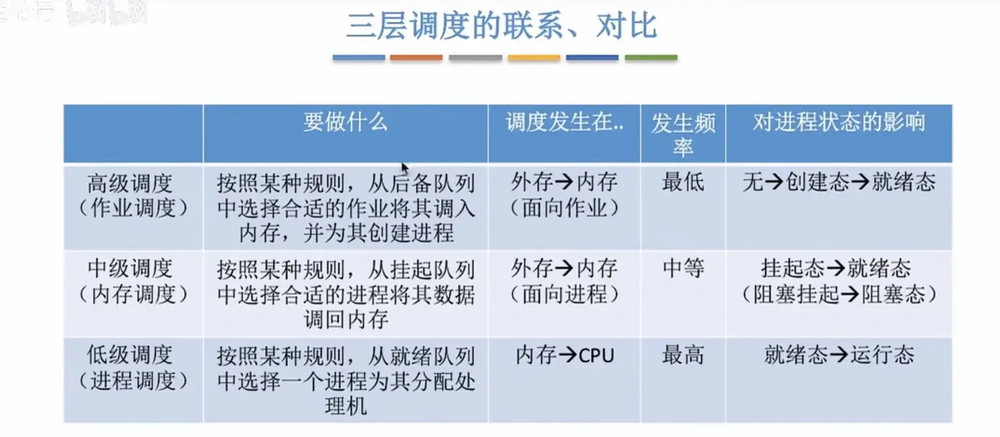

## 6.2 进程调度（低级调度）的时机、方式、切换与过程

### 1）进程调度的时机

> **进程调度**（低级调度），就是按照某种算法从就绪队列中选择一个进程为其分配处理机。
>
> - **需要进行**进程调度与切换的情况：
>   - 进程**主动**放弃
>     - 进程正常终止
>     - 运行过程中发生**异常**而终止
>     - 进程主动请求**阻塞**（如等待I/O)
>   - 进程**被动**放弃
>     - 分给进程的**时间片用完**
>     - 有更**紧急**的事需要处理（如I/O中断）
>     - 有更**高优先级**的进程进入就绪队列
>
> - **不能进行**进程调度与切换的情况：
>   1. 在**处理中断的过程中**。中断处理过程复杂，与硬件密切相关，很难做到在中断处理过程中进行进程切换。
>   2. 进程在操作系统**内核程序临界区**中。
>   3. 在**原子操作过程中**（原语）。原子操作不可中断，要一气呵成（如之前讲过的修改PCB中进程状态标志，并把PCB放到相应队列)
>
> 
>
> 针对不能进行的第二点，**注意**区分临界区和内核临界区：
>
> 
>
> 注意区分**内核临界区**和**临界区**
>
> - 临界资源：一个时间段内只允许一个进程使用的资源。各进程需要互斥地访问临界资源。
>   - **临界区**：访问临界资源的那段代码，比如**IO设备**。
> - **内核程序临界区**一般是用来访问某种内核数据结构的，比如进程的**就绪队列**（由各就绪进程的PCB组成)
>
> **在临界区是可以进行进程调度的**

### 2）进程调度的方式

>- **非剥夺调度方式**，又称**非抢占方式**。即，只允许进程主动放弃处理机。在运行过程中即便有更紧迫的任务到达，当前进程依然会继续使用处理机，直到该进程终止或主动要求进入阻塞态。
>- **剥夺调度方式**，又称**抢占方式**。当一个进程正在处理机上执行时，如果有一个更重要或更紧迫的进程需要使用处理机，则立即暂停正在执行的进程，将处理机分配给更重要紧迫的那个进程。

### 3）进程的切换与过程

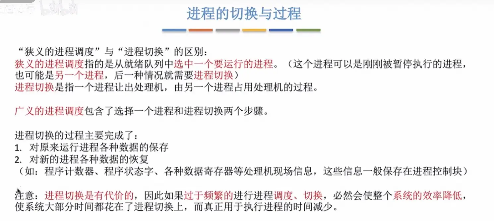

> 狭义的进程调度：从就绪队列**选中**一个要运行的进程
>
> 进程切换：使一个进程**让出**处理机，由另一个进程**占用**处理机的过程。（涉及到PCB的保存与恢复）
>
> 
>
> **广义的进程调度** = 狭义的的进程调度 + 进程切换
>
> 进程切换都是**有代价**的

### 小总结

## 6.3 调度器、评价指标、调度算法

### 1）调度器/调度程序、闲逛进程

> ②和③的转换由调度程序决定
>
> 决定因素：调度算法和时间片大小

**闲逛进程：**

> 闲逛进程就是当**没有就绪队列时运行的进程**，**优先级最低，能耗低**，每运行一个完整的指令周期，都会例行检查有没有中断，看是否需要发生进程调度

### 2）调度算法的评价指标

> 1. CPU利用率
> 2. 系统吞吐量
> 3. 周转时间
> 4. 平均周转时间
> 5. 带权周转时间
> 6. 带权平均周转时间
> 7. 等待时间
> 8. 响应时间

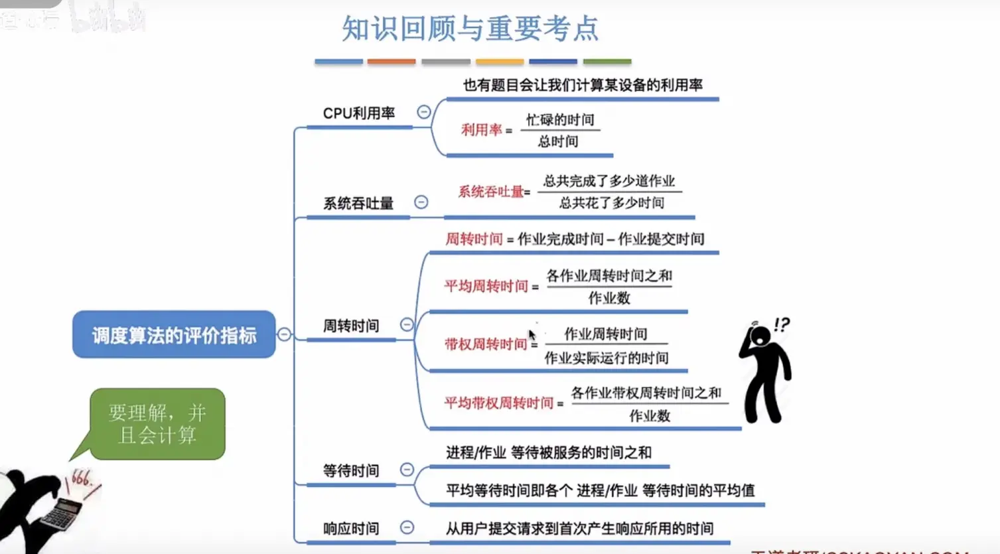

### 3）调度算法

#### ①先来先服务FCFS

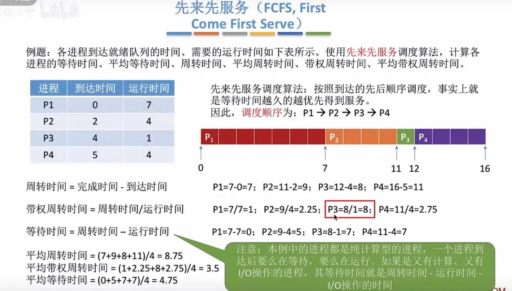

#### ②短作业优先SPF

#### ③最短剩余时间优先SRTN

> 未说明时，**默认是非抢占式的**，注意图中严格来说部分

#### ④高相应比优先HRRN

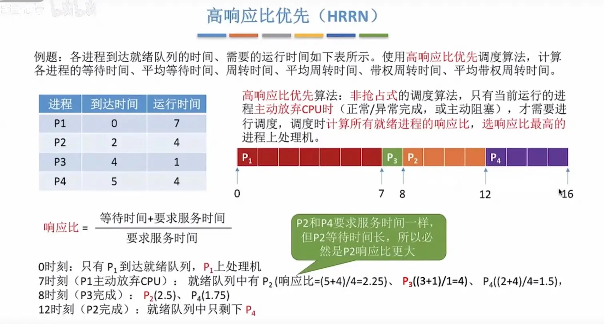

> 非抢占式的，**需要等运行完当前进程后才进行一次相应比计算**

#### 前四种算法小总结

> 不关心响应时间，不区分任务紧程度，适合用于早期的批处理系统

#### ⑤时间片轮转RR

**时间片大小为2时：**

**时间片大小为5时：**

**两种时间片大小对比：**

> 一般来说，设计时间片时要让切换进程的开销占比**不超过1%**

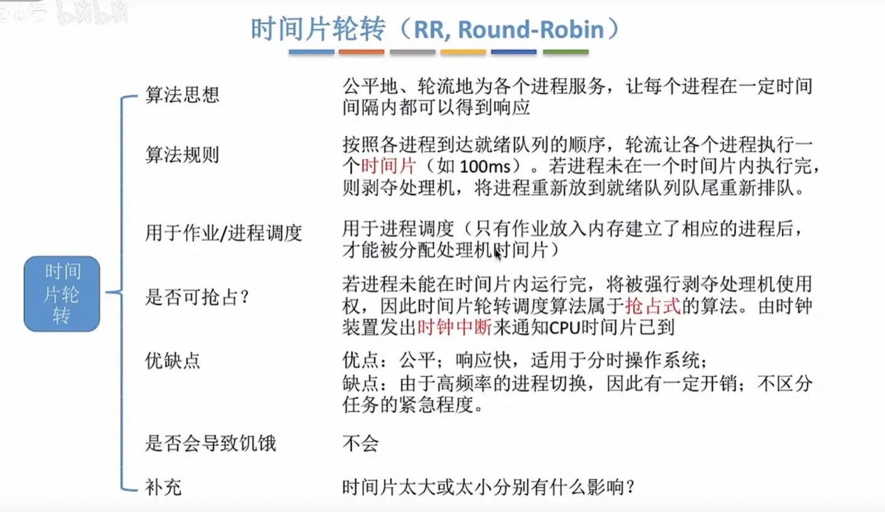

#### ⑥优先级调度算法

**非抢占式：**

**抢占式：**

> 通常：
>
> - 系统进程优先级**高于**用户进程
> - 前台进程优先级**高于**后台进程
> - 操作系统更**偏好I/O型进程**（或称I/O繁忙型进程）
>   注：与I/O型进程相对的是计算型进程（或称CPU繁忙型进程）

#### ⑦多级反馈队列调度算法

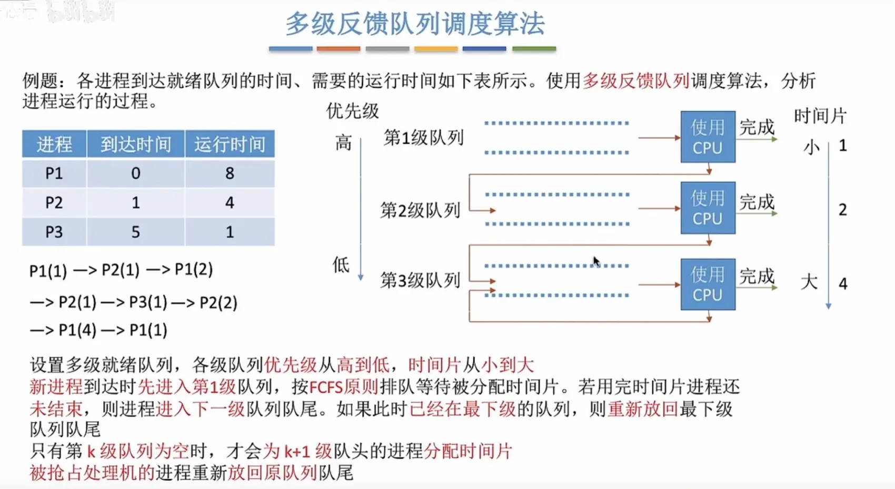

#### 后三种算法小总结

#### ⑧多级队列调度算法

> 每个进程按照分类进入对应的分类，
> 每个队列可以按照固定优先级或者时间片划分的方式进行调度
> 每个队列内部可以采用不同的其它调度算法

# 7 进程同步与进程互斥

## 7.1 进程同步的概念

> 知识点回顾：进程具有**异步性**的特征。异步性是指，**各并发执行的进程以各自独立的、不可预知的速度向前推进**。
>
> 进程同步：为了解决进程的异步带来的不确定顺序，**制约多个进程协调他们的工作次序**

## 7.2 进程互斥的概念

> 回顾：操作系统的特征：共享
>
> 我们把**一个时间段内只允许一个进程使用**的资源称为**临界资源**。如IO设备
>
> **进程互斥**指当一个进程访问某临界资源时，另一个想要访问该临界资源的进程必须等待。当前访问临界资源的进程访问结束，释放该资源之后，另一个进程才能去访问临界资源。

### 1）进程互斥的组成部分

> - 进入区：负责检查是否可进入临界区，若可进入，则应设置正在访问临界资源的标志（可理解为“上锁”)，以阻止其他进程同时进入临界区
> - 临界区：访问临界资源的那段代码
> - 退出区：负责解除正在访问临界资源的标志（可理解为“解锁”）
> - 剩余区：做其它处理

### 2）进程互斥要遵循的四个原则

> 1. 空闲让进。临界区空闲时，可以允许一个请求进入临界区的进程立即进入临界区；
> 2. 忙则等待。当己有进程进入临界区时，其他试图进入临界区的进程必须等待：
> 3. 有限等待。对请求访问的进程，应保证能在有限时间内进入临界区（保证不会饥饿）；
> 4. 让权等待。当进程不能进入临界区时，应立即释放处理机，防止进程忙等待。

## 小总结

## 7.3 进程互斥的软件实现方法（算法）

### 1）单标志法

### 2）双标志先检查法

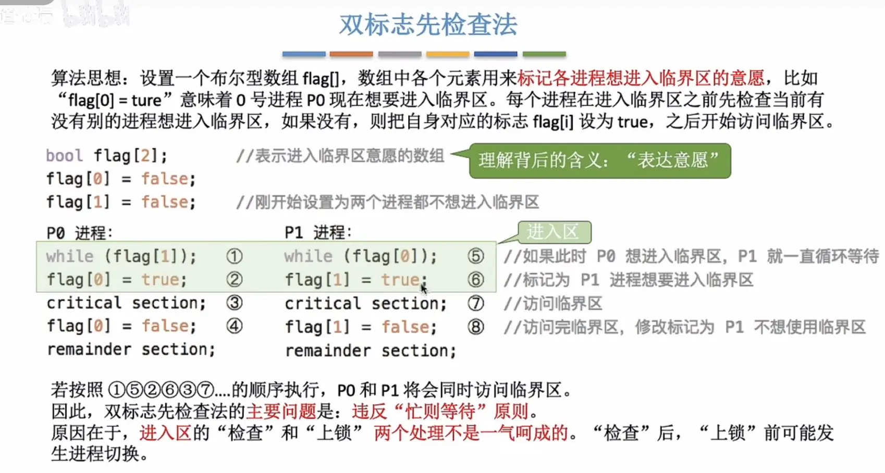

### 3）双标志后检查法

### 4）Peterson皮特孙算法

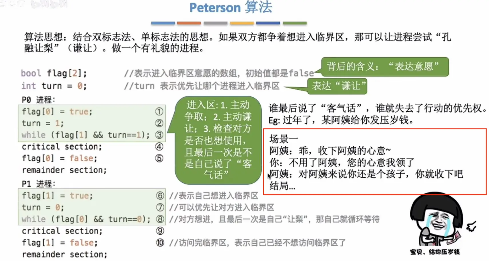

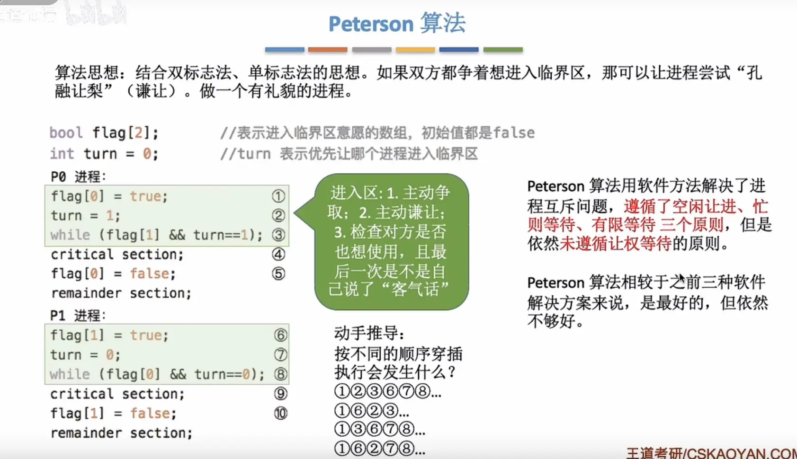

### 小总结

## 7.4 进程互斥的硬件实现方法

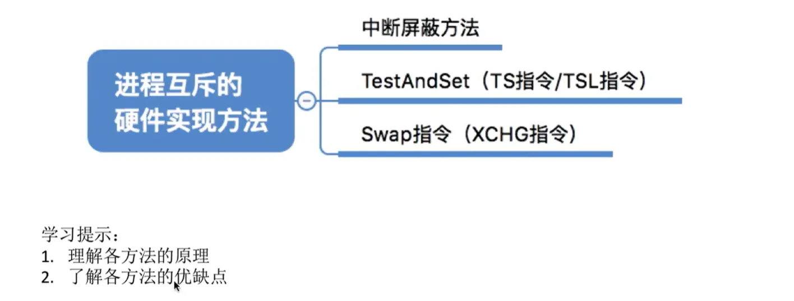

### 1）中断屏蔽方法(开关中断)

> - 优点：简单、高效
> - 缺点：
>   - 不适用于多处理机，因为开关中断指令只作用于一个CPU
>   - 只适用于操作系统内核进程，不适用于用户进程（因为开/关中断指令只能运行在内核态，这组指令如果能让用户随意使用会很危险)

### 2）TestAndSet指令(TSL指令)

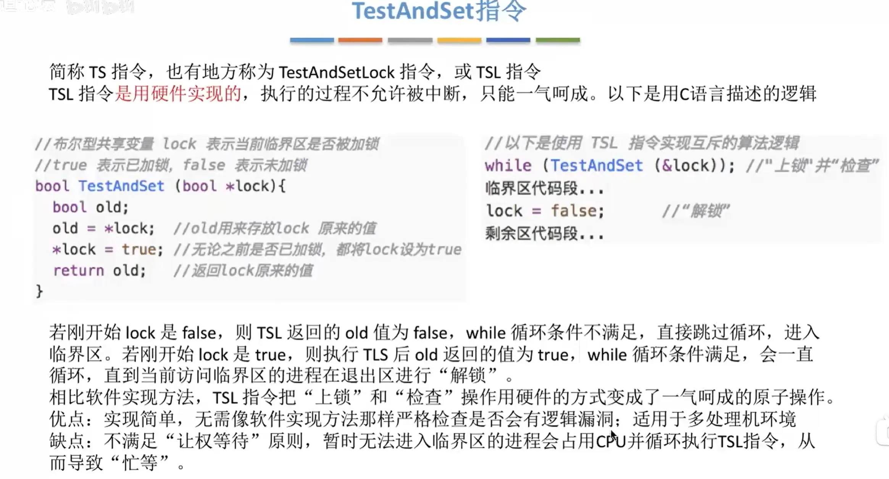

> 类似于CAS，适合多处理机，缺点：不满足让权等待

### 3）Swap指令(CAS)

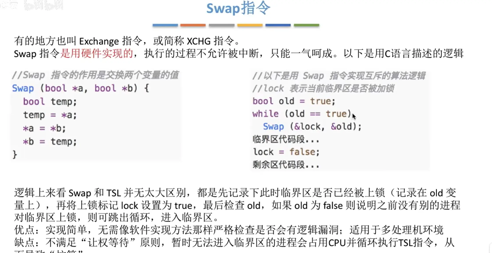

> 和TSL指令类似，应该就是JAVA中的CAS（Compare And Swap），也可能只是CAS中的S，适合多处理机，缺点也是不满足让权等待

### 小总结

> 后两者适合于多处理机，**虽然不满足让权等待，但是等待期间不用切换进程上下文，多处理器系统中，若上锁的时间短，则等待代价很低**

## 7.5 互斥锁

> **Mutex lock** ：互斥信号量（Java synchronized锁的底层实现原理）

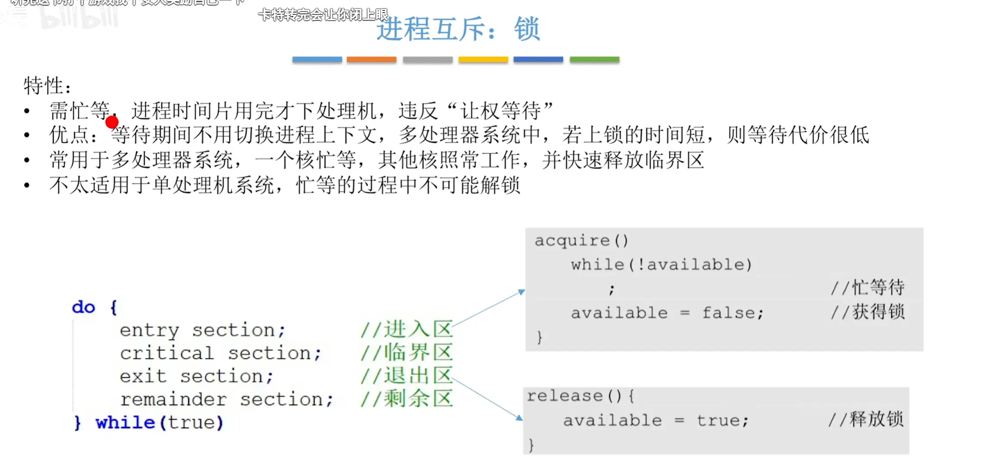

> 虽然不满足让权等待，但是等待期间不用切换进程上下文，多处理器系统中，若上锁的时间短，则等待代价很低

## 7.6 信号量机制

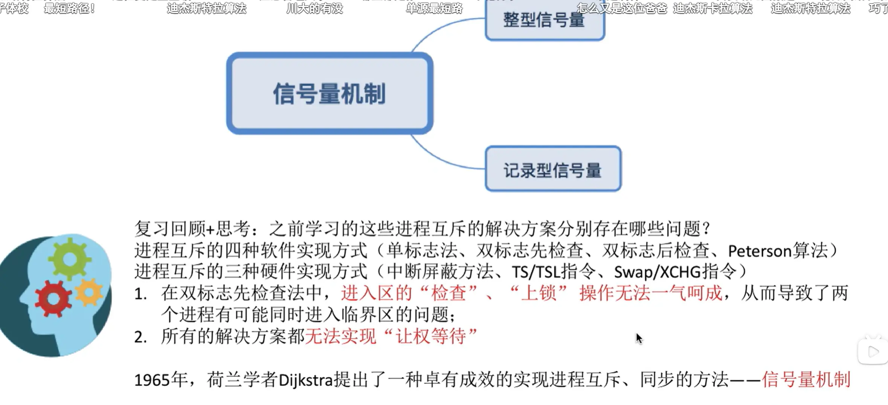

> 为了解决前面的算法无法解决的让权等待

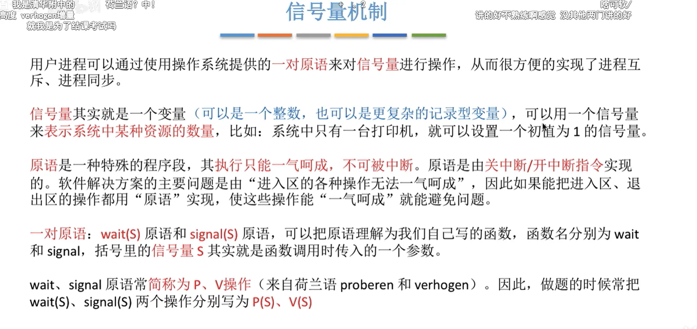

> **信号量**：可以理解为**资源的个数**，小于0时代表资源用尽需要排队
>
> wait、signal原语常**简称为P、V操作**（来自荷兰语proberen和verhogen)。因此，做题的时候常把 wait(S)、signal(S)两个操作分别写为**P(S)、V(S)**

### 1）整型信号量

> 用**wait原语**实现检查和上锁一气呵成，解决了双标志先检查法的问题
>
> 但是还是不满足让权等待
>
> 有没有什么办法改进一下？  记录型信号量

### 2）记录型信号量

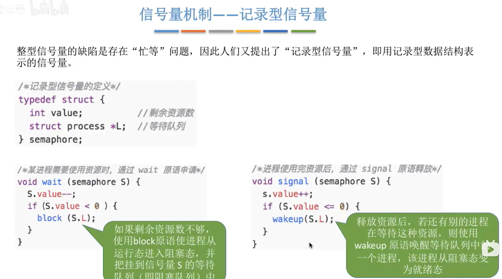

> wait先减value，signal先加value
>
> - 要是减完发现value < 0，**主动阻塞**
> - 要是加完发现value <= 0，**唤醒队头进程**（可以等于0是因为正常情况没人等待自己释放后应该大于0）

**eg：**

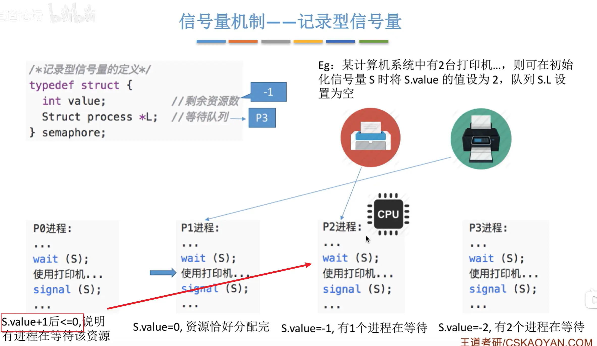

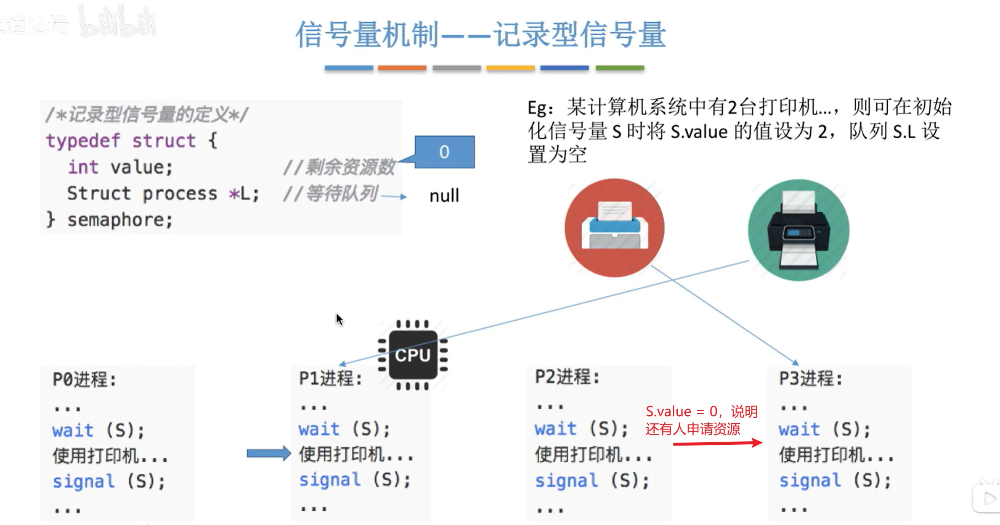

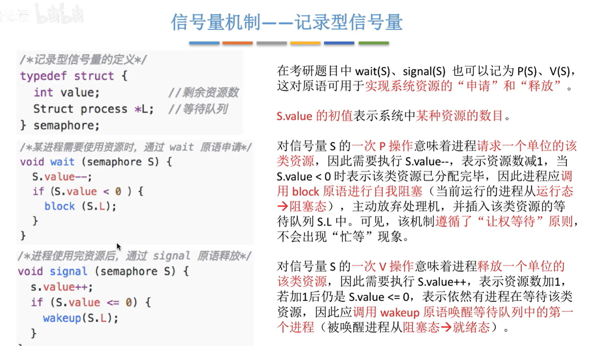

> **默认**情况下没特别说明，**信号量指记录型信号量**

### 小总结

## 7.7 用信号量实现进程互斥、同步、前驱关系

### 1）信号量实现进程互斥

> 设置**互斥信号量mutex,初值为1**			semaphore mutex=1;	默认代表记录型信号量
>
> **P、V操作必须成对出现**

### 2）信号量实现进程同步

> 为解决异步问题，控制多个进程的执行顺序，让他们按照我们想要的顺序运行
>
> 设置**互斥信号量mutex,初值为0**
>
> **先V后P**

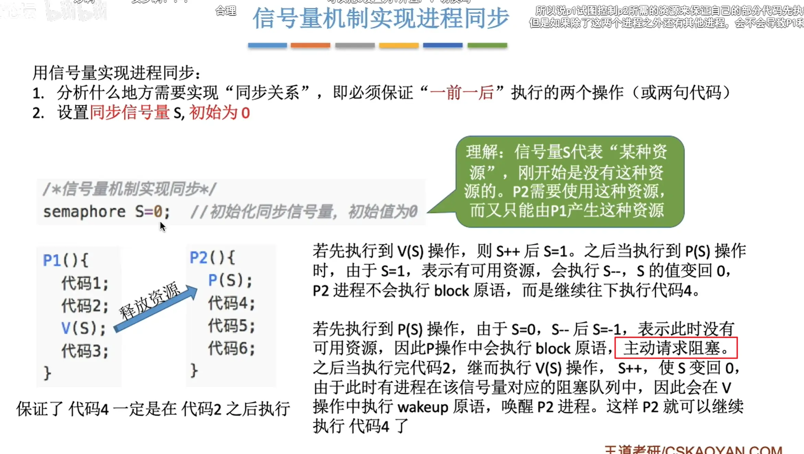

> - 若是P1先到，则将mutex加1，P2到了mutex > 0，不会被阻塞
> - 若是P2先到，则将mutex减1，mutex < 0，会被阻塞，P1到了后先加1，mutex = 0 -> wakeupP2

### 3）信号量实现前驱关系

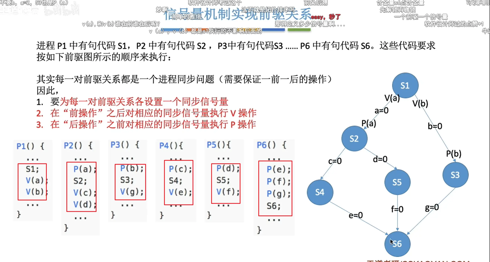

> 前驱关系就是**多级进程同步问题**
>
> 先V后P，和解决进程同步原理一致

### 小总结

> 实现互斥：**Mutex初始值为1**
>
> 实现同步：**Mutex初始值为0**

## 7.8 信号量机制经典问题

### 1）生产者-消费者问题

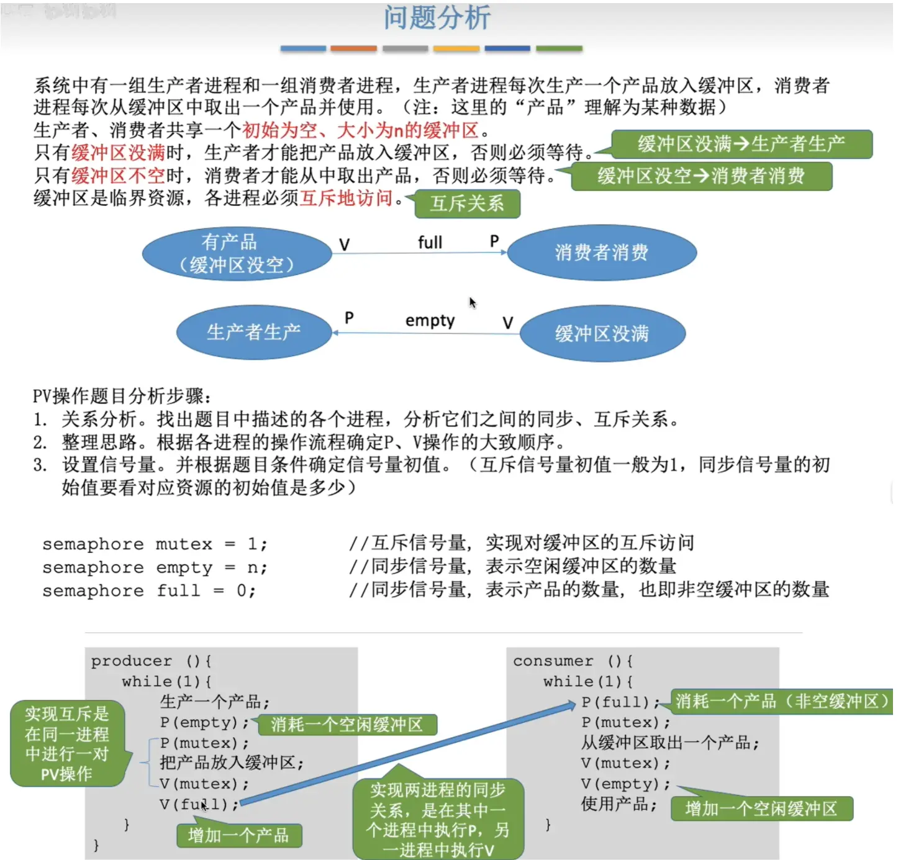

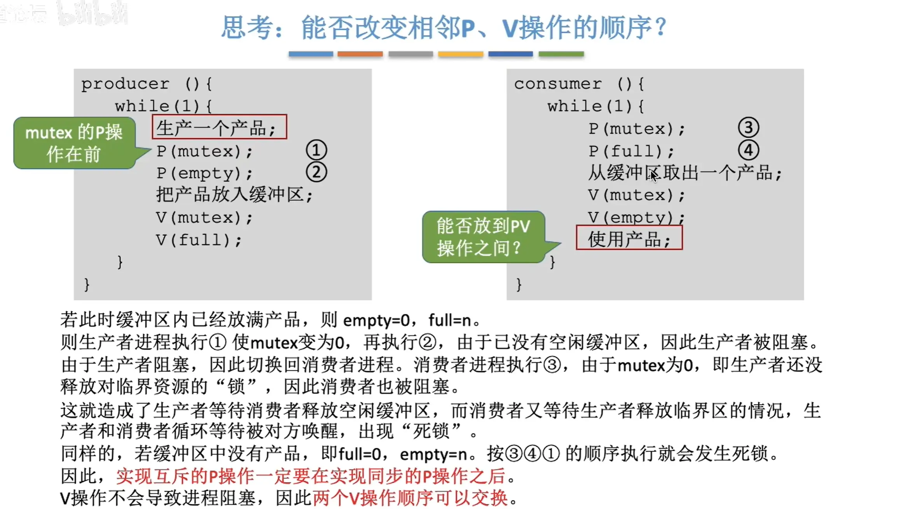

### 2）多生产者-多消费者问题

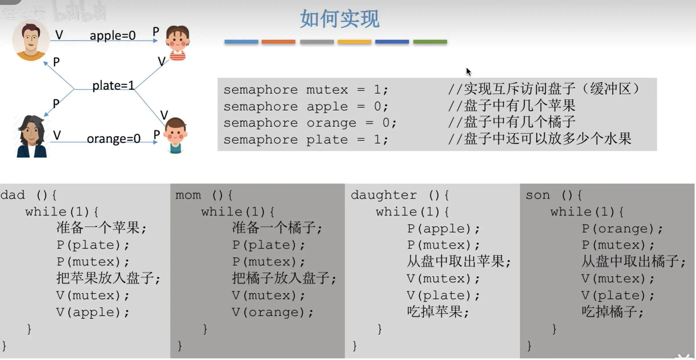

**若不设置互斥信号量mutex能实现吗？**

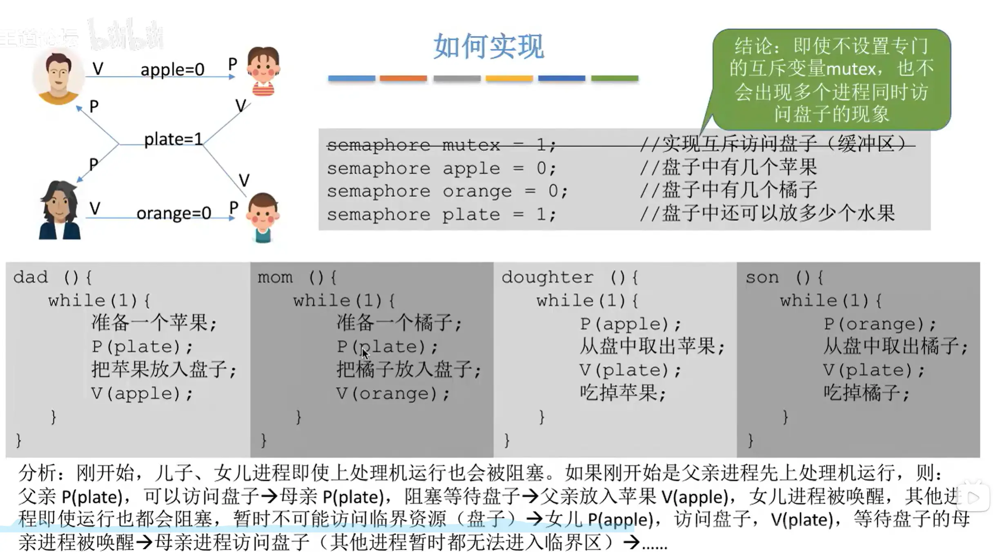

> 能，原因在于：**本题中的缓冲区大小为1**，在任何时刻，apple、orange、plate三个同步信号量中最多只有一个是1。因此在任何时刻最多只有一个进程的P操作不会被阻塞，并顺利地进入临界区
>
> 如果是两个进程同时访问缓冲区的情况，有可能导致两个进程写入缓冲区的数据相互覆盖的情况因此，**如果缓冲区大小大于1，就必须专门设置一个互斥信号量mutex来保证互斥访问缓冲区。**

总结：在生产者-消费者问题中，如果缓冲区大小为1，那么有可能不需要设置互斥信号量就可以实现互斥访问缓冲区的功能。当然，这不是绝对的，要具体问题具体分析。

建议：在考试中如果来不及仔细分析，可以加上互斥信号量，保证各进程一定会互斥地访问缓冲区。但需要注意的是，实现互斥的P操作一定要在实现同步的P操作之后，否则可能引起“死锁”。

PV操作题目的解题思路：

- 1.关系分析。找出题目中描述的各个进程，分析它们之间的同步、互斥关系。
- 2.整理思路。根据各进程的操作流程确定P、V操作的大致顺序。
- 3.设置信号量。设置需要的信号量，并根据题目条件确定信号量初值。（**互斥信号量初值一般为1，同步信号量的初始值要看对应资源的初始值是多少**)

### 3）吸烟者问题（一生产者生产多种产品-多消费者问题）

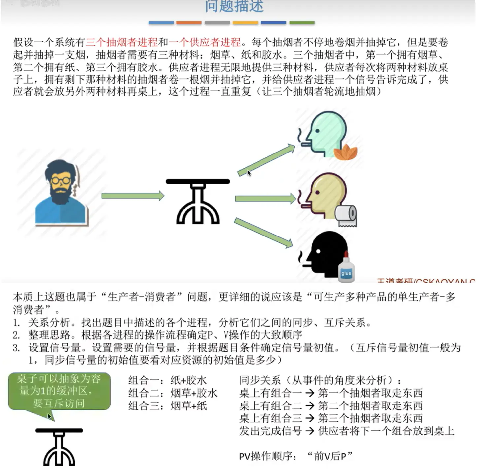

### 4）读者写者问题

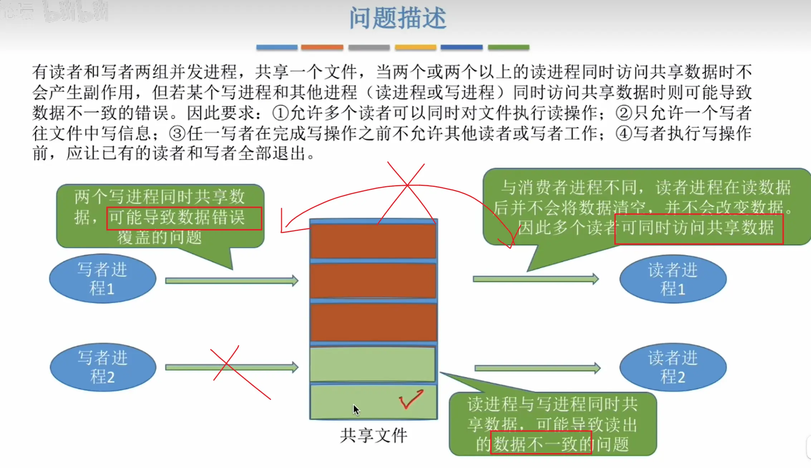

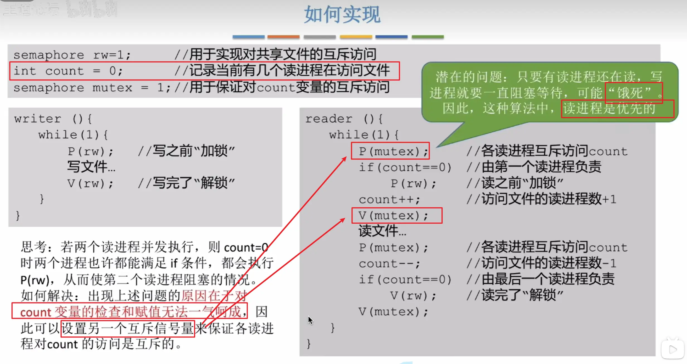

> - rw实现对共享文件的互斥访问
> - count实现读进程不互斥
> - mutex实现读进程不互斥的互斥判断
> - w实现公平写优先

### 5）哲学家就餐问题

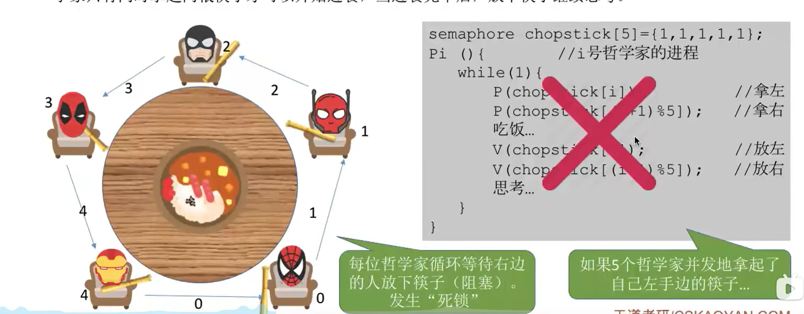

> 如果对哲学家拿起筷子的动作不做限制的话，就会发生循环等待死锁问题
>
> 如何预防死锁呢？
>
> - ①最多只能四个哲学家同时进餐，那么会有一个哲学家可以同时得到两根筷子（**互斥信号量初值为4**）
> - ②奇数先拿左边，偶数先拿右边，左右的哲学家出现竞争（**if条件判断**）

> ③每位哲学家拿筷子是互斥进行的（即**串行化**）

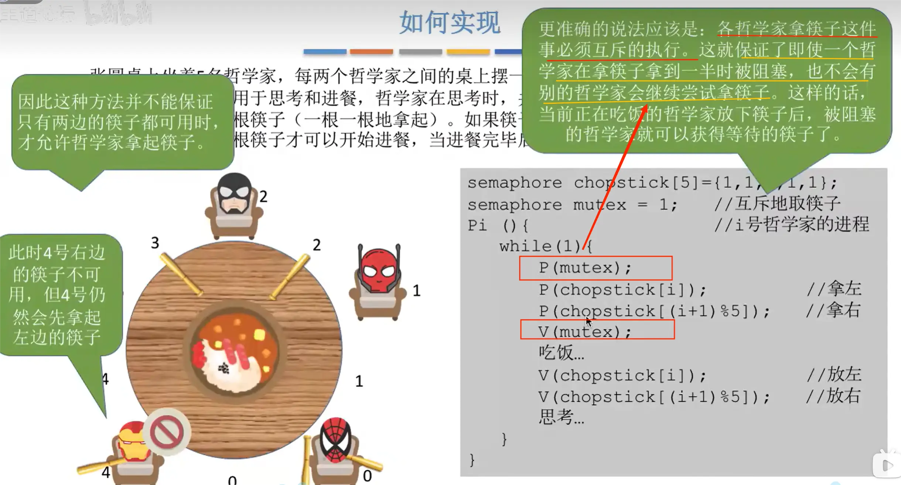

> 哲学家进餐问题的关键在于**解决进程死锁。**
>
> 这些进程之间只存在互斥关系，但是与之前接触到的互斥关系不同的是，每个进程都需要同时持有两个临界资源，因此就有“死锁”问题的隐患。
>
> 如果在考试中遇到了一个进程需要同时持有多个临界资源的情况，应该参考哲学家问题的思想，分析题中给出的进程之间是否会发生循环等待，是否会发生死锁。
>
> 可以参考哲学家就餐问题解决死锁的三种思路。

## 7.9 管程

### 1）为什么要引入管程？

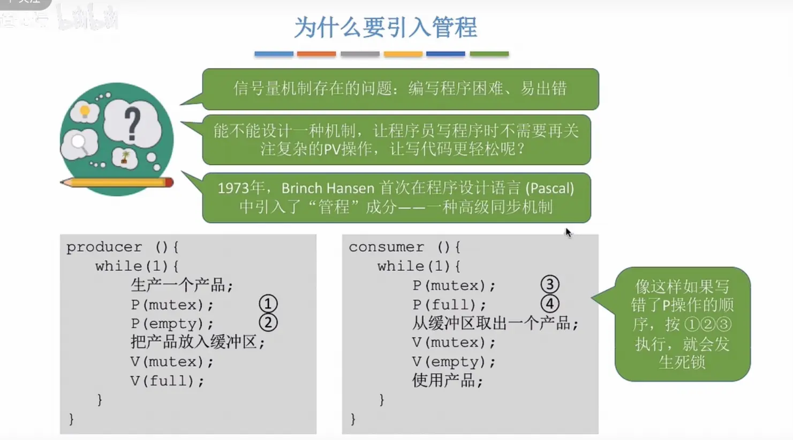

> 简而言之：信号量机制太复杂，使用管程**封装**了信号量机制，让程序员更方便的调用实现同步于互斥
>
> 封装思想

### 2）管程的定义和基本特征

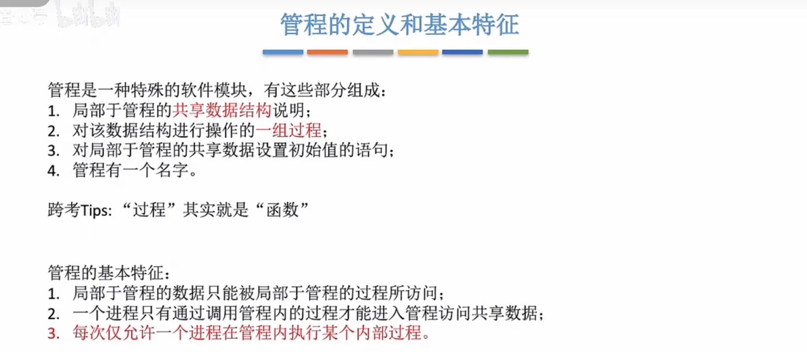

> 管程就是Java中的锁，synchronized关键字

### 3）用管程解决生产者-消费者问题

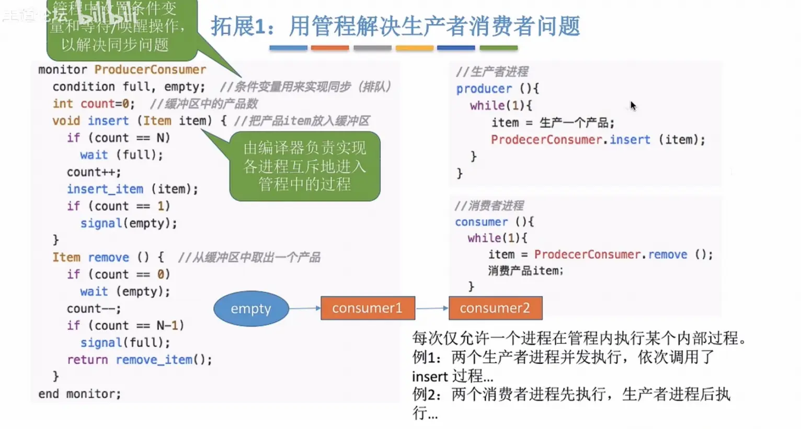

> 用管程的insert函数和remove函数来代替信号量机制的V、P操作

> 这种**互斥特性是由编译器负责实现的**，程序员不用关心
>
> 程序员可以用某种特殊的语法定义一个管程（比如：monitor ProducerConsumer......end monitor;)

### 4）Java中类似管程的机制

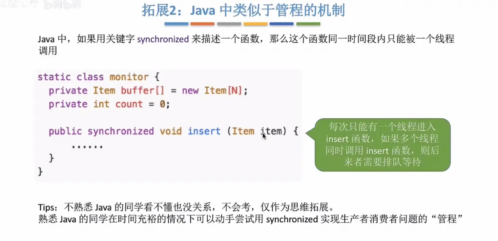

### 小总结

## 7.10 死锁

### 1）什么是死锁？

举例：

> 死锁是在**并发环境**下，各进程因**竞争资源**而造成的一种互相等待对方手里的资源，**导致各进程都阻塞**，都无法向前推进的现象。
>
> 就是“死锁”发生死锁后若无外力干涉，这些进程都将无法向前推进

### 2）死锁、饥饿、死循环的区别

### 3）死锁产生的四个必要条件

> 四个必要条件：
>
> 1. 互斥条件
> 2. 不剥夺条件
> 3. 请求和保持
> 4. 循环等待
>
> 死锁一定是循环等待，仅有循环等待不一定是死锁

### 4）什么时候会发生死锁？

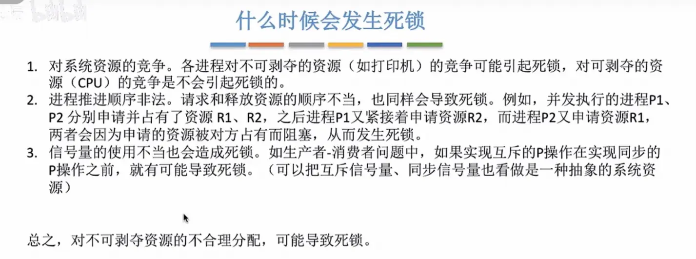

> - 资源竞争
> - 请求资源的顺序不当
> - 信号量的使用顺序不当

### 5）死锁的处理策略

1. **预防死锁**。破坏死锁产生的四个必要条件中的一个或几个。
2. **避免死锁**。用某种方法防止系统进入不安全状态，从而避免死锁（**银行家算法**)
3. **死锁的检测和解除**。允许死锁的发生，不过操作系统会负责检测出死锁的发生，然后采取某种措施解除死锁。

### 小总结

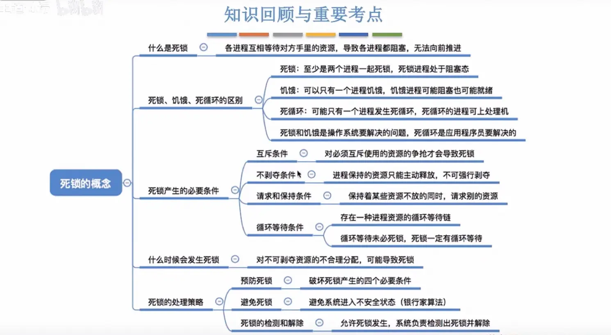

## 7.11 死锁的处理策略

### 1）预防死锁

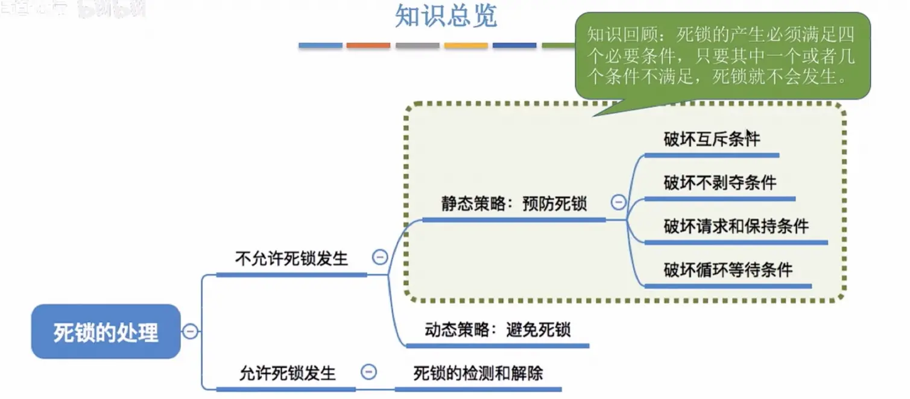

**1 破坏互斥条件**

> 例如使用SPOOLing技术，使进程的进行使异步的，不再进行等待
>
> 缺点：很多时候无法破坏互斥条件

**2 破坏不剥夺条件**

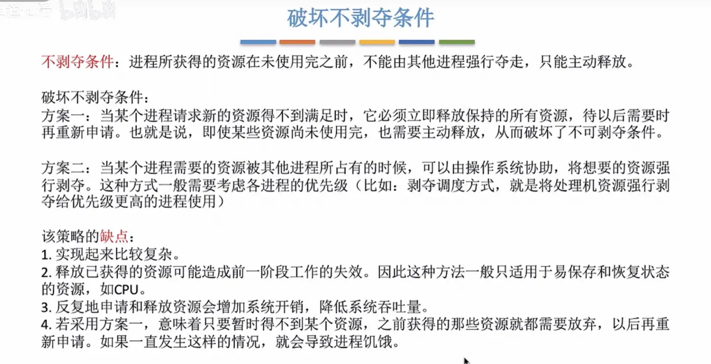

> 1. 资源不满足时**主动**立即**释放**已有资源
> 2. 优先级低的进程持有的资源**可以**被优先级高地进程**抢占**
>
> 缺点：实现复杂，使进程工作失效，可能造成进程饥饿

**3 破坏请求与保持**

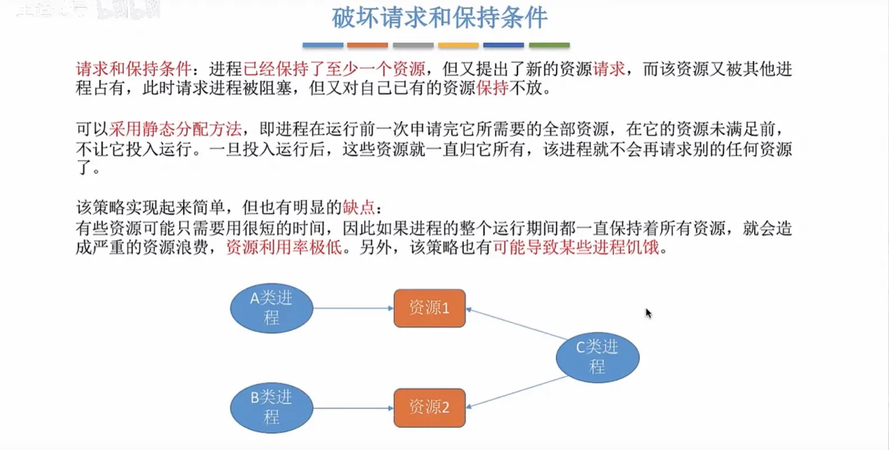

> 分配时**所有资源都满足才分配**
>
> 缺点：资源浪费，资源利用率低，可能进程饥饿

**4 破坏循环等待**

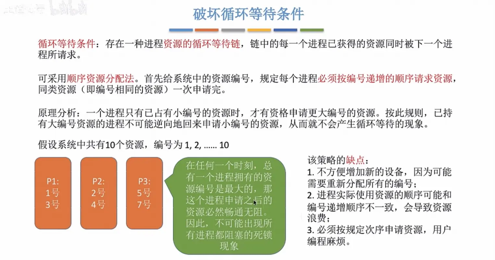

> 获取资源时**顺序获取**
>
> 缺点：耦合度高，资源浪费，编程麻烦

**小总结：**

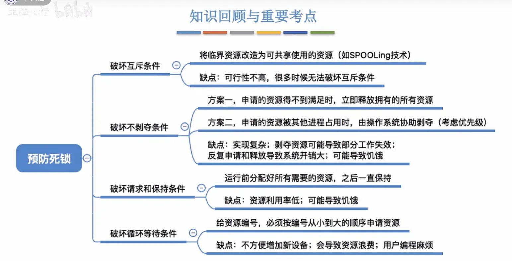

### 2）避免死锁-银行家算法

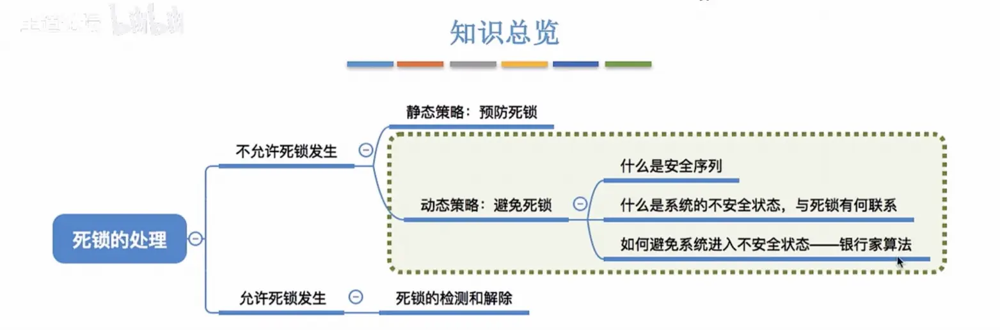

**案例过度：**

> 情况1：手里还有：40亿，此时B还想借30亿，你敢借吗？假如答应了B的请求手里还有：10亿只剩下10亿，如果BAT都提出再借 20亿的请求，那么任何一个企业的需求都**得不到满足**…
>
> 情况2：手里还有：40亿，此时…A还想借20亿，你敢借吗？假如答应了A的请求之后按**T→B→A**的顺序借钱是OK的，按**A→T→B**的顺序借钱也是OK的手里还有：20亿或者，先借给A10亿，等A还钱了手里就有20+30=50亿，再给T20亿，等T还钱了就有50+30=80亿，最后再给B借.

上面的案例中：情况1就是发生了死锁，情况2就是不会发生死锁

- **安全序列**：就是指如果系统按照这种序列分配资源，则每个进程都能顺利完成，安全序列可能有多个
  - 类似于上面情况2中的T→B→A或者A→T→B的顺序，叫做安全序列
- **安全状态**：只要能找出一个安全序列，系统就是处于安全状态
  - 上面剩余40亿时的情况就是一个安全状态，因为能找出两条安全序列
- **不安全状态**：如果分配了资源之后，系统中找不出任何一个安全序列，系统就进入了不安全状态
  - 当然，如果有进程提前归还了一些资源，那系统**也有可能重新回到安全状态**

**如果系统处于安全状态，就一定不会发生死锁**。如果系统进入**不安全状态，就可能发生死锁**（处于不安全状态未必就是发生了死锁，但发生死锁时一定是在不安全状态），因此可以在资源分配之前预先判断这次分配是否会导致系统进入不安全状态，以此决定是否答应资源分配请求。这也是“银行家算法”的核心思想。

**银行家算法：**

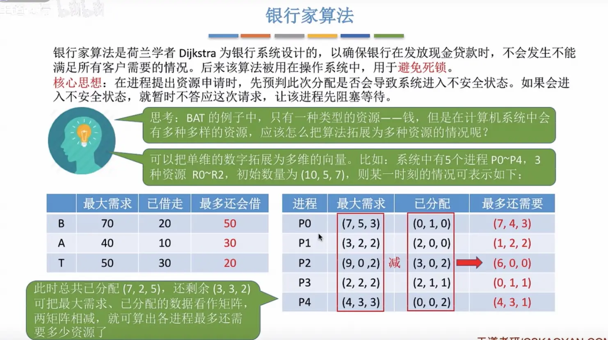

> 核心思想：在进程提出资源申请时，先**预判此次分配是否会导致系统进入不安全状态**。如果会进入不安全状态，就暂时不答应这次请求，让该进程先阻塞等待。
>
> 
>
> 上例中：资源总数(10,5,7)，剩余可用资源(3,3,2)
>
> 说明如果优先把资源分配给P1,那P1一定是可以顺利执行结束的等P1结束了就会归还资源。于是，资源数就可以增加到(2,0,0)+(3,3,2)=(5,3,2)
>
> 然后优先把资源分配给P3,那P3一定是可以顺利执行结束的等P3结束了就会归还资源。于是，资源数就可以增加到(2,1,1)+(5,3,2)=(7,4,3)
>
> 现在已经能满足其它任何一个进程的需求
>
> 所以**此案例处于安全状态，暂时不可能发生死锁**
>
> 
>
> 下例可能会发生死锁：
>
> 

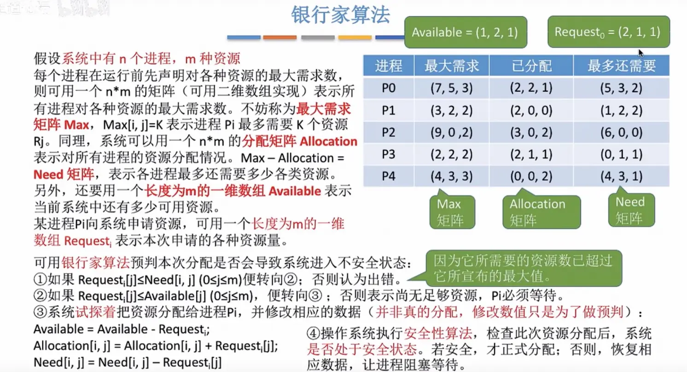

银行家算法的**数据结构**：

- 长度为m的一维数组Available表示还有多少可用资源
- n*m矩阵Max表示各进程对资源的最大需求数
- n*m矩阵Allocation表示己经给各进程分配了多少资源
- Max-Allocation=Need矩阵表示各进程最多还需要多少资源
- 用长度为m的一位数组Request表示进程此次申请的各种资源数

银行家算法**步骤**：

- ①检查此次申请是否超过了之前声明的最大需求数
- ②检查此时系统剩余的可用资源是否还能满足这次请求
- ③试探着分配，更改各数据结构
- ④用安全性算法检查此次分配是否会导致系统进入不安全状态，安全才分配

安全性算法步骤：

检查当前的剩余可用资源是否能满足某个进程的最大需求，如果可以，就把该进程加入安全序列，
并把该进程持有的资源全部回收。
不断重复上述过程，看最终是否能让所有进程都加入安全序列。

**系统处于不安全状态未必死锁，但死锁时一定处于不安全状态**。系统处于安全状态**一定不会**死锁。

### 3）检测和解除

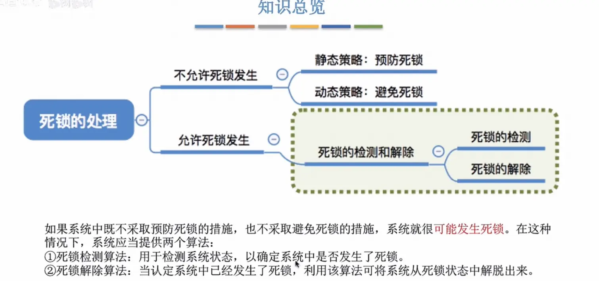

#### ①死锁的检测

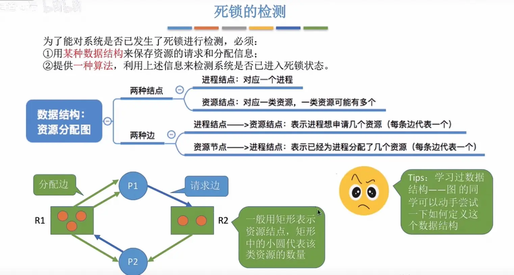

> 为了能对系统是否已发生了死锁进行检测，必须：
>
> - ①用某种**数据结构**来保存资源的请求和分配信息：
> - ②提供一种算法，利用上述信息来检测系统是否已进入死锁状态。
>
> 
>
> 进程节点 - 资源节点
>
> 请求边 - 已分配边
>
> 讲上图**看作一个快照**，分配边表示已经分配出去的，请求边表示正在请求的，不算已经分配给进程节点的

如果系统中剩余的可用资源数足够满足进程的需求，那么这个进程暂时是不会阻塞的，可以顺利地执行下去。

如果这个进程执行结束了把资源归还系统，就可能使某些正在等待资源的进程被激活，并顺利地执行下去。

例如：

如果按上述过程分析，最终**能消除所有边**，就称这个图是**可完全简化的**。此时**一定没有发生死锁**（相当于**能找到一个安全序列**)

如果最终**不能消除所有边**，那么此时就是**发生了死锁**。

**最终还连着边的那些进程就是处于死锁状态的进程：**

> 如果能化为可完全简化的，就说明不会发生死锁
>
> 死锁定理：如果某时刻系统的资源分配图是不可完全简化的，那么此时系统死锁

#### ②死锁的解除

> 1. 资源剥夺法（破坏不可剥夺条件）
> 2. 撤销进程法（例如MySQL处理死锁的策略为：等待最高上限时长50s，超过则自动终止该操作，或者主动检测到死锁发生后回滚执行程度最低的事务，破坏请求和保持）
> 3. 进程回退法（破坏请求和保持）

#### 小总结

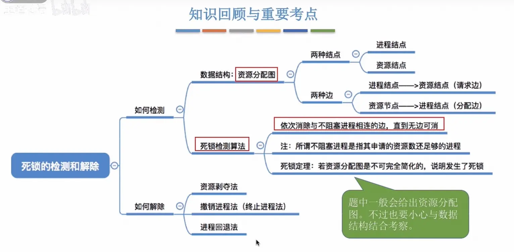

