#  四 内存管理

> author: spongehah from:hut
>
> 作者个人博客：https://blog.hahhome.top/
>
> 参考视频: B站王道考研计算机操作系统

[TOC]

# 1 内存的基础知识

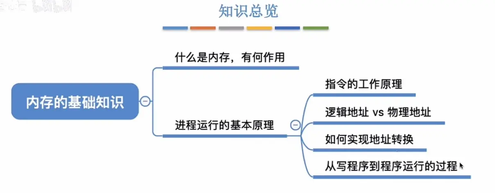

## 1.1 什么是内存，有何作用？

**内存可存放数据**。程序执行前需要先放到内存中才能被CPU处理

作用：缓和CPU与硬盘之间的速度矛盾

> 思考：在多道程序环境下，系统中会有多个程序并发执行，也就是说会有多个程序的数据需要同时放到内存中。那么，如何区分各个程序的数据是放在什么地方的呢？
>
> 方案：给内存的存储单元编地址
>
> **存储单元**：内存地址从0开始，**每个地址对应一个存储单元**
>
> - 如果计算机**“按字节编址”**则每个存储单元大小为**1字节**，即1B，即8个二进制位
> - 如果字长为**16位**的计算机**“按字编址”**，则每个存储单元大小为**1个字**；每个字的大小为**16个二进制位**

## 1.2 指令的工作原理和代码到程序运行的三步

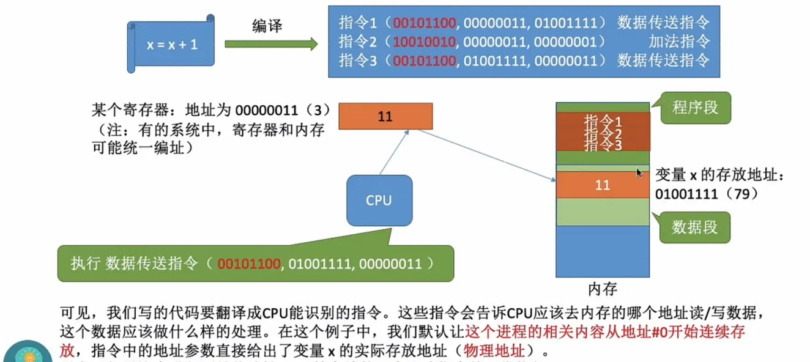

> **指令的工作基于“地址”**，每个地址对应一个数据的存储单元
>
> 上图中每条指令的**加红部分代表的是指令类型**，第二个8位代表的是某个某个寄存器的地址，第三个8位代表的是从这个地址取数据，下面的指令根据指令类型进行操作
>
> - 指令1代表从地址01001111取数据到寄存器00000011
> - 指令2代表将寄存器00000011的数据加上00000001
> - 指令3代表将寄存器00000011的数据写回地址01001111

思考：不可能每个进程分配到的地址都是从地址0开始的，如果这个进程不是从地址0开始存放的，会影响指令的正常执行吗？

**地址从0开始存放：**

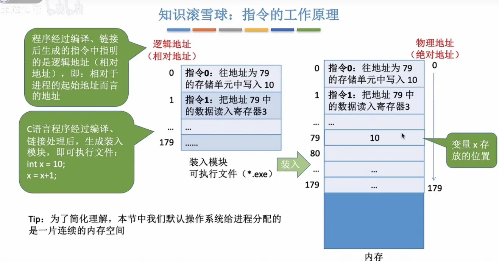

> 正常工作

**地址不从0开始存放：**

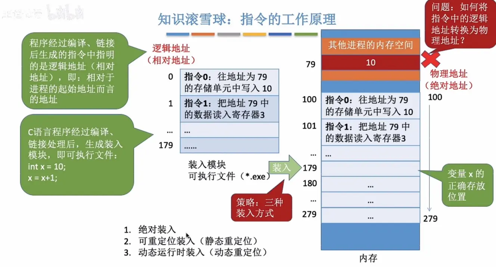

> 现在要解决的就是，**如何将逻辑地址转换为物理地址？**
>
> 答案是马上要讲的**装入**

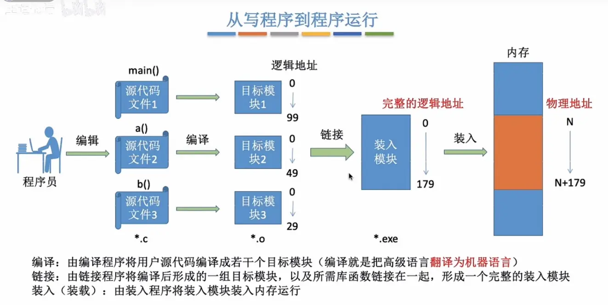

> 而程序代码到程序运行要经历：**编译 -> 链接 -> 装入** 三个步骤才能真正装入内存运行
>
> - **编译**就是把高级语言翻译为机器语言
> - **链接**：由链接程序将编译后形成的一组目标模块，以及所需库函数链接在一起，**形成一个完整的装入模块**
> - **装入**（装载）：由装入程序**将装入模块装入内存运行**，并将**逻辑地址转换为物理地址**
>
> 接下来要讲的就是如何链接以及如何装入

## 1.3 链接的三种方式

**链接**：由链接程序将编译后形成的一组目标模块，以及所需库函数链接在一起，**形成一个完整的装入模块**

### 1）静态链接

静态链接：在程序**运行之前**，先将各目标模块及它们所需的
库函数**连接成一个完整的可执行文件（装入模块）**，之后**不再拆开**。

### 2）装入时动态链接

装入时动态链挠：将各目标模块装入内存时，**边装入边链接**的链接方式。（结合后面的装入一起）

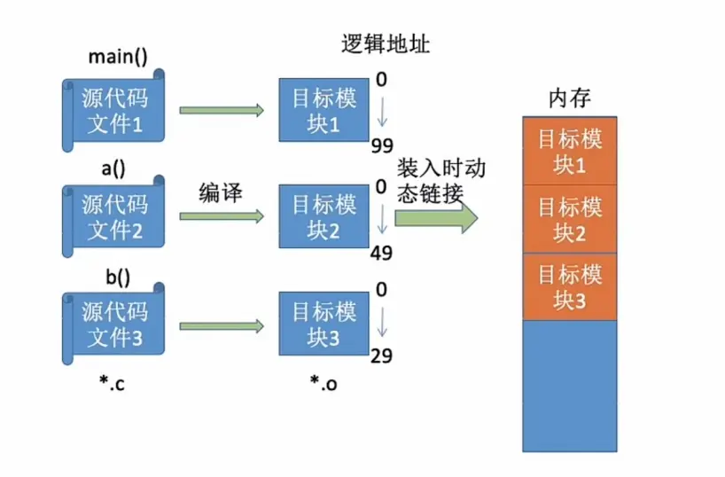

### 3）运行时动态链接

运行时动态链接：在程序执行中**需要该目标模块时，才对它进行链接**。其优点是便于修改和更新，便于实现对目标模块的共享。**用不到的模块就不需要装入内存**

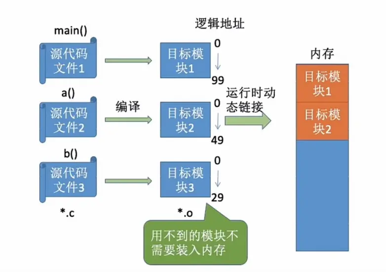

## 1.4 装入的三种方式

**装入**（装载）：由装入程序**将装入模块装入内存运行**，并将**逻辑地址转换为物理地址**

### 1）绝对装入

**绝对装入**：在编译时，如果知道程序将放到内存中的哪个位置，编译程序将产生绝对地址的目标代码。装入程序按照装入模块中的地址，将程序和数据装入内存。 

Eg:如果知道装入模块要从地址为100的地方开始存放

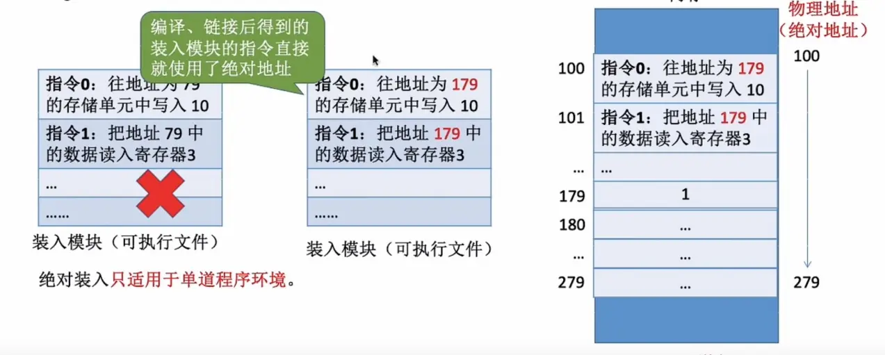

> 链接后得到的**装入模块直接就使用的是绝对地址**，
>
> 不足：**只适用于单道程序阶段，此时还无操作系统**

### 2）静态重定位（可重定位装入）

**静态重定位**：又称**可重定位装入**。编译、链接后的装入模块的地址都是从0开始的，指令中使用的地址、数据存放的地址都是相对于起始地址而言的逻辑地址。可根据内存的当前情况，将装入模块装入到内存的适当位置。**装入时对地址进行“重定位”，将逻辑地址变换为物理地址**（地址变换是在装入时**一次性完成**的)

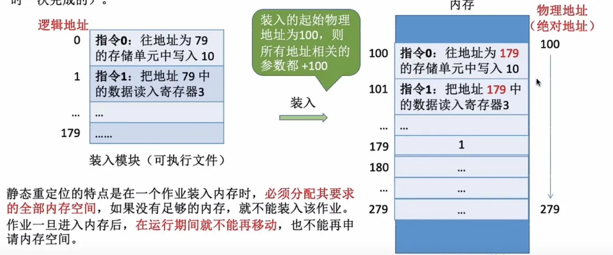

> 将装入模块装入内存时**一次性**分配要求的**全部内存空间**，并将**逻辑地址变换为物理地址**，适用于**早期多道批处理**
>
> 不足：如果没有足够的内存，就不能装入该作业。作业一旦进入内存后，**在运行期间就不能再移动**，也不能再申请内存空间。

### 3）动态重定位（动态运行时装入）

**动态重定位**：又称**动态运行时装入**。编译、链接后的装入模块的地址都是从0开始的。装入程序把装入模块装入内存后，并不会立即把逻辑地址转换为物理地址，**装入时依然保持使用逻辑地址**，而是把**地址转换推迟到程序真正要执行时才进行**。因此装入内存后所有的地址依然是逻辑地址。这种方式需要一个**重定位寄存器**的支持。

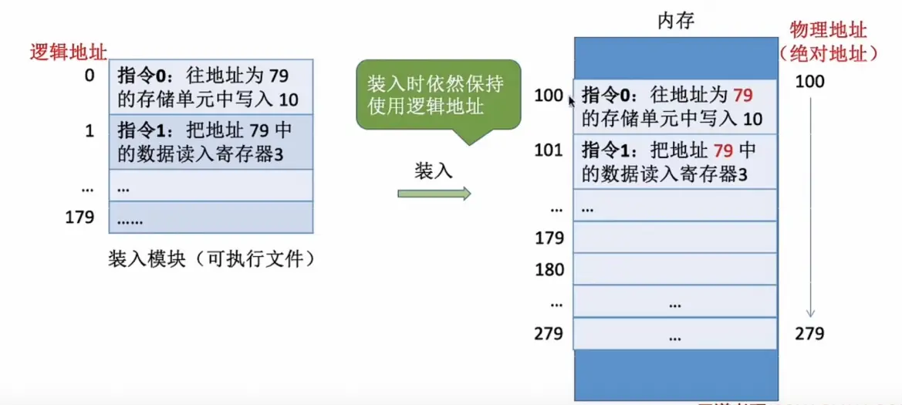

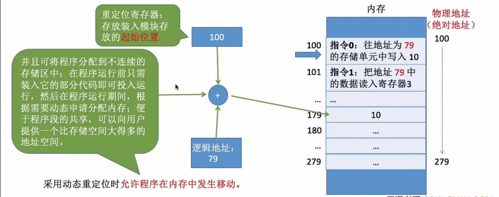

> 重定位寄存器：存放装入模块存放的**起始位置**，适用于**现代操作系统**
>
> 优点：
>
> 1. 可将程序分配到**不连续的存储区**中；
> 2. 在程序运行前**只需装入它的部分代码即可投入运行**，然后在程序运行期间，根据需要动态申请分配内存
> 3. 便于程序段的**共享**，可以向用户提供一个比存储空间大得多的地址空间。

## 小总结

# 2 内存管理

## 2.1 内存管理要实现的四个目标

1.操作系统负责**内存空间的分配与回收**

2.操作系统需要提供某种技术从**逻辑上对内存空间进行扩充**（覆盖技术、交换技术、虚拟技术）

3.操作系统需要提供地址转换功能，负责程序的**逻辑地址**与**物理地址**的**转换**（这个过程称为**地址重定位**），采用**装入**或**具体存储管理方式的地址变换机构**

4.操作系统需要提供**内存保护功能**。保证各进程在各自存储空间内运行，**互不干扰**

- 方法一：在CPU中**设置一对上、下限寄存器**，存放进程的上、下限地址。进程的指令要访问某个地址时，CPU检查是否越界
  假设进程1的逻辑地址空间为0 ~ 179：实际物理地址空间为100 ~ 279
  
- 方法二：采用**重定位寄存器**（又称**基址寄存器**）和**界地址寄存器**（又称**限长寄存器**）进行越界检查。重定位寄存器中存放的是进程的**起始物理地址**。界地址寄存器中存放的是进程的**最大逻辑地址**（注意一个是物理，一个是逻辑）
  假设进程1的逻辑地址空间为0 ~ 179：实际物理地址空间为100 ~ 279
  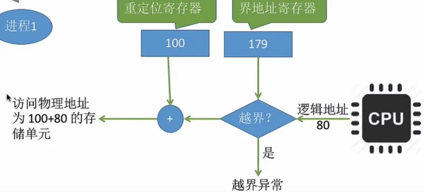

**小总结：**

## 2.2 实现内存空间的扩充

虚拟存储技术后面才会讲

### 1）覆盖技术

> **覆盖技术**，用来**解决“程序大小超过物理内存总和”的问题**
>
> 覆盖技术的思想：将**程序分为多个段**（多个模块）常用的段常驻内存，不常用的段在需要时调入内存。
>
> 内存中分为**一个“固定区”**和**若干个“覆盖区”**。
>
> 需要**常驻内存的段放在“固定区”**中，**调入后就不再调出**（除非运行结束）**不常用的段放在“覆盖区”**，**需要用到时调入内存，用不到时调出内存**

> 例如A端需放入固定区
>
> B段和C段最多只能同时运行一个，所以只需要划分一个大者（10K）的覆盖区即可
>
> D段和E、F段也是如此，只需要划分一个12K的覆盖区即可
>
> **优点：**这样总内存大小8+8+10+12+4+10=52K的进程，只需要划分30K就可以运行
>
> **缺点：**必须由**程序员声明覆盖结构**，操作系统完成自动覆盖。**对用户不透明，增加了用户编程负担**。覆盖技术只用于**早期的操作系统**中，现在己成为历史。

### 2）交换技术

> **交换（对换）技术**的设计思想：内存空间紧张时，系统**将内存中某些进程暂时换出外存**，把外存中某些已具备运行条件的进程**换入**内存（进程在内存与磁盘间动态调度）
>
> 即**中级调度**的应用：暂时换出外存等待的进程状态为**挂起状态（挂起态，suspend)**，挂起态又可以进一步细分为**就绪挂起、阻塞挂起**两种状态
> 

1. 应该在外存（磁盘）的什么位置保存被换出的进程？
   - 具有对换功能的操作系统中，通常把磁盘空间分为**文件区**和**对换区**两部分。**文件区主要用于存放文件，主要追求存储空间的利用率**，因此对文件区空间的管理**采用离散分配方式**：对换区空间只占磁盘空间的小部分，**被换出的进程数据就存放在对换区**。由于对换的速度直接影响到系统的整体速度，因此对换区空间的管理**主要追求换入换出速度**，因此通常对换区**采用连续分配方式**（学过文件管理章节后即可理解)。总之，**对换区的I/O速度比文件区的更快**。
2. 什么时候应该交换？
   - 交换通常在许多进程运行且**内存吃紧时进行**，而系统负荷降低就暂停。例如：在发现许多进程运行时经常发生缺页，就说明内存紧张，此时可以换出一些进程；如果缺页率明显下降，就可以暂停换出。
3. 应该换出哪些进程？
   - 可**优先换出阻塞进程**；可换出**优先级低**的进程；为了防止优先级低的进程在被调入内存后很快又被换出导致饥饿，有的系统还会**考虑进程在内存的驻留时间**

(注意：**PCB会常驻内存**，不会被换出外存)

### 覆盖和交换的区别

> 覆盖是在**同一个**程序或进程中的，交换是在**不同**进程（或作业）之间的

## 2.3 实现内存空间的分配与回收（连续分配管理方式）

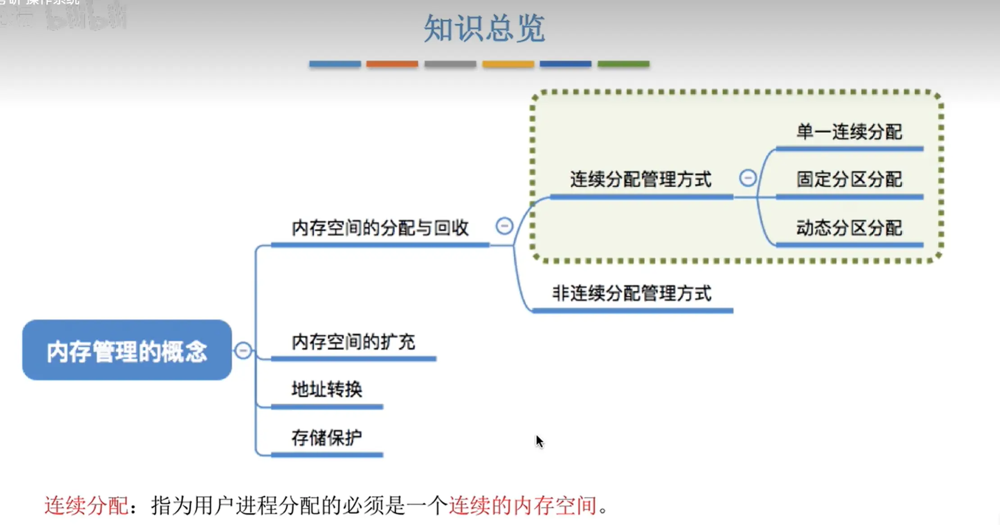

### 2.3.1 三种连续分配管理方式

#### 1）单一连续分配

> 优点：实现简单，无外部碎片
>
> 缺点：有内部碎片，**同一时间只能运行一个程序**，内存利用率极低

#### 2）固定分区分配

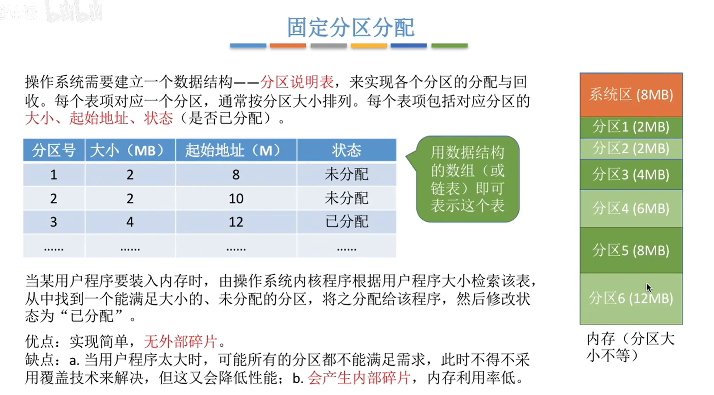

> 分为两类：
>
> 1. 分区大小相等：缺乏灵活性，但适用于某些特定场景
> 2. 分区大小不等：增加了灵活性
>
> 优点：实现简单，无外部碎片
>
> 缺点：用户程序太大时没有一个分区满足，不得不使用覆盖技术，会降低性能
> 	 会产生内部碎片，内存利用率低

#### 3）动态分区分配

> 1.系统要用什么样的**数据结构**记录内存的使用情况？ 
>
> - 空闲分区表：每个空闲分区对应一个表项。表项中包含分区号分区大小、分区起始地址等信息
> - 空闲分区链：每个分区的起始部分和末尾部分分别设置前向指针和后向指针。起始部分处还可记录分区大小等信息
>   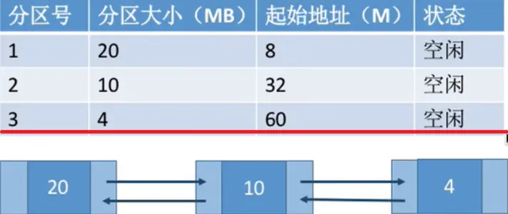
>
> 2.当很多个空闲分区都能满足需求时，应该**选择哪个分区**进行分配？ 
>
> - 把一个新作业装入内存时，须按照一定的**动态分区分配算法**，从空闲分区表（或空闲分区链）中选出一个分区分配给该作业。由于分配算法算法对系统性能有很大的影响，因此人们对它进行了广泛的研究。下个小节会介绍四种**动态分区分配算法**
>
> 3.如何进行分区的**分配与回收**操作？
>
> - 回收时**相邻的空闲区合并成一个**，若无相邻空闲区则自己成为一个空闲区

> 动态分区分配**没有内部碎片**，但是**有外部碎片**。（前面两种方法都是有内部碎片没有外部碎片）
>
> **内部碎片**：分配给某进程的内存区域中，如果有些部分没有用上。
> **外部碎片**：是指内存中的某些空闲分区由于太小而难以利用。
>
> 如何处理外部碎片？
> 可以通过**紧凑（拼凑，Compaction)技术**来解决外部碎片。例如把使用到的内存块向小地址方向整理到一起

#### 小总结

### 2.3.2 四种动态分区分配算法

#### 1）首次适应算法

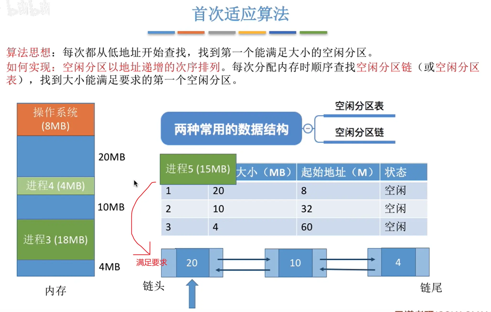

> 首次适应算法：空闲区的大小排序是**无序**的，从**低地址依次向高地址**查找，直到找到**第一个满足要求**的空闲分区

#### 2）最佳适应算法

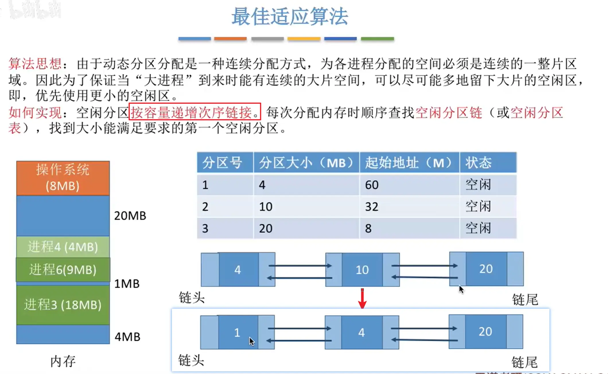

> 最佳适应算法：空闲分区**按容量递增次序链接**，每次分配内存时顺时针查找到满足要求的第一个空闲分区，即**刚好满足要求的第一个分区**
>
> 会对空闲分区进行重新排序
>
> **缺点：每次都选最小的分区进行分配，会留下越来越多的、很小的、难以利用的内存块。因此这种方法会产生很多的外部碎片。**

#### 3）最坏适应算法

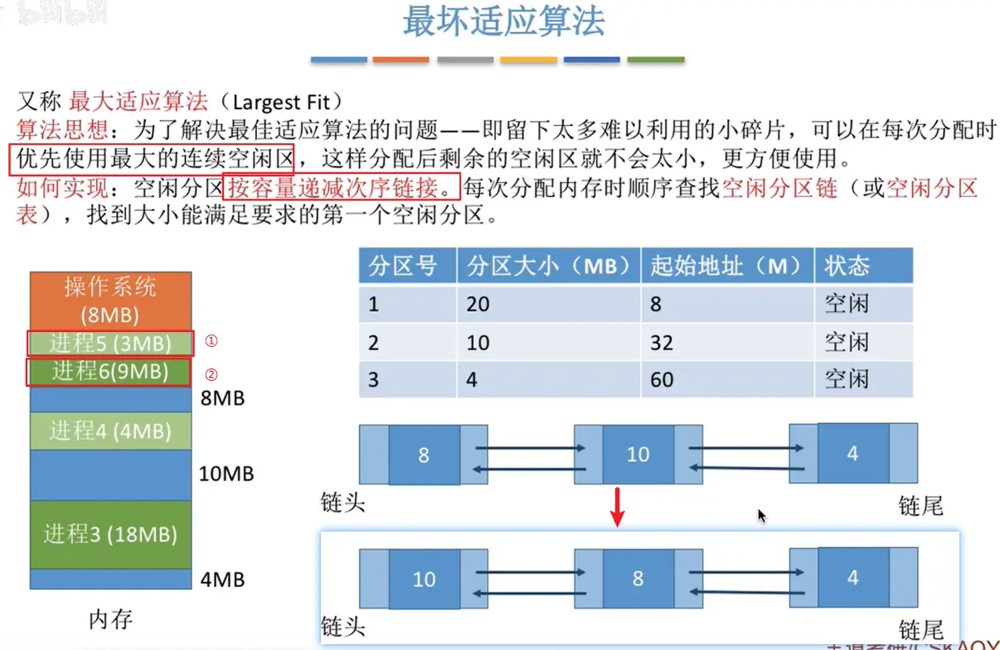

> 最坏适应算法：空闲分区**按容量递减次序链接**。每次分配内存时顺序查找空闲分区链（或空闲分区表)，找到大小能满足要求的第一个空闲分区，即**优先使用此时最大的空闲分区**
>
> 会对空闲分区进行重新排序
>
> **缺点**：每次都选最大的分区进行分配，虽然**可以让分配后留下的空闲区更大**，更可用，但是这种方式会**导致较大的连续空闲区被迅速用完**。如果之后有“**大进程”到达，就没有内存分区可用了**。

#### 4）邻近适应算法

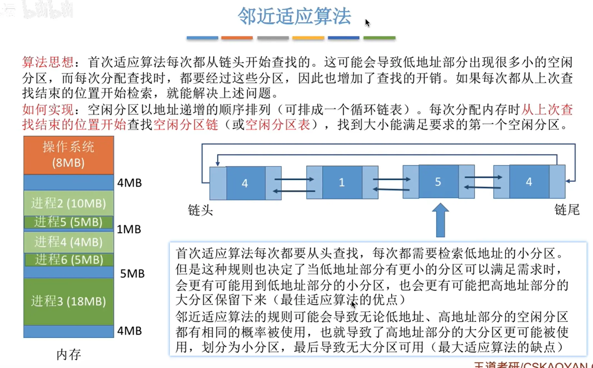

> 邻近适应算法：和首次适应算法一致，**不对空闲分区的容量进行排序**，但是将其首尾相连构成**循环链表**，每次分配内存时**从上次查找结束的位置开始**查找空闲分区链（或空闲分区表），找到大小能**满足要求的第一个**空闲分区。
>
> 
>
> 和首次适应算法的**区别**：
>
> - 首次适应算法每次都要从头查找，每次都需要检索低地址的小分区。
> - 邻近适应算法的规则可能会导致无论低地址、高地址部分的空闲分区都有相同的概率被使用，也就导致了高地址部分的大分区更可能被使用，划分为小分区，最后导致无大分区可用**（最佳适应算法的缺点）**

#### 小总结

 

## 2.4 实现内存空间的分配与回收（非连续分配管理方式）

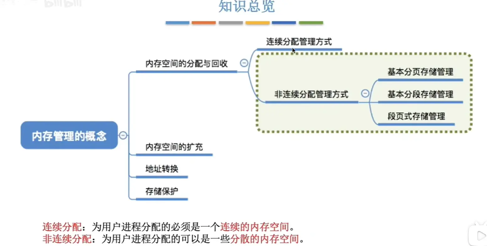

### 2.4.1 基本分页存储管理

#### 1.1）页框和页面的概念

> **页框**（页框=页帧=内存块=物理块=物理页面）：将因存空间份为一个个大小相等的分区（一般为4KB）
>
> **页/页面**：将讲程的罗辑地址空间也分为与而掘大小相的一个个部分
>
> 操作系统**以页框为单位为各个进程分配**内存空间。进程的每个页面分别放入一个页框中。也就是说，进程的**页面**与内存的**页框**有**一一对应**的关系
> 各个页面不必连续存放，可以放到不相邻的各个页框中。

#### 1.2）页表和页表的大小计算

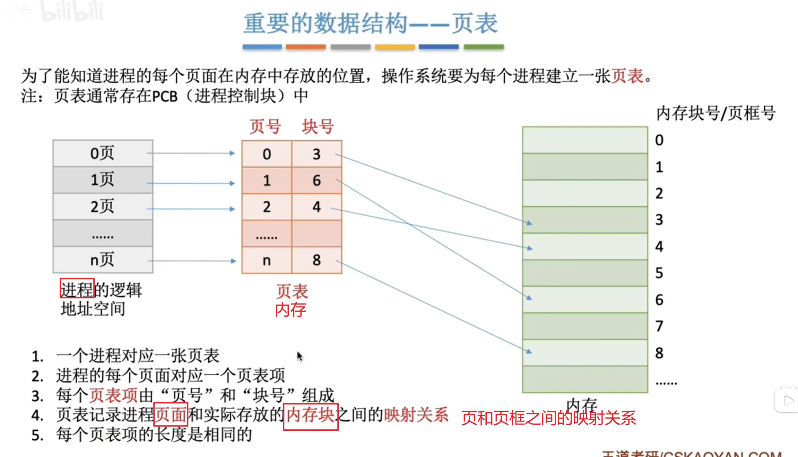

> **页表：**维护进程的**页面**与内存的**页框**有**一一对应**的关系

1.每个页表项多大？占几个字节？

2.如何通过页表实现逻辑地址到物理地址的转换？

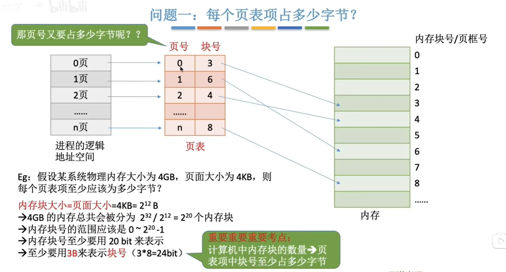

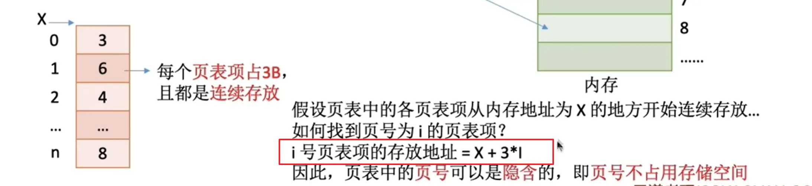

> 页表项是连续存放，因此**页号可以是隐含**的，**不占存储空间**（类比数组）
>
> **->本例中(内存大小4GB)：由于页号是隐含的，因此每个页表项占3B,存储整个页表至少需要3*(n+1)B**
>
> **注意**：页表记录的只是**内存块号**，而不是内存块的起始地址！**」号内存块的起始地址=」*内存块大小(4KB)**	

#### 1.3）逻辑地址到物理地址的转换

**逻辑地址的结构：**

> 0-11位为页内偏移量：因为一个页框的大小一般为4KB=2^12^B
>
> 12-31位为页号：为上例中的页号位数(内存空间大小为4GB)，若**内存空间大小不一样，页框大小不一样，页号的位数就不一样**

> 这是连续分配时逻辑地址到物理地址的转换方式：动态重定位，不清楚的可以去前面回顾一下

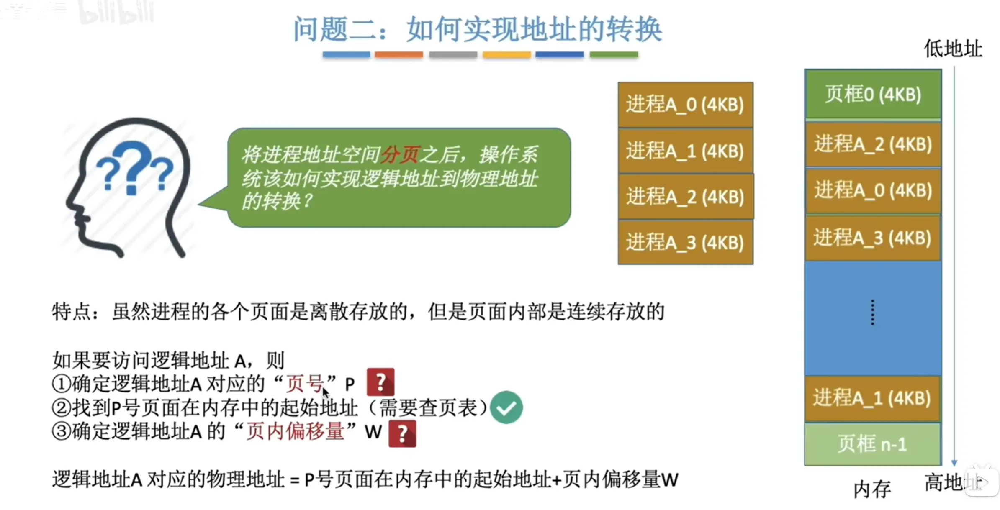

> 逻辑地址A对应的**物理地址**=P号页面在内存中的**起始地址**+**页内偏移量W**

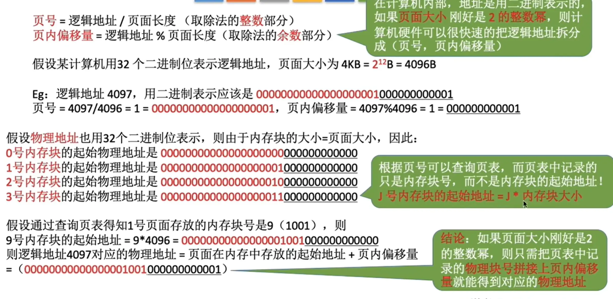

> 总结：
>
> 计算物理地址的两种方式：
>
> 1. 实际的**物理地址**=页面在内存中的**起始地址**+**页内偏移量**
>    - 起始地址=内存块号(页帧号) * 内存块的大小(一般为4KB)
> 2. 如果页面大小刚好是2的整数幂，则只需把**页表中记录的物理块号拼接上页内偏移量**就能得到对应的物理地址

#### 小总结

#### 2）基本地址变换机构

重点理解、记忆基本地址变换机构（**用于实现逻辑地址到物理地址转换的一组硬件机构**）的原理和流程

基本地址变换机构可以**借助进程的页表将逻辑地址转换为物理地址**。
通常会在系统中设置一个**页表寄存器**(PTR),存放**页表在内存中的起始地址F和页表长度M**。
进程未执行时，页表的始址和页表长度**放在进程控制块(PCB)中**，当进程被调度时，操作系统内核会把它们放到页表寄存器中。

注意：**页面大小是2的整数幂**
设页面大小为L,逻辑地址A到物理地址E的变换过程如下：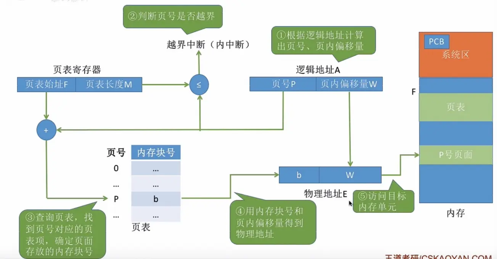

> - ①计算页号P和页内偏移量W(如果用十进制数手算，则P=A/L,W=A%L:但是在计算机实际运行时，逻辑地址结构是固定不变的，因此计算机硬件可以更快地得到二进制表示的页号、页内偏移量)
> - ②比较页号P和页表长度M,若P**≥**M,则产生越界中断，否则继续执行。（注意：页号是从0始的，而页表长度至少是1，因此**P=M时也会越界**)
> - ③页表中页号P对应的**页表项地址 = 页表起始地址F + 页号P * 页表项长度**，取出该页表项内容b,即为内存块号。（注意区分**页表项长度、页表长度、页面大小的区别**。**页表长度**指的是这个页表中总共有几个页表项，即总共有几个页：**页表项长度**指的是每个页表项占多大的存储空间：**页面大小**指的是一个页面占多大的存储空间)
> - ④计算E=b*L+W,用得到的物理地址E去访存。（如果内存块号、页面偏移量是用二进制表示的，那么把二者拼接起来就是最终的物理地址了)
>
> 动手验证：假设页面大小L=1KB,最终要访问的内存块号b=2,页内偏移量W=1023。①尝试用E=b*L+W计算目标物理地址。②尝试把内存块号、页内偏移量用二进制表示，并把它们拼接起来得到物理地址对比①②的结果是否一致
>
> 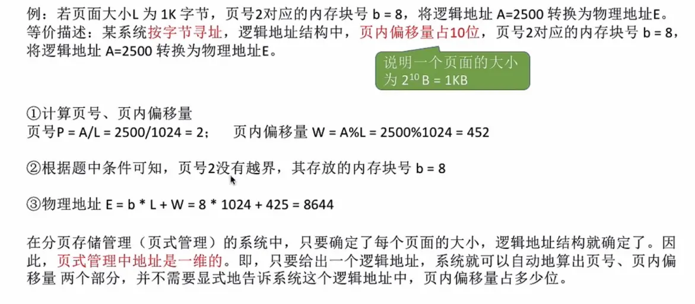

**注意：虽然前面经过计算，一个页表项只需要3B就够了，可是为了方便页表的查询，往往会让每个页表项站内据4B，**
**如下：**

**另外：进程的页表通常是装在连续的内存块中的**

小总结：

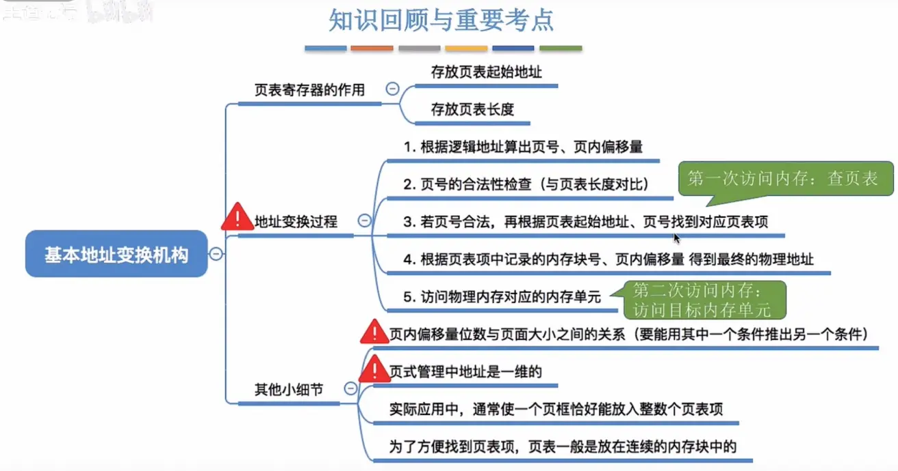

#### 3）具有快表的地址变换机构

**引入快表后，地址的变换过程：**

①CPU给出逻辑地址，由某个硬件算得页号、页内偏移量，将页号与快表中的所有页号进行比较。

②如果找到匹配的页号，说明要访问的页表顽在快表中有副本，则直接从中取出该页对应的内存块号，再将内存块号与页内偏移量拼接形成物理地址，最后，**访问**该物理地址对应的**内存单元**。因此，若**快表命中**，则访问某个逻辑地址仅需**一次访存**即可。

③如果没有找到匹配的页号，则需要**访问内存中的页表**，找到对应页表项，得到页面存放的内存块号，再将内存块号与页内偏移量拼接形成物理地址，最后，**访问**该物理地址对应的**内存单元**。因此，若**快表未命中**，则访问某个逻辑地址需要**两次访存**（注意：**在找到页表项后，应同时将其存入快表**，以便后面可能的再次访问。但若快表已满，则必须按照一定的算法对旧的页表项进行替换)由于查询快表的速度比查询页表的速度快很多，因此只要快表命中，就可以节省很多时间。因为局部性原理，一般来说快表的命中率可以达到90%以上。

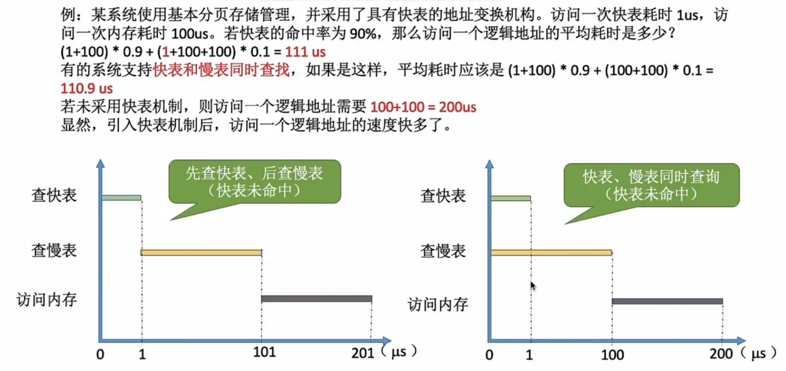

> 有的系统支持**快表和慢表同时查找**

**局部性原理：**

#### 4）两级页表

> **一级页表需要的连续内存块太多了**
>
> 根据局部性原理可知，很多时候，**进程在一段时间内只需要访问某几个页面就可以正常运行了**。因此**没有必要让整个页表都常驻内存。**

> 页面大小4KB,每个页表项4B,**每个页面可存放1K个页表项**，因此每1K个连续的页表项为一组，**每组刚好占一个内存块**，再讲各组离散地放到各个内存块中

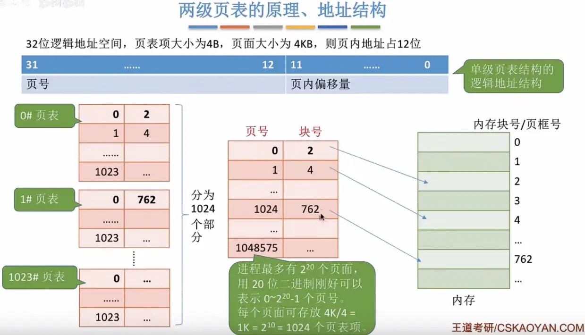

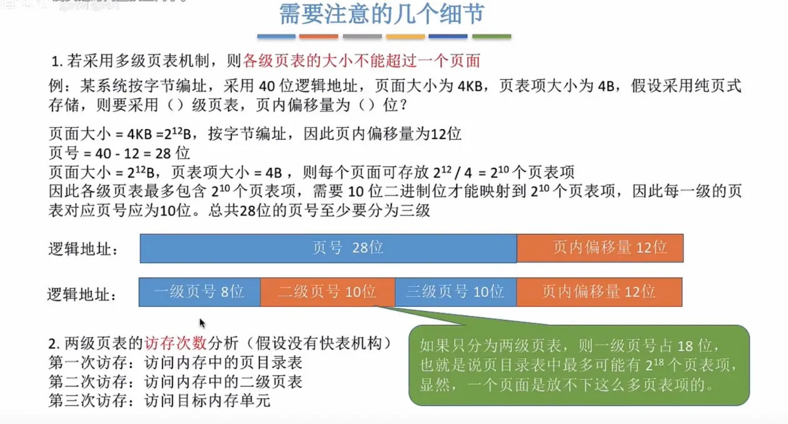

> 1 各级页表的大小不能超过一个页面
> 2 n级页表需要n+1次访存（没有快表的情况下）

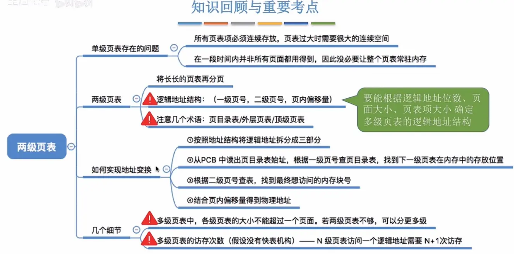

### 2.4.2 基本分段存储管理

#### 1）什么是分段

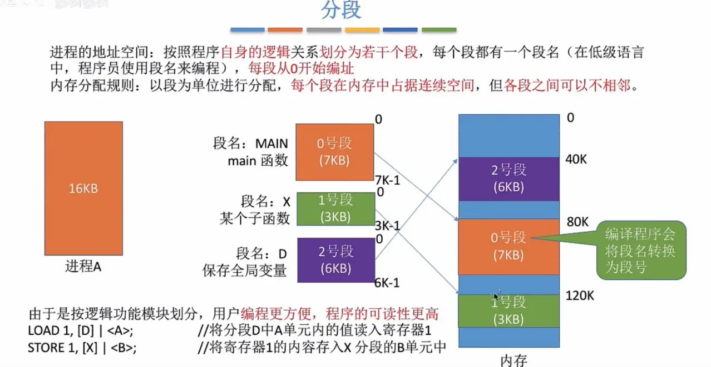

#### 2）段表和地址变换

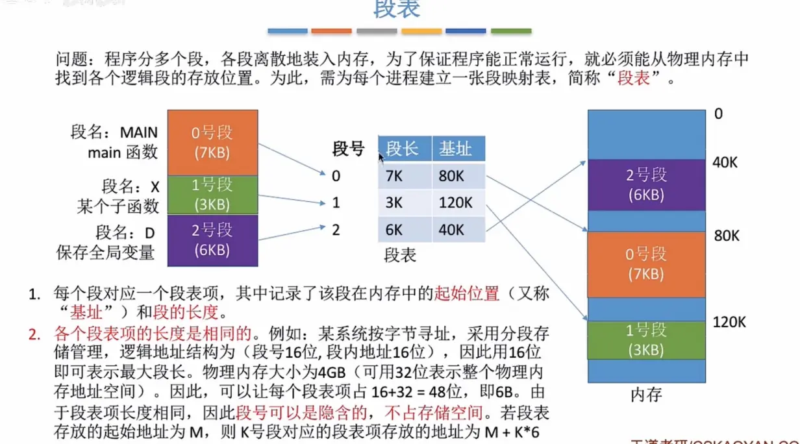

> 段表的每个段表项占6B：段长16位+基址32位=48bit=6B

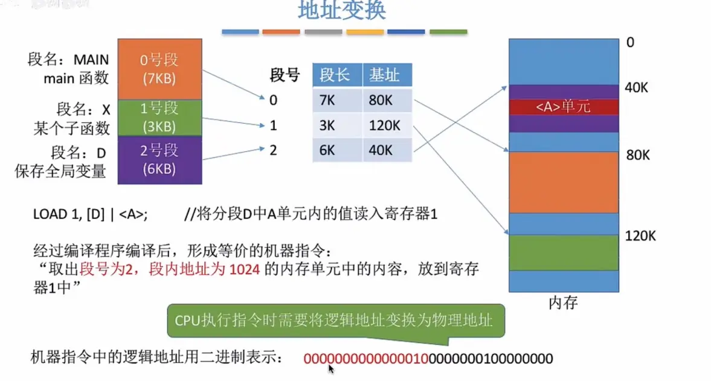

#### 3）分段、分页管理的对比

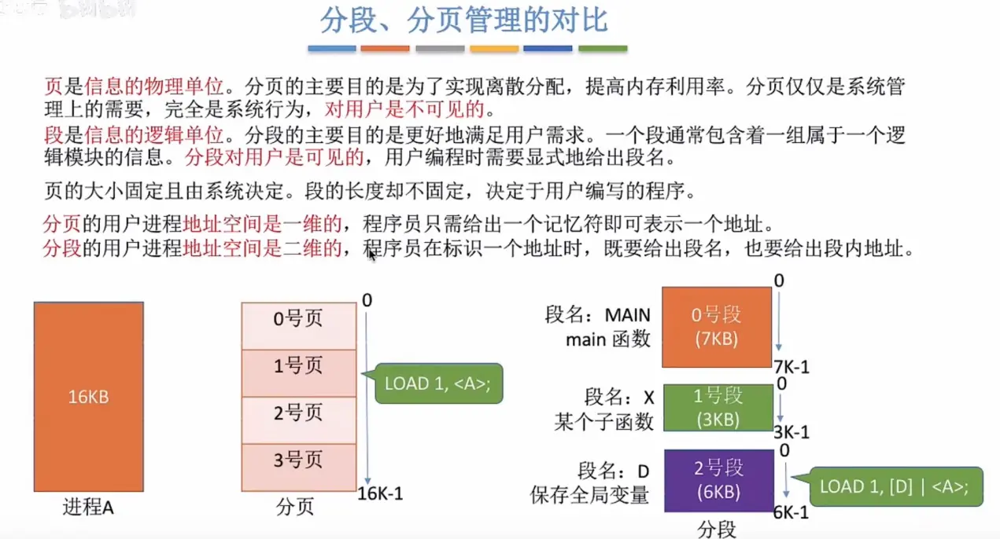

> **页**是信息的**物理单位**，**对用户是不可见**的
> **段**是信息的**逻辑单位**，**对用户是可见**的
>
> **分页**的用户进程地址空间是**一维**的
> **分段**的用户进程地址空间是**二维**的

> **分段**比分页**更容易实现信息的共享和保护**，只需指向同一个内存段即可

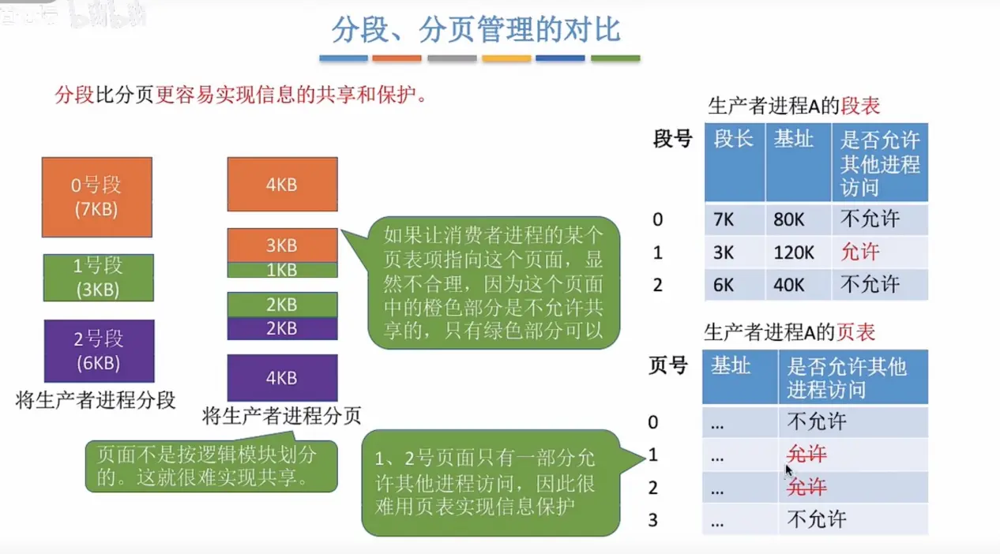

> 若是采用分页管理，那么如果需要共享的信息在一个页中，将很难实现共享

**对比小总结：**

**页**是信息的**物理单位**。分页的主要目的是为了实现离散分配，提高内存利用率。分页仅仅是系统管理上的需要，完全是系统行为，**对用户是不可见的。**
**段**是信息的**逻辑单位**。分页的主要目的是更好地满足用户需求。一个段通常包含着一组属于一个逻辑模块的信息。**分段对用户是可见的**，用户编程时需要显式地给出段名。
页的大小固定且由系统决定。段的长度却不固定，决定于用户编写的程序。

**分页**的用户进程**地址空间是一维的**，程序员只需给出一个记忆符即可表示一个地址。
**分段**的用户进程**地址空间是二维的**，程序员在标识一个地址时，既要给出段名，也要给出段内地址。

**分段**比分页**更容易实现信息的共享和保护**。不能被修改的代码称为**纯代码**或**可重入代码**（不属于临界资源)，这样的代码是可以共享的。可修改的代码是不能共享的

访问一个逻辑地址需要几次访存？
**分页（单级页表）**：第一次访存一一查内存中的页表，第二次访存一一访问目标内存单元。总共**两次访存**
**分段**：第一次访存一一查内存中的段表，第二次访存一一访问目标内存单元。总共**两次访存**
与分页系统类似，**分段系统中也可以引入快表机构**，将近期访问过的段表项放到快表中，这样**可以少一次访问**，加快地址变换速度。

#### 4）分页分段的优缺点

> 不过：分段管理中产生的外部碎片也可以用**“紧凑”**来解决，只是需要付出较大的**时间代价**

### 2.4.3 段页式管理

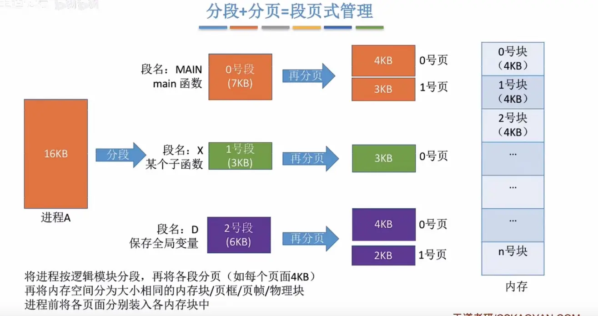

> 先分段再分页

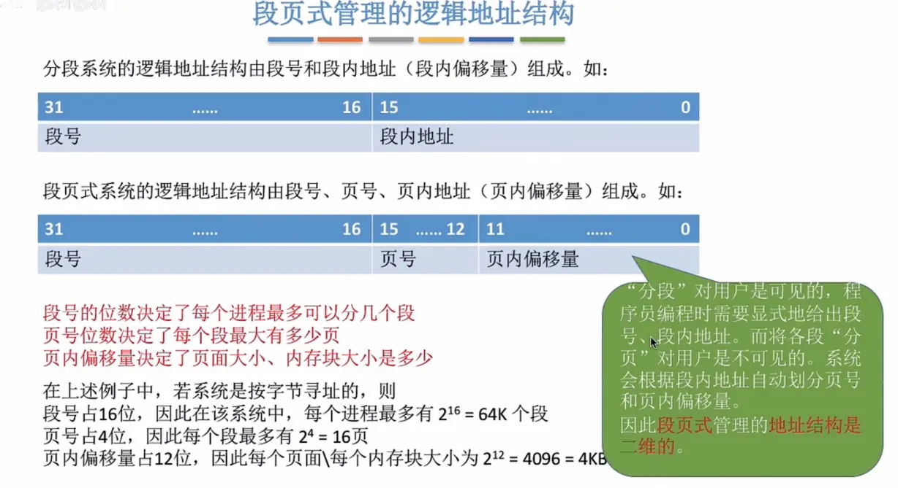

> 若是32位逻辑地址，每个段最多有2^4^=16个页

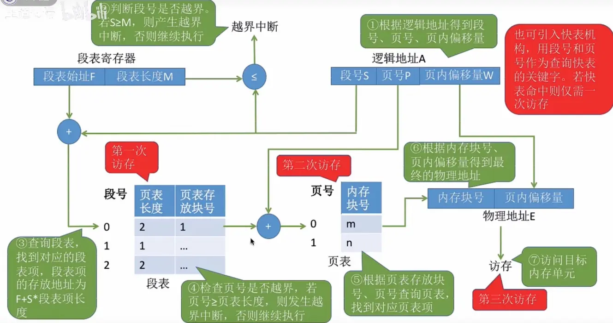

> 需要**三次访存**，比纯分页或纯分段**多一次**访存

## 2.5 虚拟内存技术

前面说了，扩展内存的技术有三项：

1. 覆盖技术
2. 交换技术
3. 虚拟存储技术

现在就来讲讲虚拟存储技术：

### 2.5.1 虚拟内存的基本概念

#### 1）传统存储管理方式的特征、缺点

> **传统存储管理**方式包括上面讲的所有连续分配和非连续分配的内存管理方式，它们的特征如下：
>
> 1. **一次性**：**作业必须一次性全部装入内存后才能开始运行**。
>    - 作业很大时，不能全部装入内存，导致**大作业无法运行**
>    - 当大量作业要求运行时，由于内存无法容纳所有作业，因此只有少量作业能运行，导致**多道程序并发度下降**
> 2. **驻留性**：一旦作业被装入内存，就**会一直驻留在内存中**，直至作业运行结束
>    - 事实上，在一个时间段内，只需要访问作业的一小部分数据即可正常运行，这就导致了内存中会驻留大量的、暂时用不到的数据，浪费了宝贵的内存资源。

#### 2）局部性原理

局部性原理在前面具有快表的地址变换机构也讲过

1. **时间局部性**：如果执行了程序中的某条指令，那么不久后这条指令很有可能再次执行：如果某个数据被访问过，不久之后该数据很可能再次被访问。（因为程序中存在大量的循环）
2. **空间局部性**：一见程序访问了某个存储单元，在不久之后，其附近的存储单元也很有可能被访问。(因为很多数据在内存中都是连续存放的，并且程序的指令也是顺序地在内存中存放的)

比如这个程序：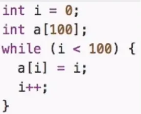这个程序，while循环内的代码拥有时间局部性，a数组具有空间局部性

#### 3）虚拟内存的定义和特征

> 虚拟内存简而言之，就是解决了上面传统方式的两个问题：
>
> 1. 解决了一次性问题：作业不用一次性全部装入内存，**只装入用到的部分**
> 2. 解决了驻留性问题：**操作系统会将暂时用不到的信息换出到外存**
>
> 看起来像是同时具备覆盖技术和交换技术的优点
>
> 虚拟内存的**三个特征**：
>
> 1. **多次性**：无需在作业运行时一次性全部装入内存，而是允许被分成多次调入内存。
> 2. **对换性**：在作业运行时无需一直常驻内存，而是允许在作业运行过程中，将作业换入、换出。
> 3. **虚拟性**：从逻辑上扩充了内存的容量，使用户看到的内存容量，远大于实际的容量。

#### 4）实现虚拟内存的方式

### 2.5.2 请求分页管理方式

#### 1）页表机制

> 与基本分页管理相比，请求分页管理中，为了实现“请求调页”，操作系统需要**知道每个页面是否已经调入内存**：如果还没调入，那么也需要知道该**页面在外存中存放的位置**。
>
> 当**内存空间不够时，要实现“页面置换”**，操作系统需要通过某些指标来决定到底换出哪个页面：有的页面没有被修改过，就不用再浪费时间写回外存。有的页面修改过，就需要将外存中的旧数据覆盖，因此，操作系统也需要记录各个页面**是否被修改**的信息。
>
> 所以：**请求页表**项比**页表**增加了4个字段

#### 2）缺页中断机构

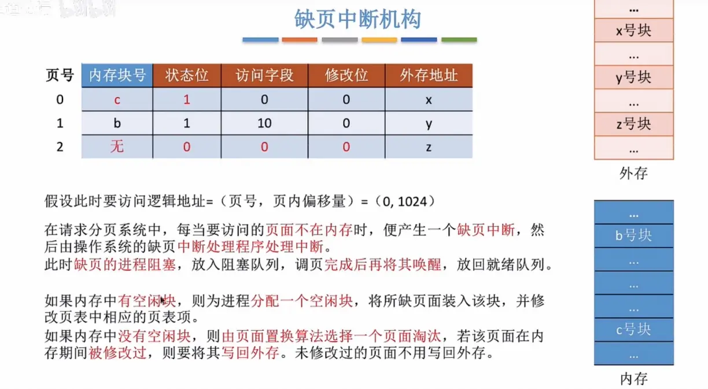
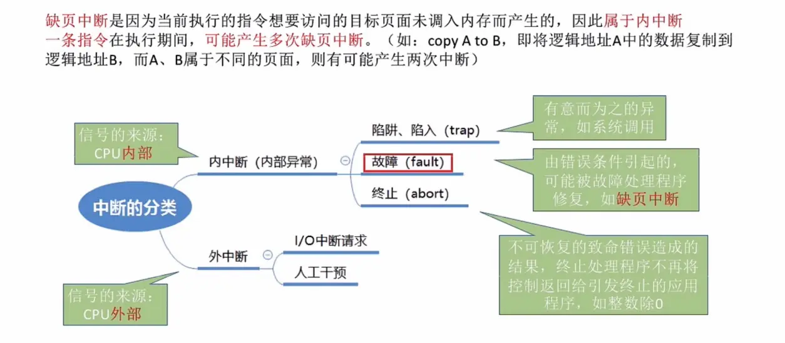

> **缺页中断**是因为当前执行的指令**想要访问的目标页面未调入内存而产生的**，因此属于**内中断**
> **一条指令**在执行期间，**可能产生多次缺页中断**。

#### 3）地址变换机构

> 注意补充细节的第⑤点，若发生缺页中断，将页面调入内存后，**会同时放入慢表和快表**
>
> 在具有快表机构的请求分页系统中，访问一个逻辑地址时，若发生缺页，则地址变换步骤是：
>
> 查快表（未命中）-> 查慢表（发现未调入内存）-> 调页（调入的页面对应的表项会直接加入快表) -> **查快表（**命中) -> 访问目标内存单元

### 2.5.3 页面置换算法

#### 1）最佳置换算法OPT

> 淘汰的页面是**内存中之后最长时间不再被访问的页面**
>
> 打勾的地方发生了缺页中断：**缺页时未必发生页面置换**
>
> 缺页率 = 缺页中断次数 / 访问页面次数
>
> 前提条件：知道之后依次要访问的页面是哪些
> 最佳置换算法可以**保证最低的缺页率**，但实际上，只有在进程执行的过程中才能知道接下来会访问到的是哪个页面。**操作系统无法提前预判页面访问序列**。因此，最佳置换算法是**无法实现**的。

#### 2）先进先出算法FIFO

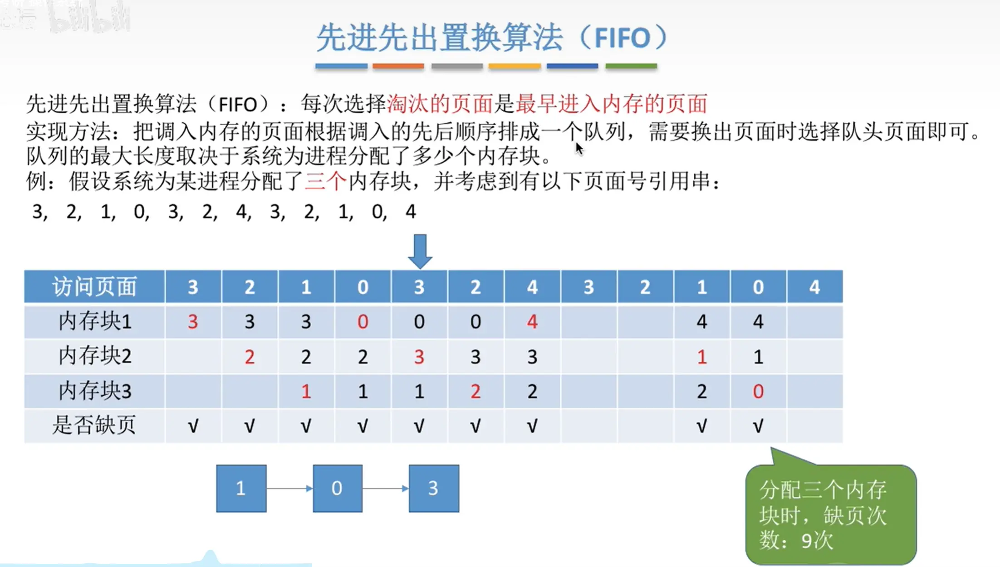
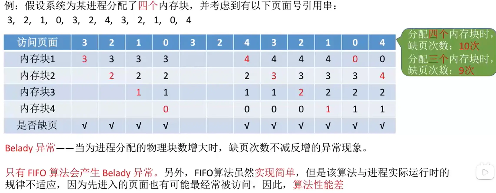

> 维护了一个队列，每次发生缺页中断时，将队首的页面换出内存，换入的新页面放到队尾
>
> Belady异常：当为进程分配的物理块数增大时，缺页次数不减反增的异常现象。
>
> **只有FIFO算法会产生Belady异常，算法性能差**

#### 3）最近最久未使用算法LRU

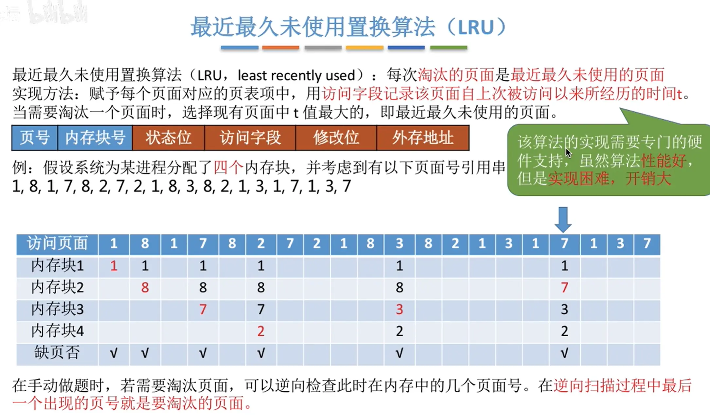

> 该算法性能好，是最接近最佳置换算法的
>
> 但是实现困难，开销大
>
> 在MySQL置换脏页和Redis对象内存淘汰中都有使用到LRU算法：
>
> 1. 在MySQL中：大致过程就是维护了一个链表，每次访问一个页就将其放到头的位置，那么尾部的页就是最近最久未使用
> 2. 在Redis中：在RedisObject中维护了一个3字节的变量lru:LRU_BITS，记录该key的最近一次访问时间戳，并对所有key的(now-LRU_BITS)进行排序，值越大，越应该被淘汰

#### 4）时钟置换算法CLOCK

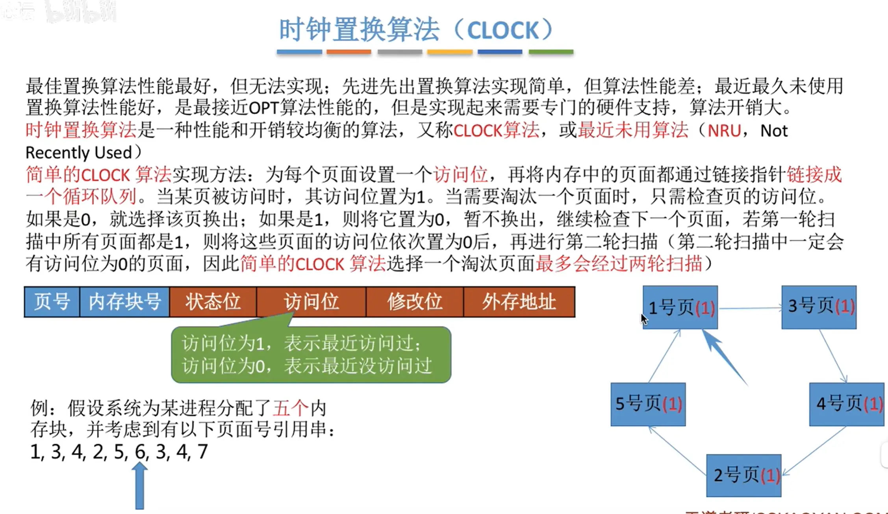

> **CLOCK算法**也叫**最近未用算法NRU**
>
> CLOCK算法扫描过程(精准空降)：https://www.bilibili.com/video/BV1YE411D7nH?t=950.8&p=55
>
> 先将1，3，4，2，5放入内存，
> 然后访问6号页时，先从1循环队列一号页开始扫描，第一轮扫描会将所有页面置0，这里会在第二轮扫描时扫描到1发现是0，然后把页面6放入1，
> 访问3时将3号页置1，访问4时将4号页置1，
> 访问7时缺页，之前扫描到1号页(现在应该是6号页)处，接着往后扫描3号页发现是1，置为0，4号页发现是1，置为0，扫描到2号页时是0，在此处替换为7号页
>
> **最多会进行两轮扫描**

#### 5）改进型的时钟置换算法

> 在CLOCK算法的基础上，再考虑修改位
>
> - 第一优先级：最近没访问，且没修改的页面(0,0)
> - 第二优先级：最近没访问，但修改过的页面(0,1)，本轮将扫描过的访问位设为0
> - 第三优先级：最近访问过但没修改的页面(0,0)
> - 第四优先级：最近访问过，且修改过的页面(0,1)
>
> **最多会进行四轮扫描**

#### 小总结

### 2.5.4 页面分配策略、抖动、工作集

#### 1）驻留集

**驻留集**：指请求分页存储管理中**给进程分配的物理块的集合**。
在采用了虚拟存储技术的系统中，驻留集大小一般小于进程的总大小

eg：考虑一个极端情况，若某进程共有100个页面，则该进程的驻留集大小为100时进程可以全部放入内存，运行期间不可能再发生缺页。若驻留集大小为1，则进程运行期间必定会极频繁地缺页

所以：**若驻留集太小，会导致缺页频繁**，系统要花大量的时间来处理缺页，实际用于进程推进的时间很少；**驻留集太大，又会导致多道程序并发度下降，资源利用率降低**。所以应该选择一个合适的驻留集大小。

#### 2）页面分配策略

#### 3）何时、何处调入页面

> 采用 预调页策略 与 请求调页策略 相结合，**运行前预调页，运行时请求调页**

> 分为 **对换区空间 足够 与 不够** 两种情况

#### 4）抖动现象 与 工作集

> 分配给进程的物理块太少，所以会发生抖动现象
> 所以提出了**工作集**的概念：

> **驻留集大小不能小于工作集大小**，否则进程运行过程中将频繁缺页。

#### 小总结

# 3 内存映射文件

内存映射文件一一操作系统向上层程序员提供的功能（系统调用）

1. 方便程序员访问文件数据
2. 方便多个进程共享同一个文件

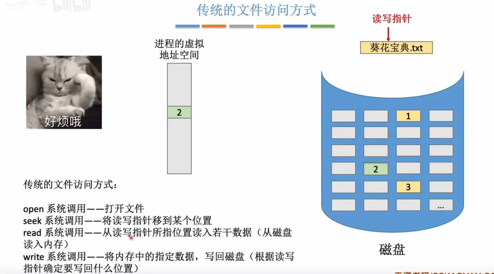

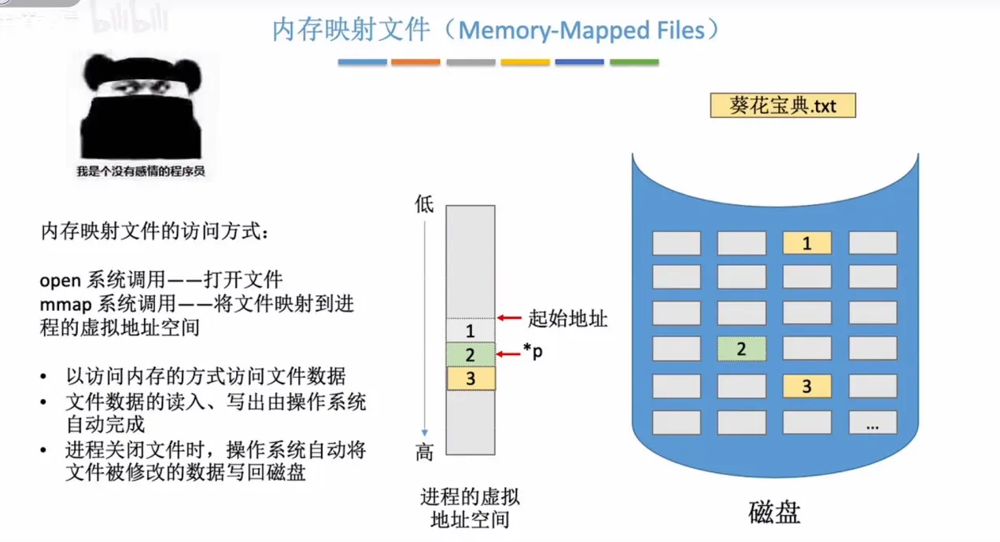

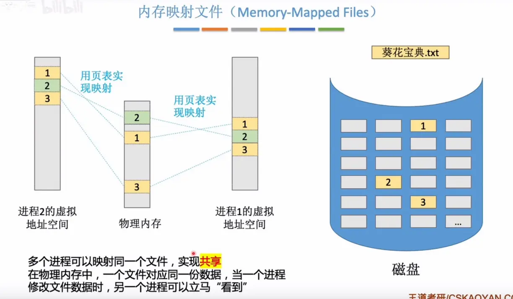

