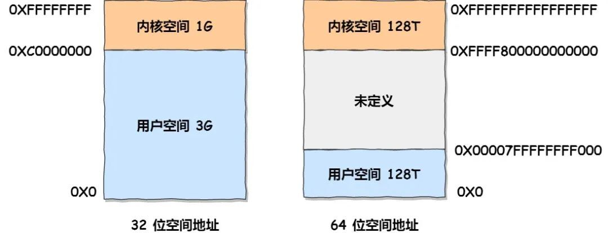
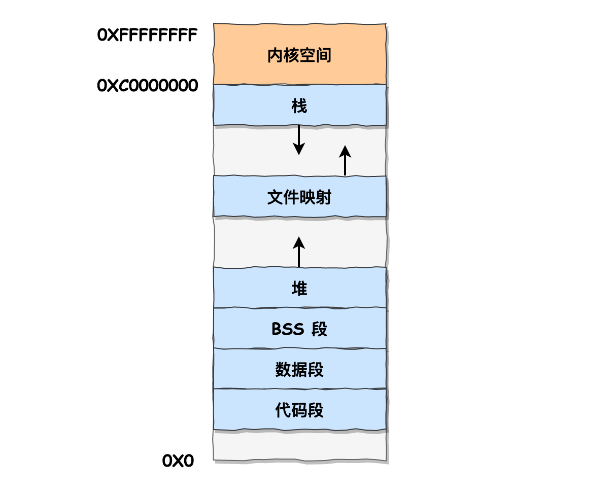
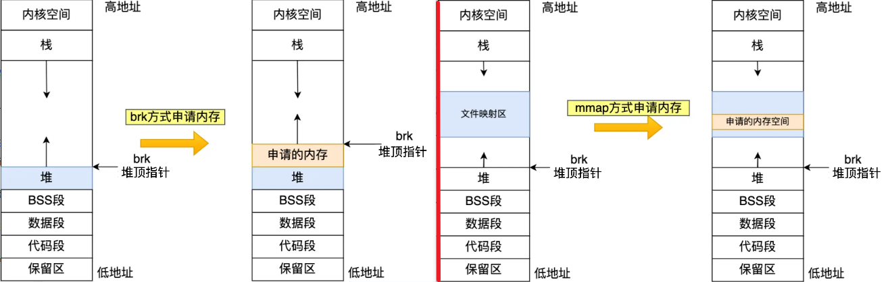
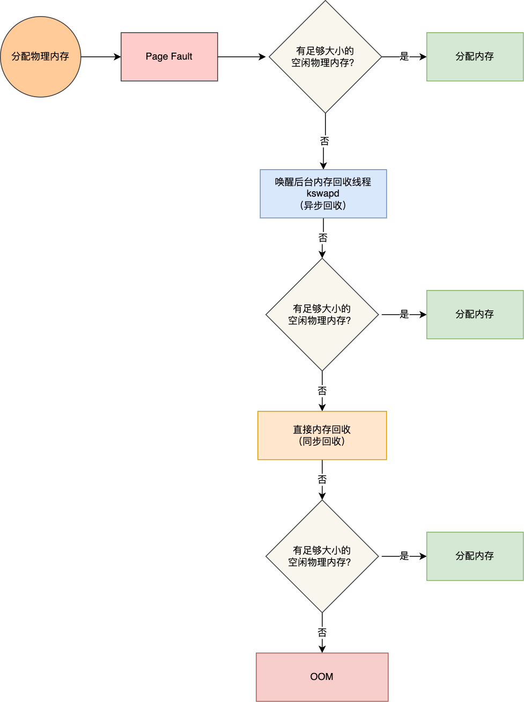
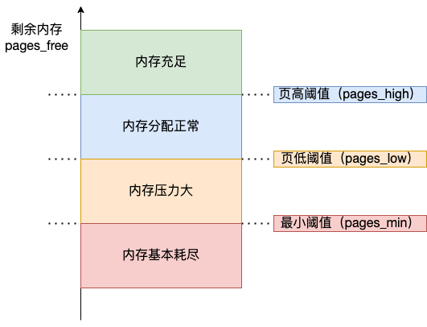
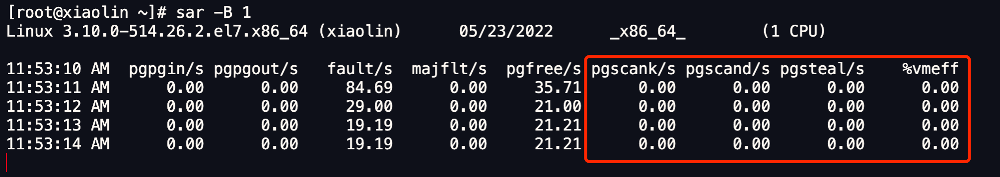
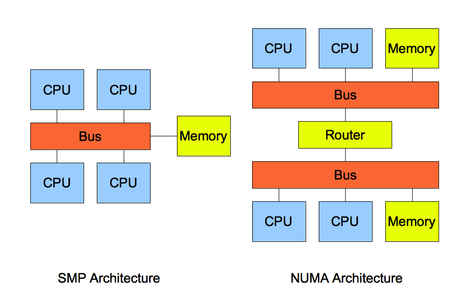
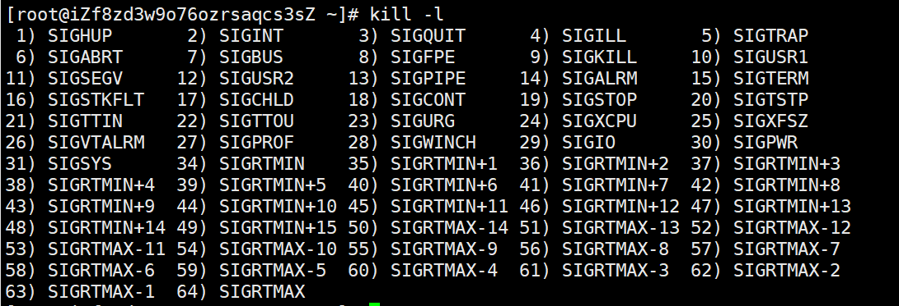

# start

[TOC]

# 1 一些常见面试题

## 1.1 进程、线程和协程各自的作用和区别？进程和线程的组成？

> **进程、线程和协程区别？**
>
> - **进程**是操作系统`资源分配的基本单位`，每个进程都有独立的`内存空间和系统资源`，相互之间互不干扰，保证了系统的稳定性和安全性。但是，进程间的切换和通信需要较大的开销。
> - **线程**是进程内的执行单元，可以看作轻量级的进程，是`CPU调度的基本单位`，`共享`同一个进程的内存空间和资源，如**代码段、数据段、堆、已打开的文件资源** 等。线程间的切换和通信比进程更快，因为它们共享同一地址空间。但是，线程没有独立的地址空间，一个线程的崩溃可能会影响整个进程。
> - **协程**是一种更轻量级的线程，也被称为微线程。它们完全在用户态下执行，不需要内核的参与，因此切换开销更小。协程可以由程序自身控制调度，实现非抢占式的多任务处理，更适合于IO密集型任务。

> **进程和线程的组成？**
>
> - 进程的组成： 进程主要由三部分组成：**程序代码**（即指令序列）、**相关数据**（包括变量、缓冲区、文件等）以及**进程控制块（PCB）**。其中，进程控制块是用于描述系统进程状态的关键数据结构，它包含了进程ID、进程状态、内存指针、文件描述符表、信号处理函数等重要信息。
> - 线程的组成： 线程是进程内的一个执行单元，其组成通常包括**线程ID**、**当前指令指针（PC）**、**寄存器集合**（用于保存线程上下文）、**堆栈**（用于函数调用和局部变量存储）以及**线程控制块（TCB**，类似于进程中的PCB，但更轻量级）。线程共享其所属进程的内存空间和部分资源，如文件句柄和信号量等，这使得线程间的数据交互变得容易，但同时也增加了同步和互斥的复杂性。

## 1.2 elect、poll、epoll的区别

1. select 和 poll 并没有本质区别，最大的区别就是，**select使用数组，poll使用链表**来存储进程关注的 Socket 集合。
   - 在使用的时候，首先需要把关注的 Socket 集合通过 select/poll 系统调用从用户态**拷贝**到内核态，然后由内核检测事件，当有网络事件产生时，内核需要**遍历**进程关注 Socket 集合，找到对应的 Socket，并设置其状态为可读/可写，然后把整个 Socket 集合从内核态**拷贝**到用户态，用户态还要继续**遍历**整个 Socket 集合找到可读/可写的 Socket，然后对其处理。
   - 很明显发现，select 和 poll 的缺陷在于，当客户端越多，也就是 Socket 集合越大，都需要**拷贝和遍历两次**，Socket 集合的遍历和拷贝会带来很大的开销，因此也很难应对 C10K问题（单机同时处理 1 万个请求的问题）。
2. epoll 是解决 C10K 问题的利器，通过两个方面解决了 select/poll 的问题。
   - epoll 在内核里使用「**红黑树」**来关注进程所有待检测的 Socket，红黑树是个高效的数据结构，增删改一般时间复杂度是 O(logn)，通过对这棵黑红树的管理，不需要像 select/poll 在每次操作时都传入整个 Socket 集合，减少了内核和用户空间大量的数据拷贝和内存分配。
   - epoll 使用事件驱动的机制，内核里维护了一个「**链表**」来记录就绪事件，只将有事件发生的 Socket 集合传递给应用程序，不需要像 select/poll 那样轮询扫描整个集合（包含有和无事件的 Socket ），大大提高了检测的效率。

而且，epoll 支持边缘触发和水平触发的方式，而 select/poll 只支持水平触发，一般而言，边缘触发的方式会比水平触发的效率高。

## 1.3 边缘触发和水平触发

- 使用边缘触发模式时，当被监控的 Socket 描述符上有可读事件发生时，**服务器端只会从 epoll_wait 中苏醒一次**，即使进程没有调用 read 函数从内核读取数据，也依然只苏醒一次，因此我们程序要保证一次性将内核缓冲区的数据读取完；
- 使用水平触发模式时，当被监控的 Socket 上有可读事件发生时，**服务器端不断地从 epoll_wait 中苏醒，直到内核缓冲区数据被 read 函数读完才结束**，目的是告诉我们有数据需要读取；

## 1.4 磁盘快照有了解吗？介绍下COW和ROW？

> **磁盘快照**： 磁盘快照是一种创建文件系统或卷在某个特定时间点的`只读副本`的技术。它允许用户在**不影响原始数据的情况下**访问、备份或恢复数据。快照通常用于数据保护、恢复和备份场景，可以迅速创建并占用较少的存储空间。
>
> **COW（写时复制）**： COW是“写时复制”的缩写，是一种实现磁盘快照的技术。在使用COW时，fork一个子进程，**子进程共享主进程的内存区域**，起初**读操作都在共享区域**进行，当要进行写操作时，将要写的数据拷贝到共享区域外，**之后的读、写操作都操作该数据的副本**。然后子进程备份共享区域的内容为快照。
>
> **ROW（写时重定向）**： ROW是“写时重定向”的缩写，是另一种实现磁盘快照的技术。ROW 与 COW 最大的不同就是：**COW 的快照卷存放的是原始数据，而 ROW 的快照卷存放的是新数据**，ROW通常将原始数据块的副本（新数据）以供快照使用，而不是共享数据块。这意味着每个修改都会导致新的数据块被分配和写入，这可能会增加存储空间的消耗。

## 1.5 进程间通信方式有哪些？

1. 管道
   - `匿名管道：`没有名字标识，匿名管道是特殊文件只存在于内存，没有存在于文件系统中，shell 命令中的「`|`」竖线就是匿名管道，通信的数据是**无格式的流并且大小受限**，通信的方式是**单向**的，**匿名管道是只能用于存在父子关系的进程间通信**，匿名管道的生命周期随着进程创建而建立，随着进程终止而消失。
   - `命名管道：`突破了匿名管道只能在亲缘关系进程间的通信限制，需要在文件系统创建一个类型为 p 的设备文件，那么毫无关系的进程就可以通过这个设备文件进行通信。
   - 另外，不管是匿名管道还是命名管道，进程写入的数据都是**缓存在内核**中，另一个进程读取数据时候自然也是从内核中获取，同时通信数据都遵循**先进先出**原则，不支持 lseek 之类的文件定位操作。
   - 管道这种通信方式**效率低**，不适合进程间频繁地交换数据
2. 消息队列
   - 消息队列实际上是保存在内核的「消息链表」。消息队列通信的速度不是最及时的，毕竟**每次数据的写入和读取都需要经过用户态与内核态之间的拷贝过程。**
   - 缺点：一是通信不及时，二是附件也有大小限制，不适合大数据的传输
3. 共享内存
   - **最快**的进程间通信方式之名。但是**多进程竞争同个共享资源会造成数据的错乱。**
4. 信号量
   - P、V操作实现**访问的互斥性，和进程间的同步**
5. 信号
   - 信号是**异步通信机制**。程有三种方式响应信号 1. 执行默认操作、2. 捕捉信号、3. 忽略信号
   - Linux下可通过 kill -l 查看所有的信号，一共有64种
6. socket
   - **要与相同和不同主机的进程间通信，那么就需要 Socket 通信了**。一个是基于 TCP 协议的通信方式，一个是基于 UDP 协议的通信方式，一个是本地进程间通信方式。

## 1.6 硬中断和软中断

为了避免由于中断处理程序执行时间过长，而影响正常进程的调度，Linux 将中断处理程序分为上半部和下半部：

- 上半部，对应硬中断，由硬件触发中断，用来快速处理中断；
- 下半部，对应软中断，由内核触发中断，用来异步处理上半部未完成的**耗时工作**；

## 1.7 一个进程最多可以创建多少线程？

- 32 位系统，用户态的虚拟空间只有 3G，如果创建线程时分配的栈空间是 10M（通过 ulimit -a 命令查看），那么一个进程最多只能创建 300 个左右的线程。
- 64 位系统，用户态的虚拟空间大到有 128T，理论上不会受虚拟内存大小的限制，而会受系统的参数或性能限制。
  - 比如下面这三个内核参数的大小，都会影响创建线程的上限：
    - ***/proc/sys/kernel/threads-max***，表示系统支持的最大线程数，默认值是 `14553`；
    - ***/proc/sys/kernel/pid_max***，表示系统全局的 PID 号数值的限制，每一个进程或线程都有 ID，ID 的值超过这个数，进程或线程就会创建失败，默认值是 `32768`；
    - ***/proc/sys/vm/max_map_count***，表示限制一个进程可以拥有的VMA(虚拟内存区域)的数量，具体什么意思我也没搞清楚，反正如果它的值很小，也会导致创建线程失败，默认值是 `65530`。

#  2 内存管理

## 2.1 malloc是如何分配内存的

### 1 Linux 进程 / 用户空间 的内存分布

在 Linux 操作系统中，虚拟地址空间的内部又被分为**内核空间和用户空间**两部分，不同位数的系统，地址空间的范围也不同。比如最常见的 32 位和 64 位系统，如下所示：



通过这里可以看出：

- `32` 位系统的内核空间占用 `1G`，位于最高处，剩下的 `3G` 是用户空间；
- `64` 位系统的内核空间和用户空间都是 `128T`，分别占据整个内存空间的最高和最低处，剩下的中间部分是未定义的。


我们看看**用户空间分布**的情况，以 32 位系统为例，用户空间内存从**低到高**分别是 6 种不同的内存段：



- 代码段，包括二进制可执行代码；
- 数据段，包括已初始化的静态常量和全局变量；
- BSS 段，包括未初始化的静态变量和全局变量；
- 堆段，包括动态分配的内存，从低地址开始向上增长；
- 文件映射段，包括动态库、共享内存等，从低地址开始向上增长（[跟硬件和内核版本有关 (opens new window)](http://lishiwen4.github.io/linux/linux-process-memory-location)）；
- 栈段，包括局部变量和函数调用的上下文等。栈的大小是固定的，一般是 `8 MB`。当然系统也提供了参数，以便我们自定义大小；

在这 6 个内存段中，堆和文件映射段的内存是动态分配的。比如说，使用 C 标准库的 `malloc()` 或者 `mmap()` ，就可以分别在堆和文件映射段动态分配内存。


### 2 malloc分配内存的两种方式

1. `brk()`：当分配的内存 < 128KB，通过 brk() 系统调用从**堆**分配内存
   - 通过free释放内存后，若进程还未结束，并**不会把内存归还给操作系统**，而是缓存在 malloc 的内存池中，待下次使用；
2. `mmap()`：当分配的内存 >= 128KB，通过 mmap() 系统调用在**文件映射区域**分配内存；
   - 通过free释放内存后，**会把内存归还给操作系统**，内存得到真正的释放。

> 注意，不同的 glibc 版本定义的阈值也是不同的。另外，**malloc() 分配的是虚拟内存**。
>
> malloc(1)默认会分配**132KB**，会预分配一个更大的空间



### 3 brk() 和 mmap() 的 优缺点 / 对比

1. `mmap()`每次free后都会真正释放内存，而每次申请内存是一次**系统调用**过程，需要进行内核态和用户态的切换，会有较大的开销。而`brk()`分配的内存当释放时会缓存在内存池中，**减少内存分配的次数**，减小开销。
2. 但是`brk()`是使用堆顶指针进行内存的分配，多次分配和free后，**可能产生很多的内存碎片**

### 4 free() 怎么知道释放多大的内存？

> free() 函数只传入一个内存地址，为什么能知道要释放多大的内存？
>
> malloc 返回给**用户态的内存起始地址**比进程的**堆空间起始地址多了 16 字节**，保存了该内存块的描述信息，其中有该内存块的大小
>
> 当执行 free() 函数时，free 会对传入进来的内存地址**向左偏移 16 字节**，然后从这个 16 字节的分析出当前的内存块的大小，自然就知道要释放多大的内存了。

## 2.2 内存管理和虚拟内存的作用

- 第一，虚拟内存可以 让进程**只装入一部分**就能运行，以及**换出**暂时不用的内存，**换入**需要的内存，让程序**以为物理空间很大**。
- 第二，进行**内存分配**；由于每个进程都有自己的**独立页表**，所以每个进程的**虚拟内存空间就是相互独立**的。进程也没有办法访问其他进程的页表，所以这些页表是私有的，**防止进程间相互影响**。
- 第三，页表里的页表项中除了物理地址之外，还有一些标记属性的比特，比如控制一个页的读写权限，标记该页是否存在等。在内存访问方面，操作系统**提供了更好的安全性**。

## 2.3 内存 分配 与 回收 的过程

应用程序通过 malloc 函数申请内存的时候，实际上**申请的是虚拟内存**，此时并不会分配物理内存。

当应用程序读写了这块虚拟内存，CPU 就会去访问这个虚拟内存， 这时会发现这个虚拟内存没有映射到物理内存， CPU 就会产生**缺页中断**，进程会从用户态切换到内核态，并将缺页中断交给内核的 Page Fault Handler （缺页中断函数）处理。

缺页中断处理函数会看是否有空闲的物理内 存，如果有，就直接分配物理内存，并建立虚拟内存与物理内存之间的映射关系。

如果没有空闲的物理内存，那么内核就会开始进行**回收内存**的工作，回收的方式主要是两种：直接内存回收和后台内存回收。

- **后台内存回收**（kswapd）：在物理内存紧张的时候，会唤醒 kswapd 内核线程来回收内存，这个回收内存的过程**异步**的，**不会阻塞**进程的执行。
- **直接内存回收**（direct reclaim）：如果后台异步回收跟不上进程内存申请的速度，就会开始直接回收，这个回收内存的过程是**同步**的，会**阻塞**进程的执行。

如果直接内存回收后，空闲的物理内存仍然无法满足此次物理内存的申请，那么内核就会放最后的大招了 ——**触发 OOM （Out of Memory）机制**。

OOM Killer 机制会根据算法选择一个占用物理内存较高的进程，然后将其杀死，以便释放内存资源，如果物理内存依然不足，OOM Killer 会继续**杀死占用物理内存较高的进程**，直到释放足够的内存位置。



## 2.4 内存回收的阈值

内核定义了**三个内存阈值**（watermark，也称为水位），用来衡量当前剩余内存（pages_free）是否充裕或者紧张，分别是：

- 页最小阈值（pages_min）；
- 页低阈值（pages_low）；
- 页高阈值（pages_high）；

这三个内存阈值会划分为四种内存使用情况，如下图：



- 图中橙色部分：如果剩余内存 `pages_min <（pages_free）<= pages_low`，说明内存压力比较大，剩余内存不多了。**这时 kswapd0 会执行内存回收，直到剩余内存大于高阈值（pages_high）为止**。虽然会触发内存回收，但是不会阻塞应用程序，因为两者关系是异步的。
- 图中红色部分：如果剩余内存`（pages_free）< pages_min`，说明用户可用内存都耗尽了，此时就会**触发直接内存回收**，这时应用程序就会被阻塞，因为两者关系是同步的。

## 2.5 哪些内存可以被回收？

- **文件页**（File-backed Page）：内核缓存的磁盘数据（Buffer）和内核缓存的文件数据（Cache）都叫作文件页。大部分文件页都是没有修改过的干净页，少部分是修改过的脏页。所以，**回收干净页的方式是直接释放内存，回收脏页的方式是先写回磁盘后再释放内存**。
- **匿名页**（Anonymous Page）：这部分内存没有实际载体，不像文件缓存有硬盘文件这样一个载体，比如`堆、栈数据等`。这部分内存很可能还要再次被访问，所以不能直接释放内存，它们**回收的方式是通过 Linux 的 Swap 机制**，Swap 会把不常访问的内存先写到磁盘中，然后释放这些内存，给其他更需要的进程使用。再次访问这些内存时，重新从磁盘读入内存就可以了。

> 文件页的回收，有部分是干净页是直接回收的，**效率高**于脏页；而匿名页会进行换入和换出，效率较低。

文件页和匿名页的回收**都是基于 LRU 算法**，也就是优先回收不常访问的内存。在Linux中，LRU 回收算法，实际上维护着 active 和 inactive 两个双向链表，其中：

- **active_list** 活跃内存页链表，这里存放的是最近被访问过（活跃）的内存页；
- **inactive_list** 不活跃内存页链表，这里存放的是很少被访问（非活跃）的内存页；

## 2.6 内存回收的参数调节

针对回收内存导致的性能影响，常见的解决方式。

1. 设置 /proc/sys/vm/swappiness，调整文件页和匿名页的回收倾向，尽量倾向于回收文件页；
2. 设置 /proc/sys/vm/min_free_kbytes，调整 kswapd 内核线程异步回收内存的时机；
3. 设置 /proc/sys/vm/zone_reclaim_mode，调整 NUMA 架构下内存回收策略，建议设置为 0，这样在回收本地内存之前，会在其他 Node 寻找空闲内存，从而避免在系统还有很多空闲内存的情况下，因本地 Node 的本地内存不足，发生频繁直接内存回收导致性能下降的问题；

### 1 调整文件页和匿名页的回收倾向

> 文件页的回收，有部分是干净页是直接回收的，**效率高**于脏页；而匿名页会进行换入和换出，效率较低。
>
> 所以我们**更倾向回收文件页**

Linux 提供了一个 `/proc/sys/vm/swappiness` 选项，用来调整文件页和匿名页的回收倾向。
swappiness 的范围是 0-100，数值越大，越积极使用 Swap，也就是更倾向于回收匿名页

一般**建议 swappiness 设置为 0**（默认值是 60），这样在回收内存的时候，会更倾向于文件页的回收，但是并不代表不会回收匿名页。

### 2 尽早触发 kswapd 后台内核线程异步回收内存

我们可以使用 `sar -B 1` 命令来观察内存回收的指标：



图中红色框住的就是后台内存回收和直接内存回收的指标，它们分别表示：

- pgscank/s : kswapd(**后台**回收线程) 每秒扫描的 page 个数。
- pgscand/s: 应用程序**直接**在内存申请过程中每秒直接扫描的 page 个数。
- pgsteal/s: 扫描的 page 中每秒被回收的个数（**pgscank+pgscand**）。

如果系统时不时发生抖动，并且在抖动的时间段里如果通过 sar -B 观察到 pgscand 数值很大，那大概率是因为「直接内存回收」导致的。我们**需要避免直接内存回收造成进程的阻塞**。

> 回顾内存回收的阈值：
>
> 1.  `pages_min <（pages_free）<= pages_low`， kswapd0 会执行内存回收，直到剩余内存大于高阈值（pages_high）为止
> 2. 图中红色部分：如果剩余内存`（pages_free）< pages_min`，触发直接内存回收

页低阈值（pages_low）可以通过内核选项 `/proc/sys/vm/min_free_kbytes` （该参数代表系统所保留空闲内存的最低限）来间接设置。

```properties
pages_min = min_free_kbytes
pages_low = pages_min*5/4
pages_high = pages_min*3/2
```

我们通过调大 pages_min 的参数大小，来**间接调大 pages_low** 的参数大小，**让后台回收线程 kswapd 尽早开始回收内存**

> 参数设置的思考：
>
> - 调大 pages_min 会使得系统**预留过多的空闲内存**，从而在一定程度上**降低了**应用程序**可使用的内存量**，这在一定程度上**浪费了内存**。极端情况下设置 min_free_kbytes 接近实际物理内存大小时，留给应用程序的内存就会太少而可能会频繁地导致 OOM 的发生。
> - 所以在调整 min_free_kbytes 之前，需要先思考一下，应用程序更加关注什么，如果关注延迟那就适当地增大 min_free_kbytes，如果关注内存的使用量那就适当地调小 min_free_kbytes。

### 3 NUMA 架构下的内存回收策略

1. SMP/UMA 指的是一种**多个 CPU 处理器共享资源的电脑硬件架构**，也就是说每个 CPU 地位平等，它们共享相同的物理资源，包括总线、内存、IO、操作系统等。每个 CPU 访问内存所用时间都是相同的，因此，这种系统也被称为**一致存储访问结构**（UMA，Uniform Memory Access）。

   - 随着 CPU 处理器核数的增多，多个 CPU 都通过一个总线访问内存，这样总线的带宽压力会越来越大，同时每个 CPU 可用带宽会减少，这也就是 SMP 架构的问题。

2. **NUMA （非一致性存储访问结构）**架构将每个 CPU 进行了分组，每一组 CPU 用 Node 来表示，一个 Node 可能包含多个 CPU 。

   **每个 Node 有自己独立的资源，包括内存、IO 等**，每个 Node 之间可以通过互联模块总线（QPI）进行通信，所以，也就意味着每个 Node 上的 CPU 都可以访问到整个系统中的所有内存。但是，访问远端 Node 的内存比访问本地内存要耗时很多。



在 NUMA 架构下，当某个 Node 内存不足时，系统可以从其他 Node 寻找空闲内存，也可以从本地内存中回收内存。

具体选哪种模式，可以通过 /proc/sys/vm/zone_reclaim_mode 来控制。它支持以下几个选项：

- 0 （默认值）：在回收本地内存之前，在其他 Node 寻找空闲内存；
- 1：只回收本地内存；
- 2：只回收本地内存，在本地回收内存时，可以将文件页中的脏页写回硬盘，以回收内存。
- 4：只回收本地内存，在本地回收内存时，可以用 swap 方式回收内存。

虽然说访问远端 Node 的内存比访问本地内存要耗时很多，但是相比内存回收的危害而言，访问远端 Node 的内存带来的性能影响还是比较小的。因此，**zone_reclaim_mode 一般建议设置为 0**。

## 2.7  如何保护一个进程不被 OOM 杀掉呢？

在系统空闲内存不足的情况，进程申请了一个很大的内存，如果直接内存回收都无法回收出足够大的空闲内存，那么就会触发 OOM 机制，内核就会根据算法选择一个进程杀掉。

Linux 到底是根据什么标准来选择被杀的进程呢？这就要提到一个在 Linux 内核里有一个 `oom_badness()` 函数，它会把系统中可以被杀掉的进程扫描一遍，并对每个进程打分，**得分最高的进程就会被首先杀掉**。

进程得分的结果受下面这两个方面影响：

- 第一，进程已经使用的物理内存页面数`process_pages`。
- 第二，每个进程的 OOM 校准值 oom_score_adj。它是可以通过 `/proc/[pid]/oom_score_adj` 来配置的。我们可以在设置 **-1000 到 1000** 之间的任意一个数值，调整进程被 OOM Kill 的几率。每个进程的 oom_score_adj **默认值都为 0**

```properties
points = process_pages + oom_score_adj * totalpages / 1000
```

- 如果你不想某个进程被首先杀掉，那你可以降低该进程的 oom_score_adj，降低该进程被 OOM 杀死的概率。
- 如果你想某个进程无论如何都不能被杀掉，那你可以将 oom_score_adj 配置为 -1000。

## 2.8 申请大于物理内存大小的内存会怎么样？

- 在 **32位** 操作系统，因为进程理论上最大能申请 3 GB 大小的虚拟内存，所以直接申请 8G 内存，会申请失败。
- 在 **64位** 位操作系统，因为进程理论上最大能申请 128 TB 大小的虚拟内存，即使物理内存只有 4GB，申请 8G 内存也是没问题，因为申请的内存是虚拟内存。如果这块虚拟内存被访问了，要看系统有没有 Swap 分区：
  - 如果**没有 Swap** 分区，因为物理空间不够，进程会被操作系统杀掉，原因是 OOM（内存溢出）；
  - 如果**有 Swap** 分区，即使物理内存只有 4GB，程序也能正常使用 8GB 的内存，进程可以正常运行；但是申请虚拟空间也会占据物理内存，所以若是申请的虚拟内存过大，还是可能会 OOM

## 2.9 Linux内存淘汰机制（LRU）/ 如何避免缓存失效和缓存污染？

这两个题目都是在问**如何改进 LRU 算法**。

- Redis 的缓存淘汰算法则是通过**实现 LFU 算法**来避免「缓存污染」而导致缓存命中率下降的问题（Redis 没有预读机制）。
- MySQL 和 Linux 操作系统是通过**改进 LRU 算法**来避免「预读失效和缓存污染」而导致缓存命中率下降的问题。

> **预读机制**：因为局部性原理，所以操作系统读取某页数据时，可能会将其**相邻的页**一起加载到内存中，**减少了 磁盘 I/O 次数，提高系统磁盘 I/O 吞吐量**。
>
> **预读失效**：这些被提前加载进来的页，并没有被访问，造成缓存内存的浪费，可能降低其他数据的缓存命中率
>
> **缓存污染**：只需要访问一次的低频数据占据缓存空间，造成活跃数据的缓存失效

Linux改进 LRU 算法解决以上问题的途径：

在Linux中，LRU 回收算法，实际上维护着 active 和 inactive 两个双向链表，其中：

- **active_list** 活跃内存页链表，这里存放的是最近被访问过（活跃）的内存页；
- **inactive_list** 不活跃内存页链表，这里存放的是很少被访问（非活跃）的内存页；

> 内存页被访问**第二次**的时候，才将页从 inactive list 升级到 active list 里。
>
> active list里被淘汰的页放到 inactive list 的队首

## 2.10 页面置换算法


请求分页管理方式的页表：


- *状态位*：用于表示该页是否有效，也就是说是否在物理内存中，供程序访问时参考。
- *访问字段*：用于记录该页在一段时间被访问的次数，供页面置换算法选择出页面时参考。
- *修改位*：表示该页在调入内存后是否有被修改过
- *硬盘地址*：用于指出该页在硬盘上的地址，通常是物理块号，供调入该页时使用。

常见的页面置换算法：

1. **最佳页面置换算法OPT：**
   - 一个**理想**算法，置换在「未来」最长时间不访问的页面。但是操作系统并不知道未来需要访问哪些内存页
2. **先进先出置换算法FIFO：**
   - 选择在内存驻留时间很长的页面进行中置换
3. **最近最久未使用的置换算法LRU：**
   - 选择最长时间没有被访问的页面进行置换
4. **最不常用算法LFU：**
   - 设置一个访问计数器，当发生缺页中断时，选择「访问次数」最少的那个页面，并将其淘汰
5. **时钟页面置换算法Clock：**
   - 把所有的页面都保存在一个类似钟面的「环形链表」中，一个表针指向最老的页面。当发生缺页中断时，算法首先检查表针指向的页面：
     - 如果它的访问位位是 0 就淘汰该页面，并把新的页面插入这个位置，然后把表针前移一个位置；
     - 如果访问位是 1 就清除访问位，并把表针前移一个位置，重复这个过程直到找到了一个访问位为 0 的页面为止；最多进行2轮扫描
   - 改进的Clock算法：考虑的因素变为 (访问位, 修改位)，最多进行4轮扫描


# 3 进程管理

## 3.1 进程被kill后是怎么做的？

在 Linux 中可以通过 `kill -l`查看所有可用的信号：一共64种：



我们可以使用kill [pid] 杀掉某一个进程，那么其背后的原理是什么呢？

1. CPU 执行正常的进程指令
2. 调用 kill 系统调用向进程发送信号
3. 进程收到操作系统发的信号，CPU 暂停当前程序运行，并将控制权转交给操作系统
4. 调用 kill 系统调用向进程发送信号（一般为 11，即 **SIGSEGV**，一般非法访问内存报的都是这个错误）
5. **操作系统根据情况执行相应的信号处理程序（函数），一般执行完信号处理程序逻辑后会让进程退出**
   - 如果进程没有注册自己的信号处理函数，那么操作系统会执行默认的信号处理程序（一般最后会让进程退出）
   - 如果注册了，则会执行自己的信号处理函数，它收到 kill 信号后，可以执行一些逻辑操作后调用 exit() 来退出，但也可以忽略信号，也可以使用 sigsetjmp，siglongjmp 这两个函数来恢复进程的执行

> kill -9 命令例外，不管进程是否定义了信号处理函数，都会马上被干掉
>
> 例如JVM 自己定义了信号处理函数，这样当发送 kill pid 命令（默认会传 15 也就是 SIGTERM）后，JVM 就可以在信号处理函数中执行一些资源清理之后再调用 exit 退出。kill -9 除外。

## 3.2 C语言线程崩溃会导致进程崩溃，Java为什么不会？

> 首先线程崩溃，进程一定会崩溃 这句话是错的
>
> 一般非法访问内存时，就会发送 11 SIGSEGV 信号，非法访问内存是很危险的，操作系统会认为这很可能导致一系列严重的后果，所以干脆就让整个进程崩溃。
>
> 那C语言中非法访问内存会导致进程崩溃，那为什么不会导致Java/JVM进程崩溃呢？比如StackoverflowError 和 NullPointerExeception 这两个错误/异常

如3.1 中所讲，因为 **JVM 自定义了自己的信号处理函数**，**拦截了 11 SIGSEGV 信号**，针对这两者不让它们崩溃。

在JVM自定义信号处理函数中，当发生例如 栈溢出 或 空指针 的错误/异常时，会接收到 11 SIGSEGV 信号，但JVM只会做一些额外的处理，并**抛出异常或错误**，或者记录错误日志

## 3.3 进程调度算法


1. **先来先服务FCFS：**
   - 非抢占式，按时间先后依次执行
   - 特点：对长作业有利，对短作业不利；带权周转时间很大，适用于 CPU 繁忙型作业的系统
2. **短作业优先SJF：**
   - 非抢占式和抢占式两种：优先选择运行时间最短的进程来运行
   - 特点：可能造成长作业饥饿现象
3. **高响应比优先调度算法HRRN：**
   - 非抢占式：每次进行进程调度时，先计算「响应比优先级：(等待时间 + 要求服务时间) / 要求服务时间」，然后把「响应比优先级」最高的进程投入运行
   - 特点：综合了 先来先服务 和 短作业优先的特点
4. **时间片轮转调度算法RR：**
   - 抢占式：每个进程被分配一个时间段，称为时间片（Quantum），即允许该进程在该时间段中运行。
   - 特点：公平、响应快。但是时间片太小开销较大，且不区分任务的紧急程度
5. **最高优先级调度算法HPF：**
   - 非抢占式和抢占式两种：从就绪队列中选择最高优先级的进程进行运行
   - 特点：区分任务的紧急程度。但是可能造成低优先级饥饿
6. **多级反馈队列调度算法：**
   - 抢占式：「时间片轮转算法」和「最高优先级算法」的综合和发展。「多级」表示有多个队列，每个队列优先级从高到低，同时**优先级越高时间片越短**。「反馈」表示如果有新的进程加入优先级高的队列时，立刻停止当前正在运行的进程，转而去运行优先级高的队列；
   - 特点：兼顾了长短作业，同时有较好的响应时间。

## 3.4 死锁

**死锁产生的条件：**

1. 互斥条件；
2. 持有并等待条件；
3. 不可剥夺条件；
4. 循环等待条件；


**避免死锁问题的发生：**

1. 死锁预防：只需要破坏上面其中一个条件就可以，最常见的并且可行的就是**使用资源有序分配法，来破坏环路等待条件**。
2. 死锁避免：银行家算法
3. 检测与解除：通过判断图是否可完全简化来判断是否发生死锁，然后采取一定措施进行死锁的解除：例如MySQL处理死锁的策略为：等待最高上限时长50s，超过则自动终止该操作，或者主动检测到死锁发生后回滚执行程度最低的事务，破坏请求和保持


# 4 设备管理

## 4.1 磁盘调度算法

磁盘的盘片中的每一层分为多个磁道，每个磁道分多个扇区，每个扇区是 `512` 字节

磁盘调度算法的目的很简单，就是为了提高磁盘的访问性能，一般是通过优化磁盘的访问请求顺序来做到的。**寻道的时间**是磁盘访问最耗时的部分，如果请求顺序优化的得当，必然可以节省一些不必要的寻道时间，从而提高磁盘的访问性能。


1. **先来先服务FCFS：**

   - 先到来的请求，先被服务。
   - 请求访问的磁道可能会很分散，那先来先服务算法在性能上就会显得很差，因为寻道时间过长

2. **最短寻道时间优先SSF：**

   - 优先选择从当前磁头位置所需寻道时间最短的请求
   - 可能存在某些请求的**饥饿**：若持续访问磁头周围的磁道，那么较远距离的请求一直无法得到执行

3. **扫描算法SCAN：**

   - 磁头在一个方向上移动，访问所有未完成的请求，直到磁头到达该方向上的最后的磁道，才调换方向
   - 中间部分的磁道会比较占便宜，中间部分相比其他部分响应的频率会比较多，也就是说每个磁道的响应频率存在差异。
   - **LOOK：**SCAN会扫描到磁盘「最始端或最末端」才开始调换方向。LOOK改进后不会

4. **循环扫描算法C-SCAN：**

   - 磁头朝某个特定方向移动时，才处理磁道访问请求，而返回时直接快速移动至最靠边缘的磁道，也就是复位磁头，这个过程是很快的，并且**返回中途不处理任何请求**，就是**磁道只响应一个方向上的请求**。
   - 循环扫描算法相比于扫描算法，对于各个位置磁道响应频率相对比较平均。
   - **C-LOOK：**C-SCAN会扫描到磁盘「最始端或最末端」才开始调换方向。C-LOOK改进后不会

   


# end

