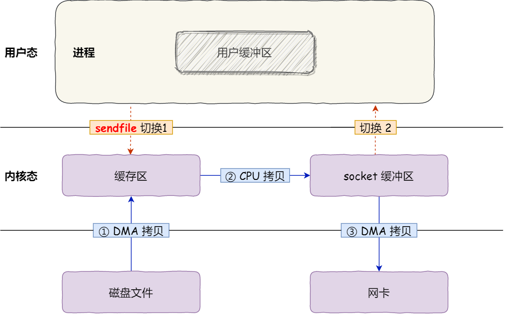

# start

[TOC]

# 1 一些常见面试题

## 1.1 进程、线程和协程各自的作用和区别？进程和线程的组成？

- **本质区别**：进程是操作系统资源分配的基本单位，而线程是任务调度和执行的基本单位
- **在开销方面**：每个进程都有独立的代码和数据空间（程序上下文），程序之间的切换会有较大的开销；线程可以看做轻量级的进程，同一类线程共享代码和数据空间，每个线程都有自己独立的运行栈和程序计数器（PC），线程之间切换的开销小
- **稳定性方面**：进程中某个线程如果崩溃了，可能会导致整个进程都崩溃。而进程中的子进程崩溃，并不会影响其他进程。
- **内存分配方面**：系统在运行的时候会为每个进程分配不同的内存空间；而对线程而言，除了CPU外，系统不会为线程分配内存（线程所使用的资源来自其所属进程的资源），线程组之间只能共享资源
- **包含关系**：没有线程的进程可以看做是单线程的，如果一个进程内有多个线程，则执行过程不是一条线的，而是多条线（线程）共同完成的；线程是进程的一部分，所以线程也被称为轻权进程或者轻量级进程

你说到进程是分配资源的基本单位，那么这个资源指的是什么？

虚拟内存、文件句柄、信号量等资源。

> **进程、线程和协程区别？**
>
> - **进程**是操作系统`资源分配的基本单位`，每个进程都有独立的`内存空间和系统资源`，相互之间互不干扰，保证了系统的稳定性和安全性。但是，进程间的切换和通信需要较大的开销。
> - **线程**是进程内的执行单元，可以看作轻量级的进程，是`CPU调度的基本单位`，`共享`同一个进程的内存空间和资源，如**代码段、数据段、堆、已打开的文件资源** 等。线程间的切换和通信比进程更快，因为它们共享同一地址空间。但是，线程没有独立的地址空间，一个线程的崩溃可能会影响整个进程。
> - **协程**是一种更轻量级的线程，也被称为微线程。它们完全在用户态下执行，不需要内核的参与，因此切换开销更小。协程可以由程序自身控制调度，实现非抢占式的多任务处理，更适合于IO密集型任务。

> **进程和线程的组成？**
>
> - 进程的组成： 进程主要由三部分组成：**程序代码**（即指令序列）、**相关数据**（包括变量、缓冲区、文件等）以及**进程控制块（PCB）**。其中，进程控制块是用于描述系统进程状态的关键数据结构，它包含了进程ID、进程状态、内存指针、文件描述符表、信号处理函数等重要信息。
> - 线程的组成： 线程是进程内的一个执行单元，其组成通常包括**线程ID**、**当前指令指针（PC）**、**寄存器集合**（用于保存线程上下文）、**堆栈**（用于函数调用和局部变量存储）以及**线程控制块（TCB**，类似于进程中的PCB，但更轻量级）。线程共享其所属进程的内存空间和部分资源，如文件句柄和信号量等，这使得线程间的数据交互变得容易，但同时也增加了同步和互斥的复杂性。

## 1.2 elect、poll、epoll的区别

1. select 和 poll 并没有本质区别，最大的区别就是，**select使用数组，poll使用链表**来存储进程关注的 Socket 集合。
   - 在使用的时候，首先需要把关注的 Socket 集合通过 select/poll 系统调用从用户态**拷贝**到内核态，然后由内核检测事件，当有网络事件产生时，内核需要**遍历**进程关注 Socket 集合，找到对应的 Socket，并设置其状态为可读/可写，然后把整个 Socket 集合从内核态**拷贝**到用户态，用户态还要继续**遍历**整个 Socket 集合找到可读/可写的 Socket，然后对其处理。
   - 很明显发现，select 和 poll 的缺陷在于，当客户端越多，也就是 Socket 集合越大，都需要**拷贝和遍历两次**，Socket 集合的遍历和拷贝会带来很大的开销，因此也很难应对 C10K问题（单机同时处理 1 万个请求的问题）。
2. epoll 是解决 C10K 问题的利器，通过两个方面解决了 select/poll 的问题。
   - epoll 在内核里使用「**红黑树」**来关注进程所有待检测的 Socket，红黑树是个高效的数据结构，增删改一般时间复杂度是 O(logn)，通过对这棵黑红树的管理，不需要像 select/poll 在每次操作时都传入整个 Socket 集合，减少了内核和用户空间大量的数据拷贝和内存分配。
   - epoll 使用事件驱动的机制，内核里维护了一个「**链表**」来记录就绪事件，只将有事件发生的 Socket 集合传递给应用程序，不需要像 select/poll 那样轮询扫描整个集合（包含有和无事件的 Socket ），大大提高了检测的效率。

而且，epoll 支持边缘触发和水平触发的方式，而 select/poll 只支持水平触发，一般而言，边缘触发的方式会比水平触发的效率高。

> I/O 多路复用可以只使用**一个进程来维护多个 Socket** 。
>
> 使用select 和 poll方式时，每次添加关注的socket，需要将所有的socket集合从用户态拷贝进内核态，然后当有网络事件发生时，内核需要遍历在整个socket集合，找到对应的socket将其设置为可读/可写，然后再将整个socket集合从内核态拷贝到用户态，用户态还需要遍历整个socket集合找到可读/可写的socket。一共需要分别拷贝和遍历socket集合两次
>
> 如果使用epoll方式，添加要关注的socket时，只需要使用epoll_ctl()将socket加入到红黑树，当有网络事件发生时，通过回调函数将对应的socket添加到就绪链表，用户调用epoll_wait()返回就绪的个数，处理写事件

## 1.3 边缘触发和水平触发

- 使用边缘触发模式时，当被监控的 Socket 描述符上有可读事件发生时，**服务器端只会从 epoll_wait 中苏醒一次**，即使进程没有调用 read 函数从内核读取数据，也依然只苏醒一次，因此我们程序要保证一次性将内核缓冲区的数据读取完；
- 使用水平触发模式时，当被监控的 Socket 上有可读事件发生时，**服务器端不断地从 epoll_wait 中苏醒，直到内核缓冲区数据被 read 函数读完才结束**，目的是告诉我们有数据需要读取；

## 1.4 磁盘快照有了解吗？介绍下COW和ROW？

> **磁盘快照**： 磁盘快照是一种创建文件系统或卷在某个特定时间点的`只读副本`的技术。它允许用户在**不影响原始数据的情况下**访问、备份或恢复数据。快照通常用于数据保护、恢复和备份场景，可以迅速创建并占用较少的存储空间。
>
> **COW（写时复制）**： COW是“写时复制”的缩写，是一种实现磁盘快照的技术。在使用COW时，fork一个子进程，**子进程共享主进程的内存区域**，起初**读操作都在共享区域**进行，当要进行写操作时，将要写的数据拷贝到共享区域外，**之后的读、写操作都操作该数据的副本**。然后子进程备份共享区域的内容为快照。
>
> **ROW（写时重定向）**： ROW是“写时重定向”的缩写，是另一种实现磁盘快照的技术。ROW 与 COW 最大的不同就是：**COW 的快照卷存放的是原始数据，而 ROW 的快照卷存放的是新数据**，ROW通常将原始数据块的副本（新数据）以供快照使用，而不是共享数据块。这意味着每个修改都会导致新的数据块被分配和写入，这可能会增加存储空间的消耗。

## 1.5 进程间通信方式有哪些？

1. 管道
   - `匿名管道：`没有名字标识，匿名管道是特殊文件只存在于内存，没有存在于文件系统中，shell 命令中的「`|`」竖线就是匿名管道，通信的数据是**无格式的流并且大小受限**，通信的方式是**单向**的，**匿名管道是只能用于存在父子关系的进程间通信**，匿名管道的生命周期随着进程创建而建立，随着进程终止而消失。
   - `命名管道：`突破了匿名管道只能在亲缘关系进程间的通信限制，需要在文件系统创建一个类型为 p 的设备文件，那么毫无关系的进程就可以通过这个设备文件进行通信。
   - 另外，不管是匿名管道还是命名管道，进程写入的数据都是**缓存在内核**中，另一个进程读取数据时候自然也是从内核中获取，同时通信数据都遵循**先进先出**原则，不支持 lseek 之类的文件定位操作。
   - 管道这种通信方式**效率低**，不适合进程间频繁地交换数据
2. 消息队列
   - 消息队列实际上是保存在内核的「消息链表」。消息队列通信的速度不是最及时的，毕竟**每次数据的写入和读取都需要经过用户态与内核态之间的拷贝过程。**
   - 缺点：一是通信不及时，二是附件也有大小限制，不适合大数据的传输
3. 共享内存
   - **最快**的进程间通信方式之名。但是**多进程竞争同个共享资源会造成数据的错乱。**
4. 信号量
   - P、V操作实现**访问的互斥性，和进程间的同步**
5. 信号
   - 信号是**异步通信机制**。程有三种方式响应信号 1. 执行默认操作、2. 捕捉信号、3. 忽略信号
   - Linux下可通过 kill -l 查看所有的信号，一共有64种
6. socket
   - **要与相同和不同主机的进程间通信，那么就需要 Socket 通信了**。一个是基于 TCP 协议的通信方式，一个是基于 UDP 协议的通信方式，一个是本地进程间通信方式。

## 1.6 中断相关

1. 中断的**类型**有哪些？

   - **外部中断**的中断事件来源于CPU外部，必然是某个硬件产生的，所以外部中断又被称为硬件中断（指我们通常所说的中断）。计算机的外部设备，如网卡、声卡、显卡等都能产生中断。外部设备的中断信号是通过两根信号线通知CPU的，一根是INTR，另一根是NMI。CPU从INTR收到的中断信号都是不影响系统运行的，CPU可以选择屏蔽（通过设置中断屏蔽寄存器中的IF位），而从NMI中收到的中断信号则是影响系统运行的严重错误，不可屏蔽，因为屏蔽的意义不大，系统已经无法运行。
   - **内部中断（异常）**来自于处理器内部，其中软中断是由软件主动发起的中断，常**被用于系统调用**（system call）；而异常则是指令执行期间CPU内部产生的错误引起的。异常也和不可屏蔽中断一样不受eflags寄存器的IF位影响，区别在于不可屏蔽中断发生的事件会导致处理器无法运行（如断电、电源故障等），而异常则是影响系统正常运行的中断（如除0、越界访问等）。

2. 中断的**作用**：

   - 中断使得计算机系统具备**处理突发事件**的能力，提高了CPU的工作效率。

     如果没有中断系统，CPU就只能按照原来的程序编写的先后顺序，对各个外设进行查询和处理，即轮询工作方式，轮询方法貌似公平，但实际工作效率却很低，却不能及时响应紧急事件。

3. 中断的**流程**：

   中断是计算机系统中一种机制，用于在处理器执行指令时暂停当前任务，并转而执行其他任务或处理特定事件。

   以下是中断的基本流程：

   - **发生中断**：当外部设备或者软件程序需要处理器的注意或者响应时，会发出中断信号。处理器在接收到中断信号后，会停止当前执行的指令，保存当前执行现场，并跳转到中断处理程序执行。
   - **中断响应**：处理器接收到中断信号后，会根据中断向量表找到对应的中断处理程序的入口地址。处理器会保存当前执行现场（如程序计数器、寄存器状态等），以便在中断处理完成后能够恢复执行。
   - **中断处理**：处理器跳转到中断处理程序的入口地址开始执行中断处理程序。中断处理程序会根据中断类型进行相应的处理，可能涉及到保存现场、处理中断事件、执行特定任务等。

4. **硬中断和软中断：**为了避免由于中断处理程序执行时间过长，而影响正常进程的调度，Linux 将中断处理程序分为上半部和下部：

   - 上半部，对应硬中断，由硬件触发中断，用来快速处理中断；
   - 下半部，对应软中断，由内核触发中断，用来异步处理上半部未完成的**耗时工作**；

## 1.7 一个进程最多可以创建多少线程？

- 32 位系统，用户态的虚拟空间只有 3G，如果创建线程时分配的栈空间是 10M（通过 ulimit -a 命令查看），那么一个进程最多只能创建 300 个左右的线程。
- 64 位系统，用户态的虚拟空间大到有 128T，理论上不会受虚拟内存大小的限制，而会受系统的参数或性能限制。
  - 比如下面这三个内核参数的大小，都会影响创建线程的上限：
    - ***/proc/sys/kernel/threads-max***，表示系统支持的最大线程数，默认值是 `14553`；
    - ***/proc/sys/kernel/pid_max***，表示系统全局的 PID 号数值的限制，每一个进程或线程都有 ID，ID 的值超过这个数，进程或线程就会创建失败，默认值是 `32768`；
    - ***/proc/sys/vm/max_map_count***，表示限制一个进程可以拥有的VMA(虚拟内存区域)的数量，具体什么意思我也没搞清楚，反正如果它的值很小，也会导致创建线程失败，默认值是 `65530`。

## 1.8 零拷贝技术

零拷贝是提升 IO 操作性能的一个常用手段，像 ActiveMQ、Kafka 、RocketMQ、QMQ、Netty、ES、gRPC、Gateway等顶级开源项目都用到了零拷贝。

**零拷贝主要是不用从 内核区域的缓存区 还要将数据拷贝(CPU拷贝)到 用户区域的缓冲区，可以减少CPU拷贝次数和上下文切换次数**

> 传统文件传输：四次上下文切换，四次拷贝（其中两次DMA拷贝，两次CPU拷贝）
>
> 
>
> 其中：**用户的缓冲区是没有必要存在的**

下图展示了各种零拷贝技术的对比图：

|                   | CPU 拷贝 | DMA 拷贝 | 系统调用   | 上下文切换 |
| ----------------- | -------- | -------- | ---------- | ---------- |
| 传统方法          | 2        | 2        | read+write | 4          |
| mmap+write        | 1        | 2        | mmap+write | 4          |
| sendfile          | 1        | 2        | sendfile   | 2          |
| sendfile + SG-DMA | 0        | 2        | sendfile   | 2          |

1. 用 `mmap()` 替换 `read()` 系统调用函数：mmap() 系统调用函数会直接把内核缓冲区里的数据「**映射**」到用户空间，这样，操作系统内核与用户空间就不需要再进行任何的数据拷贝操作。

   只用 2次DMA拷贝 + 1次CPU拷贝，但因为还是mmap和write（2次系统调用），所以仍然有4次上下文切换

   

2. sendfile()：替代前面的 read() 和 write() 这两个系统调用，这样就可以减少一次系统调用，也就减少了 2 次上下文切换的开销。

   只用 2次DMA拷贝 + 1次CPU拷贝，只需要2次上下文切换（1次系统调用）

   

3. sendfile + DMA scatter-gather copy：若网卡支持 SG-DMA（*The Scatter-Gather Direct Memory Access*）（可通过ethtool -k eth0 | grep scatter-gather命令进行查看），可以通过SG-DMA拷贝直接将内核缓冲区的数据拷贝到网卡，而不需要经过CPU拷贝

   只用 2次DMA拷贝（其中一次是SG-DMA拷贝），和2次上下文切换（1次系统调用）

   

> 上图中内核态的缓冲区指的就是**磁盘高速缓存（PageCache）**，PageCache 来缓存最近被访问的数据，使用了「**预读**功能」。
>
> 零拷贝技术是基于 PageCache 的，PageCache 会缓存最近访问的数据，提升了访问缓存数据的性能，同时，为了解决机械硬盘寻址慢的问题，它还协助 I/O 调度算法实现了 IO 合并与预读，这也是顺序读比随机读性能好的原因。这些优势，进一步提升了零拷贝的性能。
>
> 
>
> 但是，在传输大文件（GB 级别的文件）的时候，**PageCache被占满** 会不起作用，并**且大文件无法利用到缓存**，那就白白浪费 DMA 多做的一次数据拷贝，造成性能的降低，即使使用了 PageCache 的零拷贝也会损失性能。所以在高并发的场景下，针对**大文件的传输**的方式，应该使用「**异步 I/O + 直接 I/O**」来替代零拷贝技术。
>
> 直接 I/O 应用场景常见的两种：
>
> - 应用程序已经实现了磁盘数据的缓存，那么可以不需要 PageCache 再次缓存，减少额外的性能损耗。在 MySQL 数据库中，可以通过参数设置开启直接 I/O，默认是不开启；
> - 传输大文件的时候，由于大文件难以命中 PageCache 缓存，而且会占满 PageCache 导致「热点」文件无法充分利用缓存，从而增大了性能开销，因此，这时应该使用直接 I/O。

**Java 对零拷贝的支持：**

- `MappedByteBuffer` 是 NIO 基于内存映射（`mmap`）这种零拷⻉⽅式的提供的⼀种实现，底层实际是调用了 Linux 内核的 `mmap` 系统调用。它可以将一个文件或者文件的一部分映射到内存中，形成一个虚拟内存文件，这样就可以直接操作内存中的数据，而不需要通过系统调用来读写文件。
- `FileChannel` 的`transferTo()/transferFrom()`是 NIO 基于发送文件（`sendfile`）这种零拷贝方式的提供的一种实现，底层实际是调用了 Linux 内核的 `sendfile`系统调用。它可以直接将文件数据从磁盘发送到网络，而不需要经过用户空间的缓冲区。关于`FileChannel`的用法可以看看这篇文章：[Java NIO 文件通道 FileChannel 用法](https://www.cnblogs.com/robothy/p/14235598.html)。

> 如果我们需要使用 NIO 构建网络程序的话，**不建议直接使用原生 NIO**，编程复杂且功能性太弱，**推荐使用**一些成熟的基于 NIO 的网络编程框架比如 **Netty**

## 1.9 堆和栈的作用和区别是什么？

- **分配方式**：堆是动态分配内存，由程序员手动申请和释放内存，通常用于存储动态数据结构和对象。栈是静态分配内存，由编译器自动分配和释放内存，用于存储函数的局部变量和函数调用信息。
- **内存管理**：堆需要程序员手动管理内存的分配和释放，如果管理不当可能会导致内存泄漏或内存溢出。栈由编译器自动管理内存，遵循后进先出的原则，变量的生命周期由其作用域决定，函数调用时分配内存，函数返回时释放内存。
- **大小和速度**：堆通常比栈大，内存空间较大，动态分配和释放内存需要时间开销。栈大小有限，通常比较小，内存分配和释放速度较快，因为是编译器自动管理。

## 1.10 fork()原理

- 主进程在执行 fork 的时候，操作系统会把主进程的「**页表**」复制一份给子进程，这个页表**记录着虚拟地址和物理地址映射关系，而不会复制物理内存**，也就是说，两者的虚拟空间不同，但其对应的物理空间是同一个。
- 这样一来，子进程就共享了父进程的物理内存数据了，这样能够**节约物理内存资源**，页表对应的页表项的属性会标记该物理内存的权限为**只读**。
- 当父进程或者子进程在向这个内存发起**写操作**时，CPU 就会触发**写保护中断**，这个写保护中断是由于违反权限导致的，然后操作系统会在「写保护中断处理函数」里进行**物理内存的复制**，并重新设置其内存映射关系，将父子进程的内存读写权限设置为**可读写**，最后才会对内存进行写操作，这个过程被称为「写时复制(*Copy On Write*)」。

**fork()会复制哪些东西？**

- fork 阶段会复制父进程的页表（虚拟内存）
- fork 之后，如果发生了写时复制，才会复制物理内存

# 2 硬件结构

## 2.1 冯诺依曼模型5个基本结构和寄存器

5个基本结构：

- 运算器
- 控制器
- 存储器
- 输入设备
- 输出设备

寄存器：

- *通用寄存器*，用来存放需要进行运算的数据，比如需要进行加和运算的两个数据。
- *程序计数器*，用来存储 CPU 要执行下一条指令「所在的内存地址」，注意不是存储了下一条要执行的指令，此时指令还在内存中，程序计数器只是存储了下一条指令「的地址」。
- *指令寄存器*，用来存放当前正在执行的指令，也就是指令本身，指令被执行完成之前，指令都存储在这里。

## 2.2 总线


总线是用于 CPU 和内存以及其他设备之间的通信，总线可分为 3 种：

- *地址总线*，用于指定 CPU 将要操作的内存地址；
- *数据总线*，用于读写内存的数据；（synchronized锁的其实是总线）
- *控制总线*，用于发送和接收信号，比如中断、设备复位等信号，CPU 收到信号后自然进行响应，这时也需要控制总线；

当 CPU 要读写内存数据的时候，一般需要通过下面这三个总线：

- 首先要通过「地址总线」来指定内存的地址；
- 然后通过「控制总线」控制是读或写命令；
- 最后通过「数据总线」来传输数据；

## 2.3 硬件(CPU)、软件、操作系统的位数

1. 硬件（CPU）

   - 32 位和 64 位 CPU 最主要区别在于**一次能计算多少字节数据**：

     - 32 位 CPU 一次可以计算 4 个字节；

     - 64 位 CPU 一次可以计算 8 个字节；

     这里的 32 位和 64 位，通常称为 CPU 的位宽，代表的是 CPU 一次可以计算（运算）的数据量。

2. 软件

   - 64 位和 32 位软件，实际上代表**指令**是 64 位还是 32 位的：

3. 操作系统

   - 操作系统其实也是一种程序

## 2.4 64 位CPU的计算性能一定比 32 位CPU高很多吗？

64 位相比 32 位 CPU 的优势主要体现在两个方面：

- 64 位 CPU 可以一次计算超过 32 位的数字，而 32 位 CPU 如果要计算超过 32 位的数字，要分多步骤进行计算，效率就没那么高，但是大部分应用程序很少会计算那么大的数字，所以**只有运算大数字的时候，64 位 CPU 的优势才能体现出来，否则和 32 位 CPU 的计算性能相差不大**。
- 通常来说 64 位 CPU 的地址总线是 48 位，而 32 位 CPU 的地址总线是 32 位，所以 64 位 CPU 可以**寻址更大的物理内存空间**。如果一个 32 位 CPU 的地址总线是 32 位，那么该 CPU 最大寻址能力是 4G，即使你加了 8G 大小的物理内存，也还是只能寻址到 4G 大小的地址，而如果一个 64 位 CPU 的地址总线是 48 位，那么该 CPU 最大寻址能力是 `2^48`，远超于 32 位 CPU 最大寻址能力。

## 2.5 32 位的操作系统可以运行在 64 位的电脑上吗？

64 位和 32 位软件，实际上代表指令是 64 位还是 32 位的：

- 如果 32 位指令在 64 位机器上执行，需要一套兼容机制，就可以做到兼容运行了。但是**如果 64 位指令在 32 位机器上执行，就比较困难了，因为 32 位的寄存器存不下 64 位的指令**；
- 操作系统其实也是一种程序，我们也会看到操作系统会分成 32 位操作系统、64 位操作系统，其代表意义就是操作系统中程序的指令是多少位，比如 64 位操作系统，指令也就是 64 位，因此不能装在 32 位机器上。

总之，硬件的 64 位和 32 位指的是 CPU 的位宽，软件的 64 位和 32 位指的是指令的位宽。

## 2.6 存储器的层次结构

从上到小速度变慢：

- 寄存器
- CPU Cache（使用SRAM材料：静态随机存储器）
  - 分为L1、L2、L3三级缓存：
    
    查看L1数据、L1指令、L2、L3缓存的大小：cat /sys/devices/system/cpu/cpu0/cache/index**0~3**/size
- 内存（使用DRAM材料：动态随机存储器）
- SSD/HDD硬盘

**每个存储器只和相邻的一层存储器设备打交道**

## 2.7 如何写出 CPU 缓存命中率高的代码？

> 「如何写出让 CPU 跑得更快的代码？」这个问题，可以改成「如何写出 CPU 缓存命中率高的代码？」。

CPU Cache 是由很多个 **Cache Line** 组成的，Cache Line 是 **CPU 从内存读取数据的基本单位**

查看Cache Line的大小：一般为64字节

```shell
cat /sys/devices/system/cpu/cpu0/cache/index0/coherency_line_size
```

有一个 `int array[100]` 的数组，当载入 `array[0]` 时，由于这个数组元素的大小在内存只占 4 字节，不足 64 字节，CPU 就会**顺序加载**数组元素到 `array[15]`，意味着 `array[0]~array[15]` 数组元素都会被缓存在 CPU Cache 中了

所以我们要写出 CPU 缓存命中率高的代码，从以下几方面入手：

1. 对于**数据缓存**，我们在遍历数据的时候，应该**按照内存布局的顺序操作**，这是因为 CPU Cache 是根据 CPU Cache Line 批量操作数据的，所以顺序地操作连续内存数据时，性能能得到有效的提升；
   例：遍历二维数组时顺序遍历每一行再换行
2. 对于**指令缓存**，有规律的条件分支语句能够让 CPU 的**分支预测器**发挥作用，进一步提高执行的效率；
   例：遍历数组时有if-else等指令操作时，可以先对数组进行排序再遍历数组，这样指令就可以缓存到指令缓存中
3. 对于**多核 CPU 系统**，线程可能在不同 CPU 核心来回切换，这样各个核心的缓存命中率就会受到影响，于是要想提高线程的缓存命中率，可以考虑**把线程绑定 CPU 到某一个 CPU 核心。**

## 2.8 CPU Cache读取内存中数据的方式

最简单的方式：**直接映射 Cache（Direct Mapped Cache）：**

一个内存的访问地址，包括**组标记、CPU Cache Line 索引、偏移量**这三种信息，于是 CPU 就能通过这些信息，在 CPU Cache 中找到缓存的数据。而对于 CPU Cache 里的数据结构，则是由**索引 + 有效位 + 组标记 + 数据块**组成。


如果内存中的数据已经在 CPU Cache 中了，那 CPU 访问一个内存地址的时候，会经历这 4 个步骤：

1. 根据内存地址中索引信息，计算在 CPU Cache 中的索引，也就是找出对应的 CPU Cache Line 的地址；
2. 找到对应 CPU Cache Line 后，判断 CPU Cache Line 中的有效位，确认 CPU Cache Line 中数据是否是有效的，如果是无效的，CPU 就会直接访问内存，并重新加载数据，如果数据有效，则往下执行；
3. 对比内存地址中组标记和 CPU Cache Line 中的组标记，确认 CPU Cache Line 中的数据是我们要访问的内存数据，如果不是的话，CPU 就会直接访问内存，并重新加载数据，如果是的话，则往下执行；
4. 根据内存地址中偏移量信息，从 CPU Cache Line 的数据块中，读取对应的字。

## 2.9 CPU Cache数据写回内存的方式

- `写直达（Write Through）`：保持内存与 Cache 一致性最简单的方式是，**把数据同时写入内存和 Cache 中**，这种方法称为。

  - 在这个方法里，写入前会先判断数据是否已经在 CPU Cache 里面了：

    - 如果数据已经在 Cache 里面，先将数据更新到 Cache 里面，再写入到内存里面；
    - 如果数据没有在 Cache 里面，就直接把数据更新到内存里面。

    写直达法很直观，也很简单，但是问题明显，无论数据在不在 Cache 里面，每次写操作都会写回到内存，这样写操作将会花费大量的时间，无疑性能会受到很大的影响。

- `写回（Write Back）`：**当发生写操作时，新的数据仅仅被写入 Cache Block 里，只有当修改过的 Cache Block「被替换」时才需要写到内存中**，减少了数据写回内存的频率，这样便可以提高系统的性能。

  - 如果当发生写操作时，数据已经在 CPU Cache 里的话，则把数据更新到 CPU Cache 里，同时标记 CPU Cache 里的这个 Cache Block 为脏（Dirty）的，这个脏的标记代表这个时候，我们 CPU Cache 里面的这个 Cache Block 的数据和内存是不一致的，这种情况是不用把数据写到内存里的；
  - 如果当发生写操作时，数据所对应的 Cache Block 里存放的是「别的内存地址的数据」的话，就要检查这个 Cache Block 里的数据有没有被标记为脏的：
    - 如果是脏的话，我们就要把这个 Cache Block 里的数据写回到内存，然后再把当前要写入的数据，先从内存读入到 Cache Block 里（注意，这一步不是没用的，具体为什么要这一步，可以看这个「[回答 ](https://stackoverflow.com/questions/26672661/for-write-back-cache-policy-why-data-should-first-be-read-from-memory-before-w)」），然后再把当前要写入的数据写入到 Cache Block，最后也把它标记为脏的；
    - 如果不是脏的话，把当前要写入的数据先从内存读入到 Cache Block 里，接着将数据写入到这个 Cache Block 里，然后再把这个 Cache Block 标记为脏的就好了。

  可以发现写回这个方法，在把数据写入到 Cache 的时候，**只有在缓存不命中，同时数据对应的 Cache 中的 Cache Block 为脏标记的情况下，才会将数据写到内存中（就跟磁盘刷脏页类似，只有脏页才会被刷到磁盘，这里是只有脏数据才会被回写到内存）**，而在缓存命中的情况下，则在写入后 Cache 后，只需把该数据对应的 Cache Block 标记为脏即可，而不用写到内存里。

  这样的好处是，如果我们大量的操作都能够命中缓存，那么大部分时间里 CPU 都不需要读写内存，自然性能相比写直达会高很多。

## 2.10 CPU缓存一致性(MESI)

现在 CPU 都是多核的，由于 L1/L2 Cache 是多个核心各自独有的，那么会带来多核心的**缓存一致性（Cache Coherence）** 的问题，如果不能保证缓存一致性的问题，就可能造成结果错误。

Linux为了实现的这个机制，需要保证做到下面这 2 点：

- 第一点，某个 CPU 核心里的 Cache 数据更新时，必须要传播到其他核心的 Cache，这个称为**写传播（Write Propagation）**；
- 第二点，某个 CPU 核心里对数据的操作顺序，必须在其他核心看起来顺序是一样的（即其它核心需看到相同的数据变化顺序），这个称为**事务的串行化（Transaction Serialization）**。
  - 要实现事务串行化，要做到 2 点：
    - CPU 核心对于 Cache 中数据的操作，需要同步给其他 CPU 核心；
    - 要引入「锁」的概念，如果两个 CPU 核心里有相同数据的 Cache，那么对于这个 Cache 数据的更新，只有拿到了「锁」，才能进行对应的数据更新。

可以使用**总线嗅探（Bus Snooping）**来实现写传播：

我还是以前面的 i 变量例子来说明总线嗅探的工作机制，当 A 号 CPU 核心修改了 L1 Cache 中 i 变量的值，通过总线把这个事件广播通知给其他所有的核心，然后每个 CPU 核心都会监听总线上的广播事件，并检查是否有相同的数据在自己的 L1 Cache 里面，如果 B 号 CPU 核心的 L1 Cache 中有该数据，那么也需要把该数据更新到自己的 L1 Cache。

可以发现，总线嗅探方法很简单， CPU 需要每时每刻监听总线上的一切活动，但是不管别的核心的 Cache 是否缓存相同的数据，都需要发出一个广播事件，这无疑会加重总线的负载。

但是总线嗅探无法保证事务串行化，所以解决的方法就是使用MESI协议，基于总线嗅探机制实现了事务串行化，也用状态机机制降低了总线带宽压力：

> **MESI 协议**其实是 4 个状态单词的开头字母缩写，分别是：
>
> - *Modified*，已修改
> - *Exclusive*，独占
> - *Shared*，共享
> - *Invalidated*，已失效
>
> 这四个状态来标记 Cache Line 四个不同的状态。
>
> 「已修改」状态就是我们前面提到的脏标记，代表该 Cache Block 上的数据已经被更新过，但是还没有写到内存里。而「已失效」状态，表示的是这个 Cache Block 里的数据已经失效了，不可以读取该状态的数据。
>
> 「独占」和「共享」状态都代表 Cache Block 里的数据是干净的，也就是说，这个时候 Cache Block 里的数据和内存里面的数据是一致性的。
>
> 「独占」和「共享」的差别在于，独占状态的时候，数据只存储在一个 CPU 核心的 Cache 里，而其他 CPU 核心的 Cache 没有该数据。这个时候，如果要向独占的 Cache 写数据，就可以直接自由地写入，而不需要通知其他 CPU 核心，因为只有你这有这个数据，就不存在缓存一致性的问题了，于是就可以随便操作该数据。
>
> 另外，在「独占」状态下的数据，如果有其他核心从内存读取了相同的数据到各自的 Cache ，那么这个时候，独占状态下的数据就会变成共享状态。
>
> 那么，「共享」状态代表着相同的数据在多个 CPU 核心的 Cache 里都有，所以当我们要更新 Cache 里面的数据的时候，不能直接修改，而是要先向所有的其他 CPU 核心广播一个请求，要求先把其他核心的 Cache 中对应的 Cache Line 标记为「无效」状态，然后再更新当前 Cache 里面的数据。
>
> 我们举个具体的例子来看看这四个状态的转换：
>
> 1. 当 A 号 CPU 核心从内存读取变量 i 的值，数据被缓存在 A 号 CPU 核心自己的 Cache 里面，此时其他 CPU 核心的 Cache 没有缓存该数据，于是标记 Cache Line 状态为「独占」，此时其 Cache 中的数据与内存是一致的；
> 2. 然后 B 号 CPU 核心也从内存读取了变量 i 的值，此时会发送消息给其他 CPU 核心，由于 A 号 CPU 核心已经缓存了该数据，所以会把数据返回给 B 号 CPU 核心。在这个时候， A 和 B 核心缓存了相同的数据，Cache Line 的状态就会变成「共享」，并且其 Cache 中的数据与内存也是一致的；
> 3. 当 A 号 CPU 核心要修改 Cache 中 i 变量的值，发现数据对应的 Cache Line 的状态是共享状态，则要向所有的其他 CPU 核心广播一个请求，要求先把其他核心的 Cache 中对应的 Cache Line 标记为「无效」状态，然后 A 号 CPU 核心才更新 Cache 里面的数据，同时标记 Cache Line 为「已修改」状态，此时 Cache 中的数据就与内存不一致了。
> 4. 如果 A 号 CPU 核心「继续」修改 Cache 中 i 变量的值，由于此时的 Cache Line 是「已修改」状态，因此不需要给其他 CPU 核心发送消息，直接更新数据即可。
> 5. 如果 A 号 CPU 核心的 Cache 里的 i 变量对应的 Cache Line 要被「替换」，发现 Cache Line 状态是「已修改」状态，就会在替换前先把数据同步到内存。
>
> 所以，可以发现当 Cache Line 状态是**「已修改」或者「独占」**状态时，修改更新其数据**不需要发送广播**给其他 CPU 核心，这在一定程度上减少了总线带宽压力。
>
> MESI测试图形化网站：https://www.scss.tcd.ie/Jeremy.Jones/vivio/caches/MESI.htm


#  3 内存管理

## 3.1 malloc是如何分配内存的

### 1 Linux 进程 / 用户空间 的内存分布

在 Linux 操作系统中，虚拟地址空间的内部又被分为**内核空间和用户空间**两部分，不同位数的系统，地址空间的范围也不同。比如最常见的 32 位和 64 位系统，如下所示：


通过这里可以看出：

- `32` 位系统的内核空间占用 `1G`，位于最高处，剩下的 `3G` 是用户空间；
- `64` 位系统的内核空间和用户空间都是 `128T`，分别占据整个内存空间的最高和最低处，剩下的中间部分是未定义的。


我们看看**用户空间分布**的情况，以 32 位系统为例，用户空间内存从**低到高**分别是 6 种不同的内存段：


- 代码段，包括二进制可执行代码；
- 数据段，包括已初始化的静态常量和全局变量；
- BSS 段，包括未初始化的静态变量和全局变量；
- 堆段，包括动态分配的内存，从低地址开始向上增长；
- 文件映射段，包括动态库、共享内存等，从低地址开始向上增长（[跟硬件和内核版本有关 (opens new window)](http://lishiwen4.github.io/linux/linux-process-memory-location)）；
- 栈段，包括局部变量和函数调用的上下文等。栈的大小是固定的，一般是 `8 MB`。当然系统也提供了参数，以便我们自定义大小；

在这 6 个内存段中，堆和文件映射段的内存是动态分配的。比如说，使用 C 标准库的 `malloc()` 或者 `mmap()` ，就可以分别在堆和文件映射段动态分配内存。


### 2 malloc分配内存的两种方式

1. `brk()`：当分配的内存 < 128KB，通过 brk() 系统调用从**堆**分配内存
   - 通过free释放内存后，若进程还未结束，并**不会把内存归还给操作系统**，而是缓存在 malloc 的内存池中，待下次使用；
2. `mmap()`：当分配的内存 >= 128KB，通过 mmap() 系统调用在**文件映射区域**分配内存；
   - 通过free释放内存后，**会把内存归还给操作系统**，内存得到真正的释放。

> 注意，不同的 glibc 版本定义的阈值也是不同的。另外，**malloc() 分配的是虚拟内存**。
>
> malloc(1)默认会分配**132KB**，会预分配一个更大的空间


### 3 brk() 和 mmap() 的 优缺点 / 对比

1. `mmap()`每次free后都会真正释放内存，而每次申请内存是一次**系统调用**过程，需要进行内核态和用户态的切换，会有较大的开销。而`brk()`分配的内存当释放时会缓存在内存池中，**减少内存分配的次数**，减小开销。
2. 但是`brk()`是使用堆顶指针进行内存的分配，多次分配和free后，**可能产生很多的内存碎片**

### 4 free() 怎么知道释放多大的内存？

> free() 函数只传入一个内存地址，为什么能知道要释放多大的内存？
>
> malloc 返回给**用户态的内存起始地址**比进程的**堆空间起始地址多了 16 字节**，保存了该内存块的描述信息，其中有该内存块的大小
>
> 当执行 free() 函数时，free 会对传入进来的内存地址**向左偏移 16 字节**，然后从这个 16 字节的分析出当前的内存块的大小，自然就知道要释放多大的内存了。

## 3.2 内存管理和虚拟内存的作用

- 第一，虚拟内存可以 让进程**只装入一部分**就能运行，以及**换出**暂时不用的内存，**换入**需要的内存，让程序**以为物理空间很大**。
- 第二，进行**内存分配**；由于每个进程都有自己的**独立页表**，所以每个进程的**虚拟内存空间就是相互独立**的。进程也没有办法访问其他进程的页表，所以这些页表是私有的，**防止进程间相互影响**。
- 第三，页表里的页表项中除了物理地址之外，还有一些标记属性的比特，比如控制一个页的读写权限，标记该页是否存在等。在内存访问方面，操作系统**提供了更好的安全性**。

## 3.3 内存 分配 与 回收 的过程

应用程序通过 malloc 函数申请内存的时候，实际上**申请的是虚拟内存**，此时并不会分配物理内存。

当应用程序读写了这块虚拟内存，CPU 就会去访问这个虚拟内存， 这时会发现这个虚拟内存没有映射到物理内存， CPU 就会产生**缺页中断**，进程会从用户态切换到内核态，并将缺页中断交给内核的 Page Fault Handler （缺页中断函数）处理。

缺页中断处理函数会看是否有空闲的物理内 存，如果有，就直接分配物理内存，并建立虚拟内存与物理内存之间的映射关系。

如果没有空闲的物理内存，那么内核就会开始进行**回收内存**的工作，回收的方式主要是两种：直接内存回收和后台内存回收。

- **后台内存回收**（kswapd）：在物理内存紧张的时候，会唤醒 kswapd 内核线程来回收内存，这个回收内存的过程**异步**的，**不会阻塞**进程的执行。
- **直接内存回收**（direct reclaim）：如果后台异步回收跟不上进程内存申请的速度，就会开始直接回收，这个回收内存的过程是**同步**的，会**阻塞**进程的执行。

如果直接内存回收后，空闲的物理内存仍然无法满足此次物理内存的申请，那么内核就会放最后的大招了 ——**触发 OOM （Out of Memory）机制**。

OOM Killer 机制会根据算法选择一个占用物理内存较高的进程，然后将其杀死，以便释放内存资源，如果物理内存依然不足，OOM Killer 会继续**杀死占用物理内存较高的进程**，直到释放足够的内存位置。


## 3.4 内存回收的阈值

内核定义了**三个内存阈值**（watermark，也称为水位），用来衡量当前剩余内存（pages_free）是否充裕或者紧张，分别是：

- 页最小阈值（pages_min）；
- 页低阈值（pages_low）；
- 页高阈值（pages_high）；

这三个内存阈值会划分为四种内存使用情况，如下图：


- 图中橙色部分：如果剩余内存 `pages_min <（pages_free）<= pages_low`，说明内存压力比较大，剩余内存不多了。**这时 kswapd0 会执行内存回收，直到剩余内存大于高阈值（pages_high）为止**。虽然会触发内存回收，但是不会阻塞应用程序，因为两者关系是异步的。
- 图中红色部分：如果剩余内存`（pages_free）< pages_min`，说明用户可用内存都耗尽了，此时就会**触发直接内存回收**，这时应用程序就会被阻塞，因为两者关系是同步的。

## 3.5 哪些内存可以被回收？

- **文件页**（File-backed Page）：内核缓存的磁盘数据（Buffer）和内核缓存的文件数据（Cache）都叫作文件页。大部分文件页都是没有修改过的干净页，少部分是修改过的脏页。所以，**回收干净页的方式是直接释放内存，回收脏页的方式是先写回磁盘后再释放内存**。
- **匿名页**（Anonymous Page）：这部分内存没有实际载体，不像文件缓存有硬盘文件这样一个载体，比如`堆、栈数据等`。这部分内存很可能还要再次被访问，所以不能直接释放内存，它们**回收的方式是通过 Linux 的 Swap 机制**，Swap 会把不常访问的内存先写到磁盘中，然后释放这些内存，给其他更需要的进程使用。再次访问这些内存时，重新从磁盘读入内存就可以了。

> 文件页的回收，有部分是干净页是直接回收的，**效率高**于脏页；而匿名页会进行换入和换出，效率较低。

文件页和匿名页的回收**都是基于 LRU 算法**，也就是优先回收不常访问的内存。在Linux中，LRU 回收算法，实际上维护着 active 和 inactive 两个双向链表，其中：

- **active_list** 活跃内存页链表，这里存放的是最近被访问过（活跃）的内存页；
- **inactive_list** 不活跃内存页链表，这里存放的是很少被访问（非活跃）的内存页；

## 3.6 内存回收的参数调节

针对回收内存导致的性能影响，常见的解决方式。

1. 设置 /proc/sys/vm/swappiness，调整文件页和匿名页的回收倾向，尽量倾向于回收文件页；
2. 设置 /proc/sys/vm/min_free_kbytes，调整 kswapd 内核线程异步回收内存的时机；
3. 设置 /proc/sys/vm/zone_reclaim_mode，调整 NUMA 架构下内存回收策略，建议设置为 0，这样在回收本地内存之前，会在其他 Node 寻找空闲内存，从而避免在系统还有很多空闲内存的情况下，因本地 Node 的本地内存不足，发生频繁直接内存回收导致性能下降的问题；

### 1 调整文件页和匿名页的回收倾向

> 文件页的回收，有部分是干净页是直接回收的，**效率高**于脏页；而匿名页会进行换入和换出，效率较低。
>
> 所以我们**更倾向回收文件页**

Linux 提供了一个 `/proc/sys/vm/swappiness` 选项，用来调整文件页和匿名页的回收倾向。
swappiness 的范围是 0-100，数值越大，越积极使用 Swap，也就是更倾向于回收匿名页

一般**建议 swappiness 设置为 0**（默认值是 60），这样在回收内存的时候，会更倾向于文件页的回收，但是并不代表不会回收匿名页。

### 2 尽早触发 kswapd 后台内核线程异步回收内存

我们可以使用 `sar -B 1` 命令来观察内存回收的指标：


图中红色框住的就是后台内存回收和直接内存回收的指标，它们分别表示：

- pgscank/s : kswapd(**后台**回收线程) 每秒扫描的 page 个数。
- pgscand/s: 应用程序**直接**在内存申请过程中每秒直接扫描的 page 个数。
- pgsteal/s: 扫描的 page 中每秒被回收的个数（**pgscank+pgscand**）。

如果系统时不时发生抖动，并且在抖动的时间段里如果通过 sar -B 观察到 pgscand 数值很大，那大概率是因为「直接内存回收」导致的。我们**需要避免直接内存回收造成进程的阻塞**。

> 回顾内存回收的阈值：
>
> 1.  `pages_min <（pages_free）<= pages_low`， kswapd0 会执行内存回收，直到剩余内存大于高阈值（pages_high）为止
> 2. 图中红色部分：如果剩余内存`（pages_free）< pages_min`，触发直接内存回收

页低阈值（pages_low）可以通过内核选项 `/proc/sys/vm/min_free_kbytes` （该参数代表系统所保留空闲内存的最低限）来间接设置。

```properties
pages_min = min_free_kbytes
pages_low = pages_min*5/4
pages_high = pages_min*3/2
```

我们通过调大 pages_min 的参数大小，来**间接调大 pages_low** 的参数大小，**让后台回收线程 kswapd 尽早开始回收内存**

> 参数设置的思考：
>
> - 调大 pages_min 会使得系统**预留过多的空闲内存**，从而在一定程度上**降低了**应用程序**可使用的内存量**，这在一定程度上**浪费了内存**。极端情况下设置 min_free_kbytes 接近实际物理内存大小时，留给应用程序的内存就会太少而可能会频繁地导致 OOM 的发生。
> - 所以在调整 min_free_kbytes 之前，需要先思考一下，应用程序更加关注什么，如果关注延迟那就适当地增大 min_free_kbytes，如果关注内存的使用量那就适当地调小 min_free_kbytes。

### 3 NUMA 架构下的内存回收策略

1. SMP/UMA 指的是一种**多个 CPU 处理器共享资源的电脑硬件架构**，也就是说每个 CPU 地位平等，它们共享相同的物理资源，包括总线、内存、IO、操作系统等。每个 CPU 访问内存所用时间都是相同的，因此，这种系统也被称为**一致存储访问结构**（UMA，Uniform Memory Access）。

   - 随着 CPU 处理器核数的增多，多个 CPU 都通过一个总线访问内存，这样总线的带宽压力会越来越大，同时每个 CPU 可用带宽会减少，这也就是 SMP 架构的问题。

2. **NUMA （非一致性存储访问结构）**架构将每个 CPU 进行了分组，每一组 CPU 用 Node 来表示，一个 Node 可能包含多个 CPU 。

   **每个 Node 有自己独立的资源，包括内存、IO 等**，每个 Node 之间可以通过互联模块总线（QPI）进行通信，所以，也就意味着每个 Node 上的 CPU 都可以访问到整个系统中的所有内存。但是，访问远端 Node 的内存比访问本地内存要耗时很多。


在 NUMA 架构下，当某个 Node 内存不足时，系统可以从其他 Node 寻找空闲内存，也可以从本地内存中回收内存。

具体选哪种模式，可以通过 /proc/sys/vm/zone_reclaim_mode 来控制。它支持以下几个选项：

- 0 （默认值）：在回收本地内存之前，在其他 Node 寻找空闲内存；
- 1：只回收本地内存；
- 2：只回收本地内存，在本地回收内存时，可以将文件页中的脏页写回硬盘，以回收内存。
- 4：只回收本地内存，在本地回收内存时，可以用 swap 方式回收内存。

虽然说访问远端 Node 的内存比访问本地内存要耗时很多，但是相比内存回收的危害而言，访问远端 Node 的内存带来的性能影响还是比较小的。因此，**zone_reclaim_mode 一般建议设置为 0**。

## 3.7  如何保护一个进程不被 OOM 杀掉呢？

在系统空闲内存不足的情况，进程申请了一个很大的内存，如果直接内存回收都无法回收出足够大的空闲内存，那么就会触发 OOM 机制，内核就会根据算法选择一个进程杀掉。

Linux 到底是根据什么标准来选择被杀的进程呢？这就要提到一个在 Linux 内核里有一个 `oom_badness()` 函数，它会把系统中可以被杀掉的进程扫描一遍，并对每个进程打分，**得分最高的进程就会被首先杀掉**。

进程得分的结果受下面这两个方面影响：

- 第一，进程已经使用的物理内存页面数`process_pages`。
- 第二，每个进程的 OOM 校准值 oom_score_adj。它是可以通过 `/proc/[pid]/oom_score_adj` 来配置的。我们可以在设置 **-1000 到 1000** 之间的任意一个数值，调整进程被 OOM Kill 的几率。每个进程的 oom_score_adj **默认值都为 0**

```properties
points = process_pages + oom_score_adj * totalpages / 1000
```

- 如果你不想某个进程被首先杀掉，那你可以降低该进程的 oom_score_adj，降低该进程被 OOM 杀死的概率。
- 如果你想某个进程无论如何都不能被杀掉，那你可以将 oom_score_adj 配置为 -1000。

## 3.8 申请大于物理内存大小的内存会怎么样？

- 在 **32位** 操作系统，因为进程理论上最大能申请 3 GB 大小的虚拟内存，所以直接申请 8G 内存，会申请失败。
- 在 **64位** 位操作系统，因为进程理论上最大能申请 128 TB 大小的虚拟内存，即使物理内存只有 4GB，申请 8G 内存也是没问题，因为申请的内存是虚拟内存。如果这块虚拟内存被访问了，要看系统有没有 Swap 分区：
  - 如果**没有 Swap** 分区，因为物理空间不够，进程会被操作系统杀掉，原因是 OOM（内存溢出）；
  - 如果**有 Swap** 分区，即使物理内存只有 4GB，程序也能正常使用 8GB 的内存，进程可以正常运行；但是申请虚拟空间也会占据物理内存，所以若是申请的虚拟内存过大，还是可能会 OOM

## 3.9 Linux内存淘汰机制（LRU）/ 如何避免缓存失效和缓存污染？

这两个题目都是在问**如何改进 LRU 算法**。

- Redis 的缓存淘汰算法则是通过**实现 LFU 算法**来避免「缓存污染」而导致缓存命中率下降的问题（Redis 没有预读机制）。
- MySQL 和 Linux 操作系统是通过**改进 LRU 算法**来避免「预读失效和缓存污染」而导致缓存命中率下降的问题。

> **预读机制**：因为局部性原理，所以操作系统读取某页数据时，可能会将其**相邻的页**一起加载到内存中，**减少了 磁盘 I/O 次数，提高系统磁盘 I/O 吞吐量**。
>
> **预读失效**：这些被提前加载进来的页，并没有被访问，造成缓存内存的浪费，可能降低其他数据的缓存命中率
>
> **缓存污染**：只需要访问一次的低频数据占据缓存空间，造成活跃数据的缓存失效

Linux改进 LRU 算法解决以上问题的途径：

在Linux中，LRU 回收算法，实际上维护着 active 和 inactive 两个双向链表，其中：

- **active_list** 活跃内存页链表，这里存放的是最近被访问过（活跃）的内存页；
- **inactive_list** 不活跃内存页链表，这里存放的是很少被访问（非活跃）的内存页；

> 内存页被访问**第二次**的时候，才将页从 inactive list 升级到 active list 里。
>
> active list里被淘汰的页放到 inactive list 的队首

## 3.10 页面置换算法


请求分页管理方式的页表：


- *状态位*：用于表示该页是否有效，也就是说是否在物理内存中，供程序访问时参考。
- *访问字段*：用于记录该页在一段时间被访问的次数，供页面置换算法选择出页面时参考。
- *修改位*：表示该页在调入内存后是否有被修改过
- *硬盘地址*：用于指出该页在硬盘上的地址，通常是物理块号，供调入该页时使用。

常见的页面置换算法：

1. **最佳页面置换算法OPT：**
   - 一个**理想**算法，置换在「未来」最长时间不访问的页面。但是操作系统并不知道未来需要访问哪些内存页
2. **先进先出置换算法FIFO：**
   - 选择在内存驻留时间很长的页面进行中置换
3. **最近最久未使用的置换算法LRU：**
   - 选择最长时间没有被访问的页面进行置换
4. **最不常用算法LFU：**
   - 设置一个访问计数器，当发生缺页中断时，选择「访问次数」最少的那个页面，并将其淘汰
5. **时钟页面置换算法Clock：**
   - 把所有的页面都保存在一个类似钟面的「环形链表」中，一个表针指向最老的页面。当发生缺页中断时，算法首先检查表针指向的页面：
     - 如果它的访问位位是 0 就淘汰该页面，并把新的页面插入这个位置，然后把表针前移一个位置；
     - 如果访问位是 1 就清除访问位，并把表针前移一个位置，重复这个过程直到找到了一个访问位为 0 的页面为止；最多进行2轮扫描
   - 改进的Clock算法：考虑的因素变为 (访问位, 修改位)，最多进行4轮扫描


# 4 进程管理

## 4.1 进程被kill后是怎么做的？

在 Linux 中可以通过 `kill -l`查看所有可用的信号：一共64种：


我们可以使用kill [pid] 杀掉某一个进程，那么其背后的原理是什么呢？

1. CPU 执行正常的进程指令
2. 调用 kill 系统调用向进程发送信号
3. 进程收到操作系统发的信号，CPU 暂停当前程序运行，并将控制权转交给操作系统
4. 调用 kill 系统调用向进程发送信号（一般为 11，即 **SIGSEGV**，一般非法访问内存报的都是这个错误）
5. **操作系统根据情况执行相应的信号处理程序（函数），一般执行完信号处理程序逻辑后会让进程退出**
   - 如果进程没有注册自己的信号处理函数，那么操作系统会执行默认的信号处理程序（一般最后会让进程退出）
   - 如果注册了，则会执行自己的信号处理函数，它收到 kill 信号后，可以执行一些逻辑操作后调用 exit() 来退出，但也可以忽略信号，也可以使用 sigsetjmp，siglongjmp 这两个函数来恢复进程的执行

> kill -9 命令例外，不管进程是否定义了信号处理函数，都会马上被干掉
>
> 例如JVM 自己定义了信号处理函数，这样当发送 kill pid 命令（默认会传 15 也就是 SIGTERM）后，JVM 就可以在信号处理函数中执行一些资源清理之后再调用 exit 退出。kill -9 除外。

## 4.2 C语言线程崩溃会导致进程崩溃，Java为什么不会？

> 首先线程崩溃，进程一定会崩溃 这句话是错的
>
> 一般非法访问内存时，就会发送 11 SIGSEGV 信号，非法访问内存是很危险的，操作系统会认为这很可能导致一系列严重的后果，所以干脆就让整个进程崩溃。
>
> 那C语言中非法访问内存会导致进程崩溃，那为什么不会导致Java/JVM进程崩溃呢？比如StackoverflowError 和 NullPointerExeception 这两个错误/异常

如4.1 中所讲，因为 **JVM 自定义了自己的信号处理函数**，**拦截了 11 SIGSEGV 信号**，针对这两者不让它们崩溃。

在JVM自定义信号处理函数中，当发生例如 栈溢出 或 空指针 的错误/异常时，会接收到 11 SIGSEGV 信号，但JVM只会做一些额外的处理，并**抛出异常或错误**，或者记录错误日志

## 4.3 进程调度算法


1. **先来先服务FCFS：**
   - 非抢占式，按时间先后依次执行
   - 特点：对长作业有利，对短作业不利；带权周转时间很大，适用于 CPU 繁忙型作业的系统
2. **短作业优先SJF：**
   - 非抢占式和抢占式两种：优先选择运行时间最短的进程来运行
   - 特点：可能造成长作业饥饿现象
3. **高响应比优先调度算法HRRN：**
   - 非抢占式：每次进行进程调度时，先计算「响应比优先级：(等待时间 + 要求服务时间) / 要求服务时间」，然后把「响应比优先级」最高的进程投入运行
   - 特点：综合了 先来先服务 和 短作业优先的特点
4. **时间片轮转调度算法RR：**
   - 抢占式：每个进程被分配一个时间段，称为时间片（Quantum），即允许该进程在该时间段中运行。
   - 特点：公平、响应快。但是时间片太小开销较大，且不区分任务的紧急程度
5. **最高优先级调度算法HPF：**
   - 非抢占式和抢占式两种：从就绪队列中选择最高优先级的进程进行运行
   - 特点：区分任务的紧急程度。但是可能造成低优先级饥饿
6. **多级反馈队列调度算法：**
   - 抢占式：「时间片轮转算法」和「最高优先级算法」的综合和发展。「多级」表示有多个队列，每个队列优先级从高到低，同时**优先级越高时间片越短**。「反馈」表示如果有新的进程加入优先级高的队列时，立刻停止当前正在运行的进程，转而去运行优先级高的队列；
   - 特点：兼顾了长短作业，同时有较好的响应时间。

## 4.4 死锁

**死锁产生的条件：**

1. 互斥条件；
2. 持有并等待条件；
3. 不可剥夺条件；
4. 循环等待条件；


**避免死锁问题的发生：**

1. 死锁预防：只需要破坏上面其中一个条件就可以，最常见的并且可行的就是**使用资源有序分配法，来破坏环路等待条件**。
2. 死锁避免：银行家算法
3. 检测与解除：通过判断图是否可完全简化来判断是否发生死锁，然后采取一定措施进行死锁的解除：例如MySQL处理死锁的策略为：等待最高上限时长50s，超过则自动终止该操作，或者主动检测到死锁发生后回滚执行程度最低的事务，破坏请求和保持


# 5 设备管理

## 5.1 磁盘调度算法

磁盘的盘片中的每一层分为多个磁道，每个磁道分多个扇区，每个扇区是 `512` 字节

磁盘调度算法的目的很简单，就是为了提高磁盘的访问性能，一般是通过优化磁盘的访问请求顺序来做到的。**寻道的时间**是磁盘访问最耗时的部分，如果请求顺序优化的得当，必然可以节省一些不必要的寻道时间，从而提高磁盘的访问性能。


1. **先来先服务FCFS：**

   - 先到来的请求，先被服务。
   - 请求访问的磁道可能会很分散，那先来先服务算法在性能上就会显得很差，因为寻道时间过长
2. **最短寻道时间优先SSF：**

   - 优先选择从当前磁头位置所需寻道时间最短的请求
   - 可能存在某些请求的**饥饿**：若持续访问磁头周围的磁道，那么较远距离的请求一直无法得到执行
3. **扫描算法SCAN：**

   - 磁头在一个方向上移动，访问所有未完成的请求，直到磁头到达该方向上的最后的磁道，才调换方向
   - 中间部分的磁道会比较占便宜，中间部分相比其他部分响应的频率会比较多，也就是说每个磁道的响应频率存在差异。
   - **LOOK：**SCAN会扫描到磁盘「最始端或最末端」才开始调换方向。LOOK改进后不会
4. **循环扫描算法C-SCAN：**

   - 磁头朝某个特定方向移动时，才处理磁道访问请求，而返回时直接快速移动至最靠边缘的磁道，也就是复位磁头，这个过程是很快的，并且**返回中途不处理任何请求**，就是**磁道只响应一个方向上的请求**。
   - 循环扫描算法相比于扫描算法，对于各个位置磁道响应频率相对比较平均。
   - **C-LOOK：**C-SCAN会扫描到磁盘「最始端或最末端」才开始调换方向。C-LOOK改进后不会


## 5.2 DMA 和 RDMA

- DMA（Direct Memory Access直接存储器存取）：
  - DMA是操作系统的一种IO控制方式，相较于 程序直接控制方式、中断驱动方式，采取DMA方式数据直接从IO设备经过DMA拷贝到内核缓冲区，可以避免CPU对数据的拷贝，数据传输效率进一步增加
- RDMA（Remote DMA）
  - RDMA是一种概念，在两个或者多个计算机进行通讯的时候使用DMA，**从一个主机的内存直接访问另一个主机的内存。**
  - 通过将RDMA协议固化于硬件(即网卡)上，以及支持**零拷贝（Zero-copy）**和**内核旁路（Kernel bypass）**这两种途径来达到其高性能的远程直接数据存取的目标。
  - 使用RDMA的**优势**如下：
    - **零拷贝(Zero-copy)** - 零拷贝的主要任务就是避免CPU将数据从一块存储拷贝到另外一块存储。应用程序能够直接执行数据传输，在不涉及到网络软件栈的情况下，数据能够被直接发送到缓冲区或者能够直接从缓冲区里接收，而不需要被复制到网络层。
    - **内核旁路(Kernel bypass)** - 应用程序可以直接在用户态执行数据传输，不需要在内核态与用户态之间做上下文切换。
    - **不需要CPU干预(CPU offload)** - 应用程序可以访问远程主机内存而不消耗远程主机中的任何CPU。远程主机内存能够被读取而不需要远程主机上的进程（或CPU)参与。远程主机的CPU的缓存(cache)不会被访问的内存内容所填充。
    - 消息基于事务(Message based transactions) - 数据被处理为离散消息而不是流，消除了应用程序将流切割为不同消息/事务的需求。
    - 支持分散/聚合条目(Scatter/gather entries support) - RDMA原生态支持分散/聚合。也就是说，读取多个内存缓冲区然后作为一个流发出去或者接收一个流然后写入到多个内存缓冲区里去。
    - 异步接口 - 在RDMA中，提供的所有接口都是异步的通信接口，这样在编程的时候，可以更加便利的实现计算和通信的分离。
  - 目前，有三种支持RDMA的通信技术：IB（InfiniBand）、以太网RoCE（RDMA over Converged Ethernet）、以太网iWARP（internet Wide Area RDMA Protocal）。这三种技术都可以使用同一套API来使用，但它们有着不同的物理层和链路层。


# end

