# IPv4习题

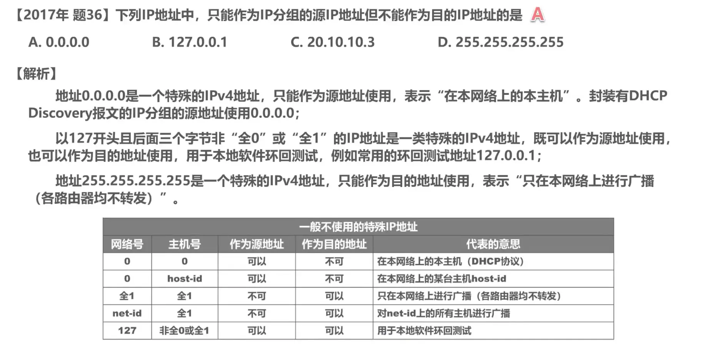

------

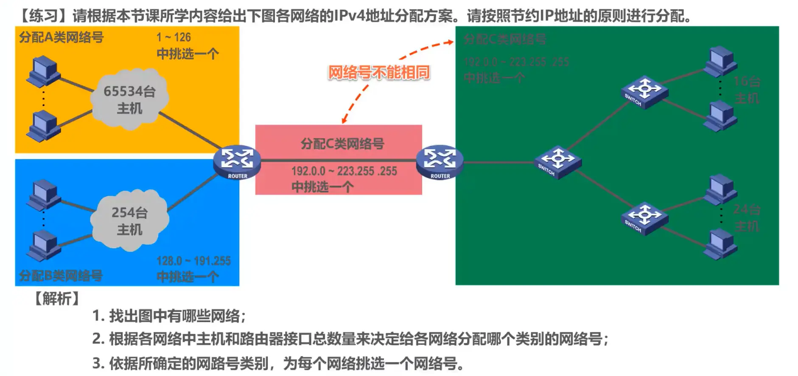

> 题目的注意点
>
> **本题按照节约原则**
>
> 路由器的接口也要分配一个IP地址
>
> 所以橙色网络的IP地址数量是 65534 + 1 = 65535，同理 蓝色网络的是 255 个，绿色网络（交换式以太网）的是 16 + 24 + 1 = 41 个，红色网络（两台路由器通过一段链路直连，它们的直连接口也属于一个网络）是 2 个
>
> 分配IP地址不能相同
>
> 不能出现两个一样的网络号

------

------

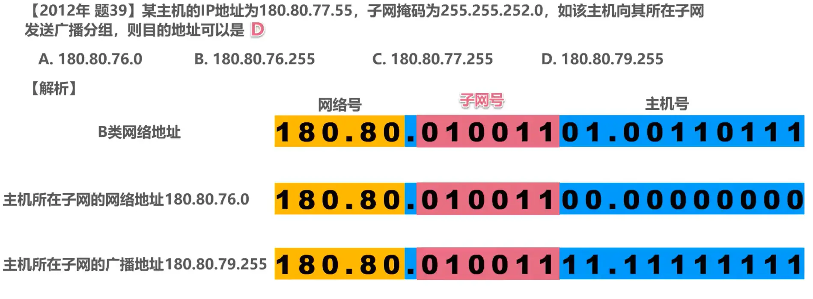

------

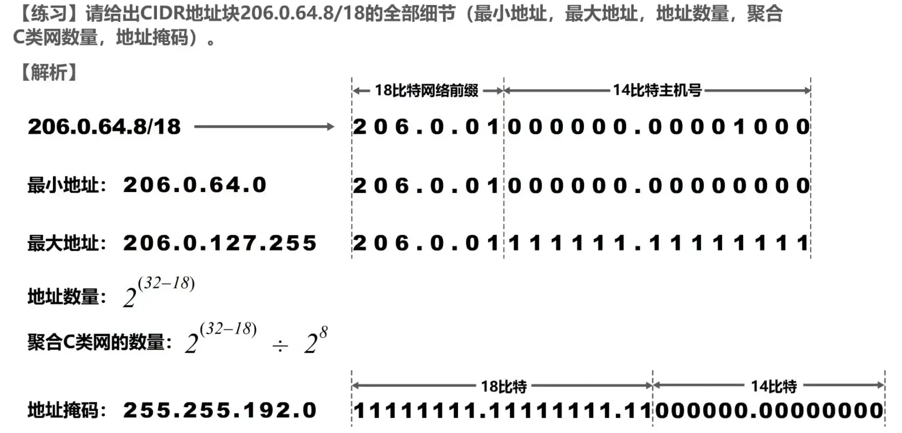

------

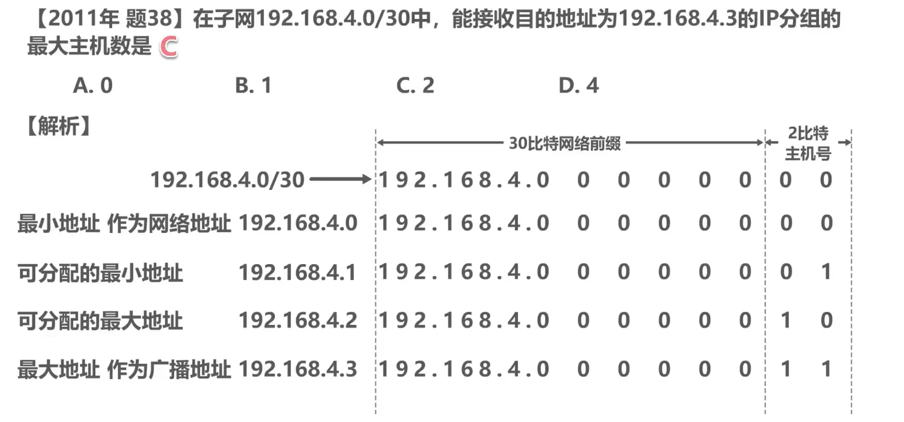

------

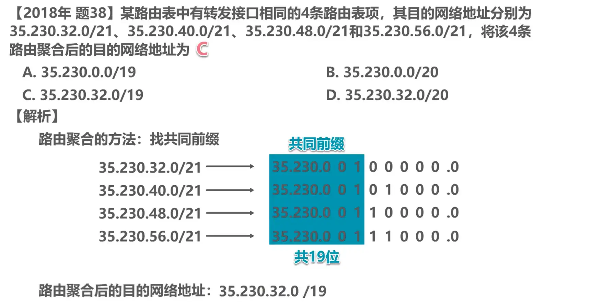

# IP数据报的发送和转发过程

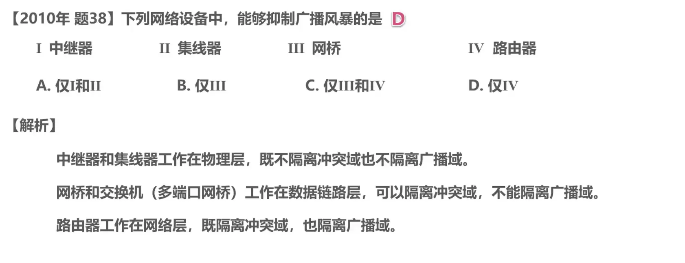

------

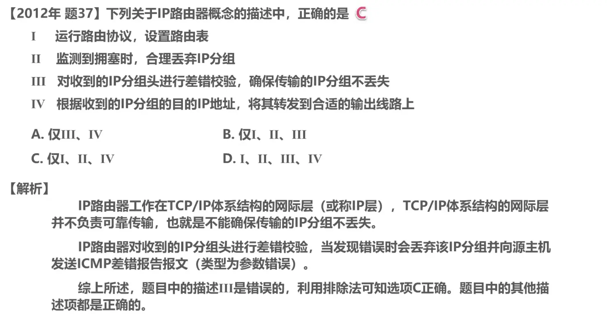

------

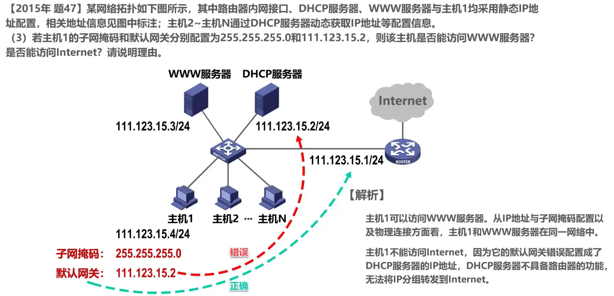

# 路由选择协议

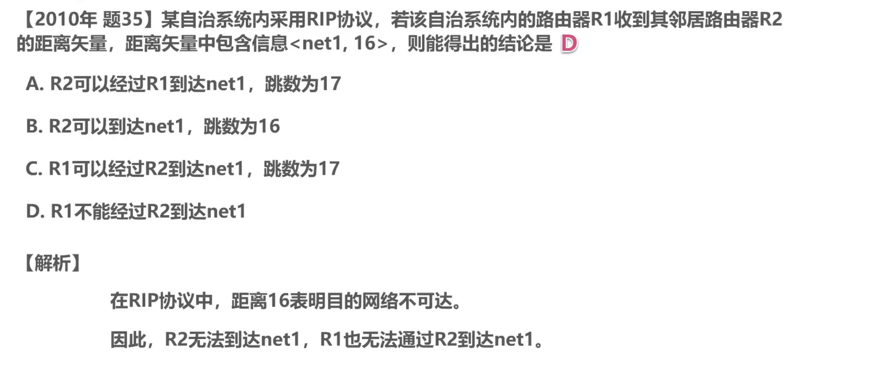

------

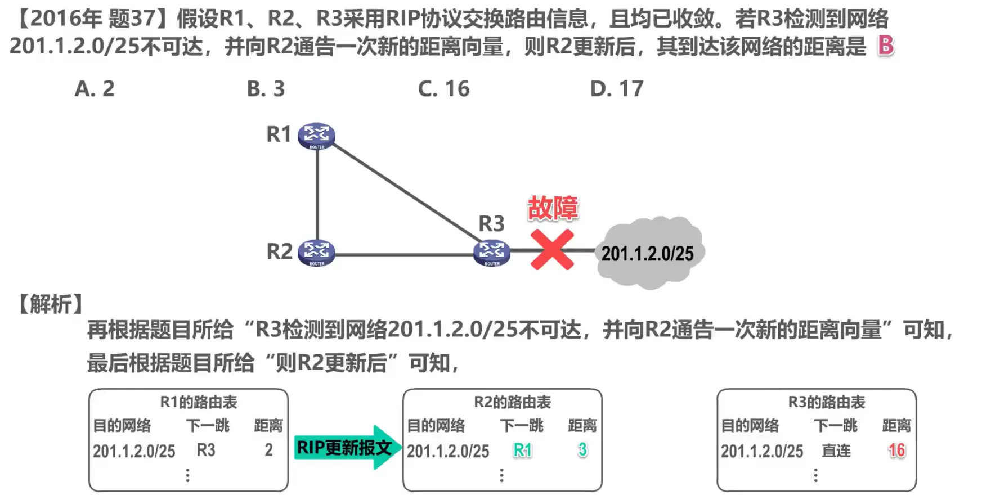

------

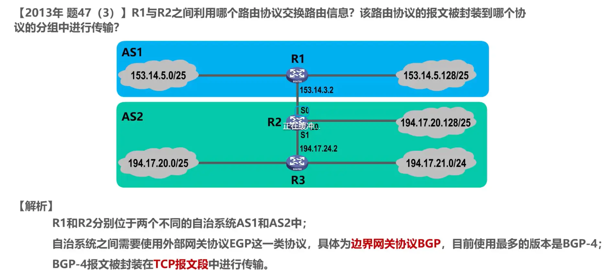

------

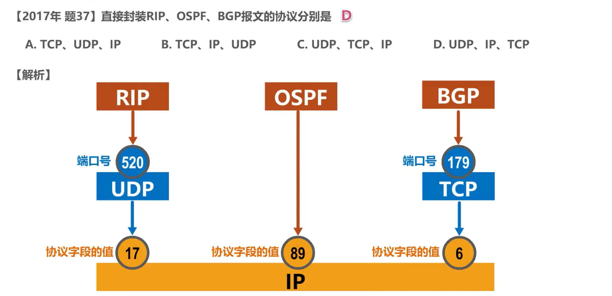

# IPv4数据报的首部格式

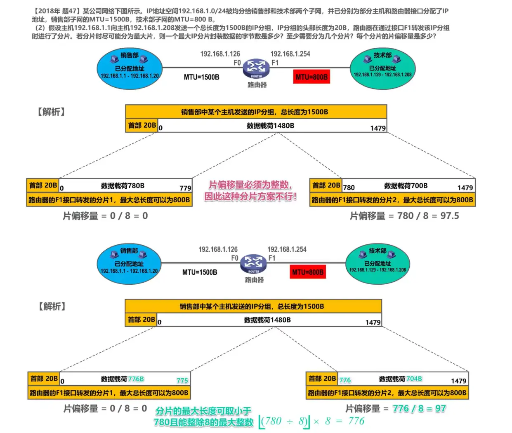

> 780/8向下取整等于97
>
> 97*8 = 776

------

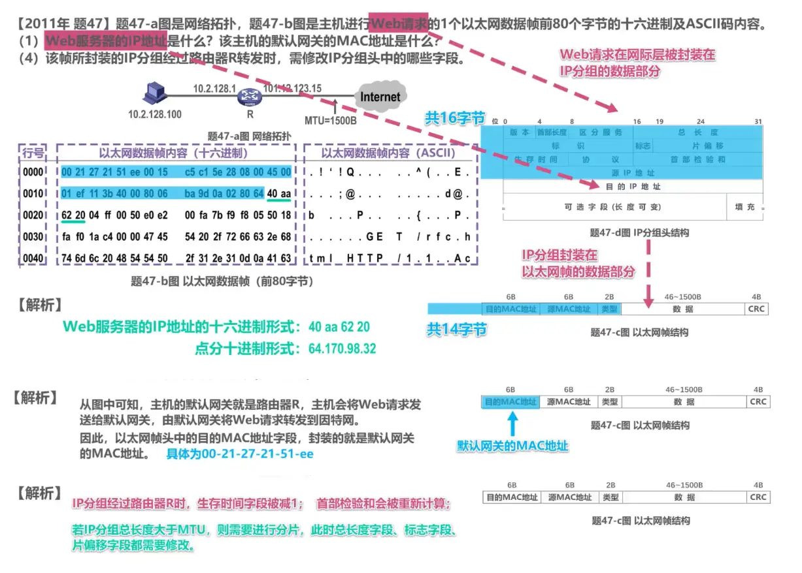

# 网际控制报文协议ICMP

